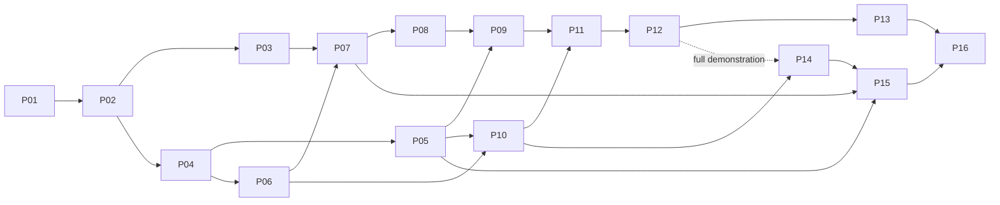

# Business Assistant — Review and Implementation Handover

> **Updated:** 2026-09-10  
> **Status:** Implementation in progress; not released or deployment-ready  
> **Baseline:** `main` at `2ad6114c074b84c457042f377e20e55c1d58fe61`  
> **Design:** [Business Assistant specification v1.4-review](../features/business-assistant/SPECIFICATION.md)

## Start here next session

### Current implementation checkpoint

**Manual BizFile upload follow-up:** the user reported `Forbidden` at preparation and could not find Save after manual review. The manual upload still prepares a signed summary of the user's edited data and saves through the existing confirm/apply-update route; it does not require an assistant review. New company creation saves directly from the editable workspace using `Confirm & Save`, without a second review dialog. Existing-company updates retain the final modal with `Confirm & Save Document` or `Confirm & Save N Changes`. The upload integration and review workspace suites pass **48 tests** under Node 24. The unlinked-source document authorization path is being checked separately; production verification requires deploying these changes.

**Production origin follow-up:** the user reported `The request origin is not allowed.` after enabling the assistant. The assistant route helper compared the public browser origin with Next's internal Docker request URL, unlike the main CSRF middleware. The fix shares the middleware's exact origin validation with assistant routes, using the request Host and explicit `ALLOWED_ORIGINS` configuration without trusting forwarded headers. Rebuild/recreate the app after this fix; browser refresh alone cannot update server code. If the proxy rewrites Host, configure `ALLOWED_ORIGINS=https://service.oakcloud.app` in `.env` before recreating the containers. Live verification remains outstanding.

**September 10:** this implementation batch is complete on `codex/business-assistant`, with local uncommitted changes. The general Business Assistant remains the product; BizFile is a registered reference capability. No commit, push, production migration, deployment, or live provider call was performed. Preserve concurrent e-signing and other user edits when preparing a commit.

Root's final focused service/API/library run passes **301 tests across 34 files**. The guarded real PostgreSQL run passes **22 tests across six files**; the Business Assistant headless Chromium suite passes **5 tests**. Full Node 24 typecheck, owned-file lint, capability registry freshness, and whitespace checks pass. The packaged worker `--once` smoke exits **0** with assistant/provider/mutation dispatch disabled. Root confirmed **69 migrations**, all applied and up to date on disposable PostgreSQL 16 at loopback **55439**. The production Next build passes, including all **169 static pages**, using Node 24 and an 8 GB heap.

**Correction preparation:** `POST /api/business-assistant/runs/:id/corrections` now uses the module-neutral `correction.service.ts` and optional typed `prepareCorrection` capability handler. The BizFile implementation lives in `bizfile/application/prepare-correction.ts`. It validates allowlisted factual findings and exact values, old proposal/approval bindings, receipt/source artifact hashes, retained original bytes, legitimate finalized pointers, and review/current company revisions. Preparation produces a new linked run/item/proposal in the same serializable transaction and leaves the operation ID unset until the existing fresh `CONFIRM` flow. Original approvals, receipts, operations and reviews are preserved. Duplicate requests return the same proposal; changed bodies conflict. Older or queued review attempts, unsupported capabilities/paths, revoked access, restore pauses, mismatched evidence and stale baselines are rejected. **24 correction tests** pass: 10 module, 10 generic service, and 4 route. The PostgreSQL correction test proves durable proposal/replay/new confirmation identity using a mocked module handler; it is not a full real-storage BizFile correction test.

**Independent source review:** a dedicated connector-aware extractor produces strict `REVIEWED`, `ABSENT`, `UNREADABLE`, or `UNSUPPORTED` section attestations. The server verifies original SHA-256, decodes PDF/images, validates one-based page references and derives completeness. Pre-provider limits are **100 pages, 10 MiB, and 40 million image pixels**. Raw attestation is retained and revalidated by the reviewer, including a default-path connector regression. Current source/target access, workspace pause and the provider kill switch are rechecked before each provider call. The five review suites contain **35 passing tests**. Factual comparison remains explicitly `SELECTED_CHANGES_ONLY`; complete source coverage cannot by itself produce an overall PASS. Annotated model-quality evidence and unselected/full-state comparison are unfinished.

**Preferences and retries:** creation and actions now take the shared business barrier and recheck actor/scope authority and restore pause inside a serializable transaction. Request replay is transaction-scoped; versioning and supersession include capability ID/version. The memory suite passes **11 tests**. Read-only retries no longer require canonical mutation access, while write retries retain their mutation gate (**3 tests**). Learning authorization is transaction-bound, but static validation still cannot approve/promote a learning candidate.

**Database bug found by real validation:** the fresh-authorization helper previously selected PostgreSQL advisory-lock functions returning `void`, which Prisma 7 could not deserialize. Both queries now select a scalar from a subquery while taking the same transaction locks. Focused authorization and all PostgreSQL suites pass after the fix. The test command now includes every assistant/BizFile PostgreSQL suite and requires matching `DATABASE_URL` and `BUSINESS_ASSISTANT_TEST_DATABASE_URL` before importing Prisma. Earlier e-signing type errors are no longer present.

### Current outstanding work

1. **P12 correction completion:** add the correction UI entry and clear supported-field presentation; implement identity-aware collection-row corrections separately. Add a full real-storage/real-BizFile correction test through canonical execution, including rollback and same-source lifecycle preservation. Current correction preparation verifies storage bytes while holding the authorization transaction; move network reads to an authorized prefetch phase with transaction-time source revalidation before production, and measure lock/timeout behavior. Preserve exact finding, revision, source, and fresh-approval bindings.
2. **P12 review completion:** compare unselected/full-state source differences and unauthorized unselected writes against immutable before/after evidence, distinguish later human edits, and finish an annotated held-out reviewer evaluation. Agree thresholds with the domain/product owner before provider comparison. Do not infer accuracy from mocked tests or model confidence.
3. **P14 learning:** finish held-out behavioral evaluation, governed activation and configuration consumption, visible behavior changes, and rollback/deletion guarantees. Resolve legacy target aliases explicitly. Promotion remains blocked while only static validation exists.
4. **P13/P15 operations:** complete immutable source retention before commit, evidence/memory retention and legal-hold decisions, provider budgets, mixed-batch cancellation/failure coverage, global-lock performance checks, and staging deployment/restore drills. Follow-up task creation is still explicitly unsupported by the current BizFile plan.
5. **P16 release:** verify real provider/storage topology and the packaged deployment image, complete end-to-end acceptance evidence, and keep dispatch disabled until the corresponding gates pass. Source coverage, passing unit tests, and a successful local build do not establish full-product completion. Existing detailed P01–P16 plans and historical evidence below remain the handover backlog.

### Historical implementation log

The entries below record earlier checkpoints and their then-outstanding work. For current status, use the checkpoint and outstanding list above; earlier passing builds and migration counts do not validate later edits.

**Latest continuation (September 8, afternoon):** branch remains `codex/business-assistant`. The previous agent processes were no longer live; saved edits were retained and Luna Max resumed on bounded implementation tasks: contact lock-order completion, durable BizFile file/page effects, and remaining legacy helpbot retirement. The complete Node 24 typecheck passes with an 8 GB heap. General answer-context freshness, canonical audit, and review/recovery contract suites passed **12 tests across 3 files** in this continuation. A production Next build completed successfully with an 8 GB heap, including all 171 static pages. Later edits still require final verification; no deployment is authorized or performed.

Current implemented boundaries include the general `assistant.answer` read capability, fresh scoped conversation/preference loading at dispatch, exact signed approval, source revision protection, additive aggregate revision triggers, same-operation advisory coordination and claim fencing, atomic canonical summary audit, and atomic fenced review persistence. Root independently reran the **5-test** PostgreSQL worker suite, now also checking that an expired claim cannot publish a review and a settled review cannot be duplicated. All **66 migrations** applied to the disposable test database and migration status was current. The reconstructed committed adapter output is checked against its registered schema before worker recovery continues.

Priority unfinished work for handover:

1. Contact merge/identity/duplicate and outer compatibility lock ordering are complete for the reviewed callers; focused and real PostgreSQL validation are recorded below. Preserve this order when adding writers: business barrier, any merge backup barrier, global authorization gate, then contact/domain locks.
2. Required storage/page effect execution and recovery are implemented and validated for the bounded cases above. Remaining release work includes immutable source retention before commit, broader failure/cancellation coverage, and production storage/deployment verification.
3. Extend the independent extractor/reviewer contract with verifiable section/page coverage, validate it on annotated fixtures, and implement linked correction proposals with fresh approval. Current review performs independent extraction and selected-field comparisons but deliberately returns `NEEDS_REVIEW` without complete coverage evidence.
4. Finish governed behavioral learning evaluation, authorization, configuration consumption, and evidence/memory retention. Static checks cannot approve or promote learning.
5. Officer cessation is now an explicit signed canonical change with a required valid date; selection can omit it. Update confirmation rejects changed officer choices, and canonical officer/shareholder counts are read from persisted rows. **35 focused tests** passed across selected-plan, preparation, apply-update, and upload suites. Follow-up task creation remains unsupported by this import plan and returns an explicit preparation error instead of silently claiming success.
6. Complete integration/build/packaged-worker and end-to-end gates. Verified unused Eden/helpbot service, hooks, components and four `/api/ai/assistant` handlers are now removed. Shared document AI, generic AI routes, `AiConversation`, and backup data remain. The legacy cleanup's four focused tests pass; this establishes internal consumer removal, not external traffic measurements.

Further September 8 verification: the apply-update route suite now passes **7 tests**, including rejection of officer actions added after signing. The **4 PostgreSQL aggregate revision tests** passed again independently. Contact merge, identity, duplicate, and compatibility suites passed **77 tests** before the final outer-transaction ordering fix. The required-effect executor and its additional claim migration are under active implementation; the earlier 66-migration result does not validate that new migration. Deleted Next route type artifacts were removed from `.next/types` after `next typegen` retained them; they are generated files, not application source.

**September 8 evening continuation:** Luna Max resumed after a credit interruption. Contact compatibility ordering is complete: the outer legacy transaction now takes the shared business barrier before company upsert and nested identity resolution. **93 focused tests** pass, and the aggregate PostgreSQL suite now passes **5 tests**, including an exported-helper, two-client restore/contact lock regression. Root's broader pre-effect-integration run passed **192 tests across 23 files**. Memory deletion rejects all new writes to tombstones while preserving exact delete retries; tenant preference changes require current administrator access. Memory, answer, and learning tests pass **15 tests across 3 files**. A full Node 24 typecheck passes at this checkpoint; later effect/review/governance edits require rechecking.

The saved effect executor is not yet a release-ready completion: verify storage-finalization source-revision transitions, immutable destinations, restore-before-row-lock ordering, strict image parsing, fenced retries, and both UI/assistant worker drainage. Its claim migration adds a 67th migration and needs separate database validation. Independent review and learning governance are active bounded Luna tasks; actual held-out learning evaluation and full retention policy remain outstanding.

**Source-trigger correction:** integration review found that the original source guard referenced snake_case extraction/MIME/size columns, but the actual `Document` table retains camelCase names for those fields. The original isolated test duplicated that incorrect table shape, so its passing result did not validate real document updates. Additive migration `20260908010000_bizfile_source_guard_column_mapping` replaces the trigger body using the actual mappings, bringing the migration count to **68**. The corrected isolated PostgreSQL suite passes **4 tests**, including separate approval and storage-pointer revision transitions. The effect executor must bind the actual committed document revision after approval, while preserving the original prepared revision/hash in source evidence; an assumed single increment is insufficient. Full-schema effect tests and all-68 migration status remain required.

The authorization/aggregate gate currently serializes relevant company/contact writes globally. This is a deliberate initial correctness tradeoff that needs load verification; the migration does not claim fine-grained write concurrency.

#### Earlier verification detail

September 8 continuation: previous subagents were no longer live, but their source-revision migration/helper and PostgreSQL worker tests were saved. Luna Max resumed with bounded assignments for worker verification, source-revision verification, and same-operation reconciliation. Root's Node 24 typecheck passed before this continuation's edits; final integration checks remain required. The apply-update route's six focused tests pass. A combined ten-suite run passed 78 of 79 tests; the remaining task-recovery fixture incorrectly returned `company-1` from the mocked persisted write while expecting `company-a`/`company-b`. Correcting that fixture preserved its assertions, and the contact-resolution plus learning suites then passed all 15 tests.

Learning evaluation now truthfully reports `STATIC_VALIDATION` and `behavioralEvaluation: NOT_RUN`. Schema/version checks cannot approve or promote a candidate, including older records falsely marked as passing held-out evaluation. Three regression tests cover this boundary. Actual behavioral evaluation, workspace governance, and configuration consumption remain unfinished; this guard is not completion of P14.

The September 8 focused service/API regression run passed **154 tests across 18 files**. This includes bounded streaming request parsing, safe internal error responses, and canonical audit transaction/replay tests. Canonical summary audit now participates in the mutation transaction; the mocked audit tests verify propagation and replay, not real database rollback. Luna's source-revision unit and PostgreSQL suites passed **14 tests**: revision zero, original-byte SHA-256, changed source rejection, ignored metadata changes, and rewind protection. PostgreSQL source tests apply the exact migration to an isolated schema and drop it afterward. Ordinary company/child/contact aggregate protection and same-operation recovery are still being integrated.

Build checkpoint: Next compiled successfully, then exceeded Node's default 4 GB heap during validation. An 8 GB retry reached a source-revision TypeScript narrowing error, which was corrected with an explicit numeric type guard. A clean final build remains pending. A root cleanup-script error briefly corrupted four files; they were restored from saved edit history with every nonempty line verified against the exact erroneous transformation before restoration. The subsequent 154-test run passed. No user changes were discarded.

The user subsequently authorized implementing this plan on a feature branch, removing unused deprecated paths, and using Luna with Max reasoning for implementation. Work is on `codex/business-assistant`; the reviewed attachment remains unchanged. Luna Max agents cover the generic backend and canonical BizFile integration; the root agent completed the authorization work after an interruption. The former authorization agent was reassigned to canonical BizFile after the original agent could not restart. Credit interruptions occurred; the user reported them cleared and both agents resumed. Saved work is not evidence of completed packages.

Current source changes include the general workspace and navigation, conversation/approval/preferences UI and hooks, additive assistant/receipt schema, partial durable backend and canonical change-plan services, legacy route removal, fresh authorization helpers, exact-origin middleware handling, backup safeguards, and worker/build wiring. These are in-progress changes, not a claim that P01–P16 or BA-AC01–23 pass.

Verified during implementation using the bundled **Node 24.19.0** runtime:

- Six authorization, origin and backup suites passed, **32 tests**, including file-failure dispatch-pause preservation.
- The real PostgreSQL authorization suite passed **3 tests**: operation-first and revocation-first ordering, plus role-permission deletion. It applied the exact statement-trigger migration in a disposable isolated test schema, removed afterward. This does not validate the complete assistant schema or worker recovery.
- **5 Chromium tests** passed with mocked APIs: general discovery/record attachment and untrusted text; stable request retry; exact revision/subset approval; mobile navigation/overflow; and re-preparation after changing BizFile selection. Desktop/mobile screenshots were inspected. This is UI evidence, not live backend or model validation.
- The updated company-upload integration suite passed **15 tests**, covering preparation before saving, exact plan/token submission, task resumption, contact decisions, error handling, and ignoring late preparation/save responses after reset. Current extraction tests passed **41 tests**; existing review-workspace tests passed **32 tests**; the client-boundary test passed **1 test**.
- Next route type generation removed the stale legacy route entry. The latest full typecheck still reported unfinished generic worker/claim typing. Full compilation/build remains pending integration.

Subsequent verification: the backend completed a Node 24 typecheck and applied all **64** migrations to the disposable database. Root independently confirmed migration status. A schema diff then exposed missing Prisma mappings for `action_kind`/`event_type`, a feedback target type difference, and assistant index/FK metadata drift; those mappings were corrected. Root's September 8 database-to-schema diff contains no Business Assistant/BizFile receipt or revision-column differences. Unrelated pre-existing index/default drift remains logged in `AGENTS.md` and must not be blindly applied. Schema parity does not inspect trigger behavior; the source and aggregate trigger suites are separate gates.

Additional focused work: the preparation route now uses fresh source/target authorization and mapped validation errors (**5 tests**). Signed exact-plan preparation/confirmation and token tests passed **36 tests**; committed-operation expiration recovery passed **5 tests**. The signature binds actor, workspace, source, plan, task context, and 30-minute expiry; legacy direct-save bypasses are removed. Selected-plan tests passed **4 tests** for unselected relationship preservation, KEEP/CLEAR, CREATE target rejection, and dependency selection. A **1-test** review guard verifies that metadata alone cannot produce a source-review PASS. The actual independent reviewer remains outstanding; current incomplete evidence returns NEEDS_REVIEW honestly.

Validation database: an isolated disposable PostgreSQL 16 container named `oakcloud-business-assistant-test-20260906`, bound to loopback port **55439**, database `business_assistant_test`. Do not use the application database on port 5433. Schema/migration and real transaction/crash tests must be completed before release claims. No production migration or deployment has been performed.

The existing upload UI now prepares and approves exact server plans. The unused `/api/companies/:id/documents/:documentId/extract` route and its deprecated `extractBizFileData` function/export are removed; repository search found no remaining runtime/test references to that function. Current vision extraction remains.

Immediate remaining work: complete and review the backend/canonical agents' changes; validate migrations and recovery with real PostgreSQL; finish reviewer/learning/retention behavior; run full static, focused, browser, build and packaged-worker gates; then retire the remaining unused helpbot surface. Keep mutation and provider dispatch disabled until the corresponding safety and evaluation gates pass.

Backup behavior under implementation: overwrite restores retain assistant history, receipt/evidence/effect records, and existing storage objects. Duplicate historical rows are not allowed to overwrite newer tombstones. Old pending approvals and claims expire; uncertain operations retain their operation identity for reconciliation. A failure after database restoration leaves a durable dispatch-pause marker until a successful retry. Unreferenced object deletion belongs to retention, outside the restore transaction.

### Original documentation review record

Build **a general Business Assistant over canonical Oakcloud capabilities**. BizFile is the reference integration, not the product boundary. The user explicitly clarified this during the review. Do not make documents, companies, imports, or independent source review mandatory for every capability.

This session reviewed the supplied `business-assistant-specification-v1.3-review.md`, inspected the repository, ran a focused baseline suite, and drafted the linked refined specification and this plan. No application source, API, schema, migration, legacy route, provider configuration, or business data was changed. The attachment's implementation/deletion instructions were reviewed as source content, not executed.

The attachment reports an approved v1.2 baseline. Its original approval record and referenced companion review/change log were not supplied. Source-reported decisions remain identified as such. This plan recommends implementation choices without representing them as newly approved product decisions.

**Immediate next-session objective:** P01 and P02 below. Revalidate callers and runtime; capture exact canonical behavior and decide the generic contracts/migration boundaries. Do not begin by wiring Olaf to `processBizFileExtractionSelective`: the function currently does broader synchronization than its name implies.

## Review conclusions

The proposed direction is viable: one assistant, module-owned capabilities, exact approval, durable execution, independent review where applicable, and bounded learning. The main implementation risk is assuming the current BizFile command already guarantees selective changes, fresh authorization, immutable evidence, and crash-safe finalization. It does not yet expose those guarantees.

The largest correction is architectural framing. Generic capabilities need optional resource attachments and review policy, read-only outcomes, and module-owned recovery handlers. Otherwise a nominally module-neutral API still contains a BizFile-specific execution engine.

### Findings and resulting refinements

Priorities below describe implementation sequencing, not a repository-wide security assessment. File line numbers are the inspected baseline and may move.

| ID | Priority | Evidence / issue | Required result | Work |
|---|---|---|---|---|
| R01 | Foundation | Source §§1/4/10/12/14/22 frame nearly every flow around document import/review | General product scope, resource references, read/write contract, optional review; test a non-document capability | P02/P04/P05/P10 |
| R02 | Before BizFile writer | [Older company-scoped route](../../src/app/api/companies/%5Bid%5D/documents/%5BdocumentId%5D/extract/route.ts) POST calls `processBizFileExtraction` at line 108 immediately after extraction; GET also extracts/returns cache | Record legacy candidate status; verify consumers; retire or explicitly block direct-save before common boundary is considered complete | P01/P08 |
| R03 | Before exact selection | [Processor](../../src/services/bizfile/processor.ts) lines 266–303 calls broad `applyReviewedData`; [sync](../../src/services/bizfile/company-sync.ts) lines 142–310 writes/replaces multiple sections | Real module-owned selected change plan; omission is KEEP; no unselected relationship rewrite | P01/P03 |
| R04 | Before stale guard | [Apply-update](../../src/app/api/documents/%5BdocumentId%5D/apply-update/route.ts) lines 79–87 creates warning and continues | Reject stale revision under the actual mutation boundary; cover child/contact writers | P06/P07 |
| R05 | Before CREATE | [Processor](../../src/services/bizfile/processor.ts) lines 374–385 resolves existing UEN; sync lines 107–121 upserts | Approved CREATE cannot become UPDATE after another caller creates same UEN; active/recycled conflicts block | P03/P07 |
| R06 | Before retry | [Processor](../../src/services/bizfile/processor.ts) transaction at line 225; storage/page/summary audit at lines 388–410 occurs afterward; selective path differs | Atomic receipt/evidence/effect intent; recover finalization without reimport; classify modes explicitly | P06/P07 |
| R07 | Before preview | [Upload page](../../src/app/%28dashboard%29/companies/upload/page.tsx) lines 568–578 resolves contact previews before submission; processor lines 90–99 rejects unreviewed existing matches | Server preparation exposes exact contact decisions; schema-validated revision and stale identity check | P03/P09/P11 |
| R08 | Before fresh RBAC | [Auth](../../src/lib/auth.ts) lines 51–56: 30s process-local session cache; [RBAC](../../src/lib/rbac.ts) lines 22–24: 5m permission cache | Shared cookie-free fresh evaluator; revocation writer coordination; no assistant-specific permission semantics | P06 |
| R09 | Before durable acceptance | [Instrumentation](../../src/instrumentation.ts), [scheduler](../../src/lib/scheduler/scheduler.ts); [filing claims](../../src/services/esigning-sharepoint-filing/repository.ts) use durable domain rows, while scheduler history is in memory | Build small durable assistant queue/worker with global slots/fencing; reuse patterns, not domain-specific jobs | P04/P05 |
| R10 | Before scope promise | Prepared input in draft omits task context/contact revision; current sync enqueues schedule reconciliation | Bind contact/task/source/downstream effect preconditions to approval | P03/P07/P09 |
| R11 | Before correction | Current apply-update has no EXTRACTED-only requirement, but `persistDocumentApproval` reuses processing state/current revision | Prove already-processed source correction preserves prior evidence and lifecycle | P07/P09/P12 |
| R12 | Before exact evidence | [BizFile types](../../src/services/bizfile/types.ts) and [review schema](../../src/lib/validations/bizfile-review.ts) use JS numbers; Document state is mutable/string-typed | Exact numeric/date bounds or canonical migration; immutable source and receipt evidence; no stringifying-away lost precision | P03/P07/P12 |
| R13 | Before lifecycle API | Original API has no concrete evaluation/promotion/rollback management contract and read-only success state | Add neutral learning actions and typed read/write/review policies; make permissions and statuses executable | P02/P10/P14 |
| R14 | Before audit | [Schema](../../prisma/schema.prisma) AuditAction/ChangeSource lack proposed Business Assistant enum values; [audit helper](../../src/lib/audit.ts) accepts tx and optional upsert | Explicit event metadata mapping or complete enum/type/UI migration; preserve immutable audit evidence | P04/P07/P15 |
| R15 | Before cutover | Helpbot source, hooks, APIs, component/export remain; no external mount found; [backup](../../src/services/backup.service.ts) also consumes `AiConversation` | Delete only verified legacy surface; preserve document AI and include new records in backup/restore/purge | P15/P16 |
| R16 | Before API safety | [Middleware](../../src/middleware.ts) line 75 accepts equality OR prefix for allowed origin | Exact parsed origin equality on new mutation surface, with sibling-prefix tests; don't infer complete CSRF safety from helper presence | P06/P10 |
| R17 | Before no-change summaries | Sync `changedSections` is a constant list; selective counts are partly input lengths | Compute actual persisted differences; no blanket success counts or NO_CHANGE derived only from current return object | P03/P07/P12 |
| R18 | Before release evidence | Local Node 22.19.0 differs from required Node 24; existing CI only explicitly runs Chromium resolver test before build | Verify runtime; add focused platform/domain/DB gates rather than claim CI already covers them | P01/P04/P16 |

### Duplicate path assessment

Current frontend caller is `src/app/(dashboard)/companies/upload/page.tsx`:

| UI intent | Routes | Shared backend |
|---|---|---|
| New upload | `/api/documents/upload`, `/:documentId/extract`, `/:documentId/confirm` | Vision extractor, normalization, review schema, full processor |
| Existing company | `/:documentId/preview-diff`, `/:documentId/apply-update` | Vision extractor, normalization, diff, selective processor |
| Older API | `/api/companies/:id/documents/:documentId/extract` GET/POST | `extractBizFileData`; POST full processor without intervening reviewed confirmation |

Static searches found no frontend caller to the older company-scoped extraction route. That supports **legacy candidate**, not proof of zero external usage. Its GET is still documented in `docs/reference/API_REFERENCE.md`. Inspect existing request logs/API consumers during P01 without copying client data or credentials into this document. If no consumer exists, remove the file and reference; if a consumer exists, document a short prepare/confirm migration with a deliberate response change. Do not preserve a direct-save bypass to satisfy an ambiguous backwards-compatibility promise.

The extractor function used there, `extractBizFileData`, is explicitly documented as deprecated in `src/services/bizfile/extractor.ts`; the current alternative is `extractBizFileWithVision`. Remove the deprecated function/export only after its final consumer is retired and shared tests/imports are accounted for.

Within the current `/api/documents` flow, `extract` and `preview-diff` duplicate extraction/FYE enrichment orchestration. That is a separate consolidation task from retiring the older endpoint. `processBizFileExtraction` and `processBizFileExtractionSelective` already share transaction/sync internals; preserve that foundation.

## Evidence and current checks

### Static facts

- Baseline branch/commit: `main`, `2ad6114c074b84c457042f377e20e55c1d58fe61`; tracked worktree initially clean.
- `AGENTS.md` calls for clean reusable code, documentation under `docs/`, design guidelines for UI, and unrelated observations logged there.
- PostgreSQL provider in Prisma; database Compose image `postgres:16-alpine`. Live database version, applied migrations, extension configuration, connection/pooling behavior, and production replicas were not queried.
- Lockfile versions: Next 15.5.6, React 19.2.0, Prisma/client 7.2.0, Zod 3.25.76, Vitest 4.0.15.
- Runtime declaration Node `>=24 <25`; current shell Node 22.19.0, npm 10.9.3. Existing [Node migration record](./2026-09-05-node-24-runtime-migration.md) remains the runtime authority.
- Shared recovery examples: `src/services/esigning-sharepoint-filing/{repository,worker}.ts`; `src/services/schedule-reconciliation/{queue,worker}.ts`; `src/services/tasks/integration.service.ts`; `src/lib/scheduler/tasks/*.task.ts`.
- Key additional writer inventory seeds: `src/services/company.service.ts`, `src/services/company/profile-sections.ts`, `src/services/contact.service.ts`, `src/services/contact-merge.service.ts`, `src/services/backup.service.ts`. This seed list is not an exhaustive writer audit.
- `acra-enrichment.ts` enriches annual-return/accounts-due dates from locally synced ACRA data, and extraction finalization invokes it. Current routes separately retrieve missing FYE. Preserve both provenance paths; the reviewed value is not necessarily the original PDF value.
- Source attachment SHA-256 at handover: `461497a4677a13a5ea41e965f4187f651923471487560971cf460856d60da8fd`. The original Downloads file was read only and not edited.

### Baseline test execution

```powershell
npm run test:run -- __tests__/api/bizfile-confirm-route.test.ts __tests__/services/bizfile-company-sync.test.ts __tests__/services/bizfile-contact-resolution.test.ts __tests__/services/bizfile-diff-source-path.test.ts __tests__/lib/bizfile-review-validation.test.ts --reporter=dot
```

First attempt: Vitest/esbuild could not read parent directories/load config inside the filesystem sandbox; no tests executed. An approved unsandboxed retry completed on 2026-09-05: **5 test files passed, 65 tests passed**, duration 5.27s, Node 22.19.0.

This is characterization of existing tests, not proof of the proposed functionality. No new tests were written, no live providers were called, and no DB migrations were run. Full unit suite, typecheck, lint, build, browser, real PostgreSQL concurrency/fault tests, and model-quality evaluation remain implementation gates under Node 24.

### External technical cross-checks

Use repository evidence for Oakcloud facts. These primary references support only implementation mechanics:

- PostgreSQL row locks are transaction-bound, advisory locking requires cooperating callers, and lock ordering matters for deadlocks. Apply this to the mutation/revocation/aggregate design; a lease timestamp alone is insufficient. [PostgreSQL locking documentation](https://www.postgresql.org/docs/current/explicit-locking.html).
- `SKIP LOCKED` is suitable for queue-like contention but yields an inconsistent general-purpose view; use it for work claiming, not as the source snapshot isolation strategy. [PostgreSQL SELECT documentation](https://www.postgresql.org/docs/current/sql-select.html).
- Prisma's versioned transaction guidance explains transaction-scoped clients, isolation/retry handling, and keeping slow network work outside interactive transactions. Integrate with the actual transaction owner. [Prisma transaction guidance, v6 reference](https://www.prisma.io/docs/orm/v6/prisma-client/queries/transactions). The installed repository is Prisma 7.2.0; verify exact types/options against that installation during implementation rather than adopting a newer API from current unversioned documentation.

References checked 2026-09-05. Current PostgreSQL documentation resolves to version 18; confirm equivalent chosen mechanics against the actual PostgreSQL 16 deployment during P01. The browser could retrieve the Prisma v6 reference; current/v7 URLs could not be fetched, so no current Prisma documentation verification is claimed. No provider terms, legal retention requirement, compliance certification, or production capacity was inferred from these references.

## Delivery model and dependencies

| Milestone | Packages | Outcome |
|---|---|---|
| M0 — Baseline and design | P01–P02 | Verified contracts/callers and reviewable implementation decisions |
| M1 — Reusable assistant | P04–P06, platform portions of P10 | Durable neutral runtime proven with a non-document read fixture |
| M2 — Canonical reference readiness | P03, P07–P08 | Correct canonical BizFile selection/receipts/effects and caller convergence |
| M3 — Reference pilot | P09–P12 | One exact approved BizFile operation plus independent review in workspace |
| M4 — Batch and learning | P13–P14 | Ten-item isolation and complete governed learning path |
| M5 — Release | P15–P16 | Operations/retention/restore, cutover and full validation |

Dependencies:



P03 canonical work does not dictate generic runtime shape. P05 neutral tests may use a test-only write adapter, but no production BizFile writes until P07–P12 safety gates pass. P14 may start with structured preference plumbing after P04/P06/P10; promotion release evidence depends on its own evaluated workflow, not merely the BizFile pilot.

Each package should be a reviewable change with tests and this plan updated. Do not launch parallel agents or unrelated new tasks from this plan; it describes dependencies, not delegation authorization.

## Implementation work packages

### P01 — Verify baseline and characterize current callers

**Depends on:** none. **Owner role:** implementing engineer. **Criteria:** BA-AC09/10/17/23.

Read `AGENTS.md`, specification, RBAC/service/audit/design guides, existing BizFile tests and these files:

```text
src/app/(dashboard)/companies/upload/page.tsx
src/app/api/documents/upload/route.ts
src/app/api/documents/[documentId]/{extract,preview-diff,confirm,apply-update}/route.ts
src/app/api/companies/[id]/documents/[documentId]/extract/route.ts
src/services/bizfile/{processor,company-sync,diff,extractor,normalizer,types}.ts
src/lib/validations/bizfile-review.ts
src/services/contact-identity.service.ts
src/services/tasks/integration.service.ts
src/services/schedule-reconciliation/queue.ts
```

Tasks:

1. Record current branch/commit, dirty paths, Node/npm versions, lockfile and Prisma generation status. Use the configured Node 24 runtime; do not upgrade unrelated dependencies.
2. Search every processor/extractor caller and frontend route reference. Check documented API consumers and available operational traffic for the old endpoint. Record “unknown external usage” if unavailable; do not claim dead code.
3. Capture current request/response and error fixtures for upload, extract, preview, confirm, apply-update, completed-document retries, correction source, task context, and UEN/recycle conflicts.
4. Add behavior tests for broad replacement/omitted sections, unused or ineffective officer actions, unreviewed contact matches, post-commit storage failure, advisory concurrency warning, and CREATE/UEN lookup. Describe existing deficiencies; do not encode them as permanent requirements.
5. Trace Document/ProcessingDocument/DocumentRevision/page states, cleanup/deletion/re-extraction, source versioning and storage behavior. Identify page evidence usable before/after company mutation.
6. Inventory aggregate and authorization writers, audit transactions, task/schedule recovery completion, upload capacity checks, and usage accounting. Record active workspace/admin behavior from code, not old guide names.

**Existing test starting points:** `__tests__/api/bizfile-confirm-route.test.ts`, `document-upload.test.ts`; `__tests__/services/bizfile-{company-sync,contact-resolution,diff-source-path,acra-enrichment}.test.ts`; `__tests__/lib/bizfile-review-validation.test.ts`; `__tests__/app/companies-upload-bizfile-review.test.tsx`; component/browser BizFile review suites.

**Deliverable/gate:** updated caller/transaction/effects/writer matrix in this plan and green characterization tests under Node 24. Identify intentional behavior changes explicitly. No assistant mutation or legacy deletion in this package.

### P02 — Freeze generic contracts and implementation decisions

**Depends on:** P01. **Criteria:** BA-AC02/03/05/07/08.

**Planned code locations:** `src/services/business-assistant/contracts.ts`, `src/lib/validations/business-assistant.ts`, module DTO boundaries. Schema design recorded here before generating migrations.

Tasks:

1. Define common capability ID/version/schema/policy fields and read/write discriminated definitions. Include generic resources, deterministic partition, prepared/revision/result schema, write reconciliation/effects, and REQUIRED/NONE review. Resolve every referenced shared type; do not use `any` or fake write receipts for reads.
2. Define durable request/turn/action DTOs, proposed and accepted responses, exact revision/subset binding, safe errors, and result pagination. Distinguish user input from authoritative command payload.
3. Define execution/review/effect dimensions and pure aggregation precedence, including all-blocked, all-excluded, read-only success, no-change effects, partial expiry/cancellation, and unknown outcomes.
4. Define source-owned resource resolution and renderer registry so business-assistant core needs no BizFile/table/field knowledge. Decide how conversation detail supplies allowed capability descriptors.
5. Record chosen worker topology, capacity implementation, lock order, aggregate invalidation, authorization revocation coordination, immutable artifact storage bounds, audit mapping, and pending-version policy in the decision table below. These are concrete engineering review points; dependent implementation must not silently substitute weaker guarantees.
6. Set initial tunable limits with explicit disabled/unconfigured behavior. File size can reuse canonical upload settings; pages, bytes, token/cost and backlog limits must be measured before pilot. No silent truncation.

**Gate:** schemas/type contracts and state table are coherent; reviewer can describe a non-document read and a generic write using the same API. No production second module or general workflow engine is required.

### P03 — Build a true canonical selected-change plan

**Depends on:** P02. **Criteria:** BA-AC09/10/13.

**Modify:** `src/services/bizfile/{types,diff,company-sync,processor}.ts`, `src/lib/validations/bizfile-review.ts`. **Add as needed:** `src/services/bizfile/application/{prepare-import,revise-import,change-plan}.ts`.

Tasks:

1. Extract shared preparation orchestration from extract/preview-diff; retain existing extraction/normalization/FYE enrichment functions, local ACRA compliance enrichment, and provider accounting. Extend the canonical extraction result to retain pre-enrichment values and provenance where currently lost; do not reconstruct them from enriched output. Separate raw source, enriched values, and reviewed edits in immutable artifacts.
2. Define canonical stable change IDs and effect semantics. Scalars use KEEP/SET/CLEAR; collections use explicit add/update/cease/remove and dependency groups. Do not infer deletions from missing extraction fields. Resolve officerActions semantics with tests before exposing them.
3. Extend existing sync to apply a validated plan with no writes to unselected fields/records. Preserve IDs/history/source linkage for unchanged relationships. Avoid a second mapper or a full-replacement JSON merge disguised as selective update.
4. Prepare and validate contact candidates/decisions server-side using existing identity services. Bind reused/restored contact identities and versions; disclose changes affecting shared contacts. Reject unsupported ambiguity instead of auto-selecting another contact.
5. Make CREATE and UPDATE explicit command modes. A new UEN conflict blocks CREATE; no lookup/upsert fallback into UPDATE. Keep recycled records blocked pending normal recovery workflow.
6. Add exact scalar/date/decimal handling to canonical DTO conversion where current JS numbers cannot preserve approved source values. If the existing extractor has already lost precision, block the value and require a supported reviewed representation rather than invent digits.
7. Compute true domain changes and NO_CHANGE from baseline/plan/results. Retain Document/task effects even when the company plan is empty.

**Tests:** unselected fields/IDs/history unchanged; omitted versus null versus explicit removal; officer follow-up/cease; shareholder/class combinations; empty/identical data; enrichment origin; invalid contact; exact numeric boundary; date-only round trip; CREATE conflict; same input via UI and assistant fixtures.

**Gate:** selecting a subset actually controls canonical writes. Existing full replacement fixtures remain identified as compatibility behavior until P08 migrates the UI. This is the highest-effort reference integration package and must not be hidden inside a thin adapter task.

### P04 — Add persistence, registry, and migration scaffolding

**Depends on:** P02. **Criteria:** BA-AC03/04/05/06/07/18/19.

**Modify:** `prisma/schema.prisma`, new additive `prisma/migrations/<timestamp>_business_assistant_foundation/migration.sql`, `package.json`, relevant CI workflow. **Add:** generic services/validation, registry generator and generated file from specification §8.

Tasks:

1. Implement conversation/message/run/item/attempt/proposal/approval/review/feedback/memory/learning logical records. Use existing `Workspace`/`tenantId` conventions, owner IDs, generic resources, and immutable artifact versions. Explicitly decide bounded JSON versus separate immutable rows.
2. Add tenant-safe FK/unique constraints, request idempotency key/body hash, stage-attempt uniqueness, proposal revision uniqueness, expected-version checks, claim indexes, cursor ordering, and expiry/retention fields. Negative tests must reject cross-tenant relationships at the persistence boundary.
3. Add durable action dedup storage if an existing entity cannot cover all action kinds. Store response references, not another copy of business outcome data. Configure replay-retention behavior.
4. Add owner scope and capability applicability for memory; persist evaluation outputs/approvals/versioned learning target allowlists. No vector DB or opaque learned prompt blobs.
5. Generator discovers standard `assistantCapabilities` exports from the exact convention, emits deterministic static imports, rejects duplicate pairs, and verifies definitions without network calls. Use test fixture manifests outside production registry discovery.
6. Add generate/check scripts. CI runs freshness check BEFORE any script that regenerates. Include server/client import-boundary checks so manifests/providers/Prisma do not enter browser bundles.
7. Record migration order and N/N-1 compatibility. Do not delete legacy schema/data or backfill a success receipt for historical writes that cannot be proved.

**Tests:** registry order/duplicates/stale output/versions; cross-tenant FKs; duplicate requests/proposals/attempts; JSON/date/decimal canonical serializer; forbidden client imports; schema round trips; default private ownership.

**Gate:** migration applies cleanly to a disposable database and existing app can run with additive tables. `generate:assistant-capabilities`, `check:assistant-capabilities`, `db:generate`, typecheck and focused tests pass.

### P05 — Durable requests, claims, worker, and generic state machine

**Depends on:** P04. **Criteria:** BA-AC03/06/07/12/22.

**Add:** `src/services/business-assistant/{conversation.service,run.service,claim.repository,proposal.service,worker}.ts`; proposed `scripts/business-assistant-worker.ts`; worker start script and same-image command packaging. Reuse code patterns from filing/schedule recovery without coupling their domain records.

Tasks:

1. Transactionally accept first conversation/message and transport key, then claim inbound classification work. If process dies after commit but before 202 reaches browser, replay returns original IDs.
2. Filter allowed capabilities, validate candidate input, persist deterministic partition once, and enqueue preparation. Answers/clarifications do not create fictitious domain writes.
3. Implement immutable proposal revisions and atomic confirm/freeze/operation allocation. Serialize REVISE versus CONFIRM; two concurrent confirmations cannot approve different revisions or subsets.
4. Implement DB-backed global capacity slots, fair claim order, token/generation/heartbeat, bounded stage scheduling, and immutable terminal attempts. Claim expiry may requeue work but cannot bypass module reconciliation.
5. Dispatch write recovery through manifest `reconcile`/`finalize`, never a BizFile-specific table lookup. Read-only fixtures have observed-at outputs and no receipt requirement.
6. Implement pure aggregate status/count derivation; serialize cancellation with a pluggable transaction guard. Keep current partial outcomes readable across restart.
7. Package worker with Node 24 and Prisma/runtime initialization, health/heartbeat, graceful stop, polling interval, backoff, and singleton-loop protection. Do not initialize unrelated app schedulers in the worker process. Ensure the production image contains its entry point and dependencies; do not rely on a missing development-only CLI at runtime.

**Tests:** crash after inbound acceptance, identical/different-body replay, partition once, duplicate confirmations, neutral read fixture, two worker processes competing for slots, stale completion, classification timeout, retry caps, run aggregation truth table, shutdown/restart without browser. Mock domain adapters are acceptable here; actual database mutation guarantees come from P07.

**Gate:** durable generic runtime works with test-only capabilities and no BizFile fields in core. Worker loss never becomes a false business-success claim.

### P06 — Fresh actor/resource authorization and revocation ordering

**Depends on:** P02/P04; integrate with P05. **Criteria:** BA-AC08/21/22.

**Modify/extract:** `src/lib/auth.ts`, `src/lib/rbac.ts`, shared workspace access helpers and relevant role/user/workspace assignment write paths. **Add:** narrow fresh actor evaluator and `business-assistant/policy.service.ts`; transaction-visible authorization guards as chosen in P02.

Tasks:

1. Reuse current role semantics, including internalRole/admin aliases, without copying stale guide assumptions. Build cookie-free actor resolution from stored user/workspace IDs; never fall back to a different default workspace during queued work.
2. Provide a cache-bypassing shared permission evaluator usable with the mutation transaction client. Verify active/nondeleted user/workspace and current company/contact/document/task authority.
3. Coordinate role, role-permission, user assignment, user active/deleted state, workspace status and relevant record access writers with authorization revision/lock semantics. Document lock order and multi-replica behavior. Prove revoke-first blocks; gate-first may finish.
4. Authorize resource reads on every list/detail/poll/provider-dispatch/feedback/memory path and before dedup replay responses. Do not leak denied source content through run titles, summary text, counts, previews, cached findings, or operator displays.
5. Define explicit module recovery authority for already committed effect intent. Losing user permission must stop new source/provider work while permitting necessary canonical finalization under audited recovery authority.
6. Implement source-controlled mutation/provider kill switches and request/tenant budget checks. Exact parsed origin validation must reject prefix lookalikes; keep safe new-route behavior even if a broader middleware change is scheduled separately.

**Tests:** two workspaces including admin-selected scope; cached permission revoked on another process; user disabled; target unassigned; source deleted; task invalid; dedup replay after revocation; prefix-origin rejection; private cache separation; kill switch before/after gate; permitted committed recovery without new assistant authority.

**Gate:** current-access guarantees have real DB race tests and exact writer coverage. If complete coordination is not proved, the live writer remains disabled; do not document “immediate revocation” based only on uncached preflight.

### P07 — Canonical receipts, aggregate guards, effects, and evidence

**Depends on:** P03/P04/P06. **Criteria:** BA-AC09/10/11/12/13/15.

**Modify:** BizFile processor/sync, canonical company/contact/source writer boundaries, task/schedule integrations, audit calls, schema. **Add as needed:** module `operation.repository.ts`, `effect.service.ts`, `application/{execute-import,reconcile-import,finalize-import,read-import-snapshot}.ts`; additive `<timestamp>_bizfile_operation_recovery` migration.

Tasks:

1. Add module operation receipt unique `(tenantId, operationId)` and payload hash; bounded immutable before/after evidence; effect intents with unique `(operationId,effectKind,target)`; result references/revisions and safe failure metadata. No assistant table is required by the canonical command itself.
2. Implement aggregate revision/guard coverage for Company, CompanyAddress, CompanyOfficer, CompanyShareholder, ShareCapital, CompanyAuditor, CompanyFormerName, CompanyCharge, relevant CompanyContact/Contact identities, Document source changes, soft delete/restore, and manual/profile/import writers. Include shared-contact effects and new matching candidates. Update this exact table list after the P01 audit.
3. Coordinate all active writer paths with the chosen parent/domain guards; use DB enforcement for revision invalidation where application-only participation is incomplete. A hash check alone cannot prevent a concurrent child phantom. Use sorted locks for multiple related resources and test deadlock retry safety.
4. Enter guard/checks in the actual transaction owner before the first domain mutation. Reconcile an existing operation under the same serialization boundary, check approval/cancel/fence/source/mode/revision/identity, select baseline, apply canonical plan, verify deterministic conformance, persist receipt/evidence/audits/enqueue intents, then commit.
5. Move full-processor summary audit into the transaction using existing tx support. Classify full/selective Document naming/pages behavior rather than silently changing one mode to match the other. Preserve canonical BIZFILE provenance plus caller attribution.
6. Persist storage effect intent; reconcile source/destination hashes, pointer update, and cleanup in a repeatable sequence. Reuse existing task recovery and schedule enqueue contracts. Distinguish durable enqueue obligation from eventual downstream execution; avoid duplicate recovery systems.
7. Resume commit-known failure at effects/read-back/review. Without receipt, block on/acquire the same operation guard to settle earlier in-flight transaction before declaring NO_COMMIT. Database unavailability remains UNKNOWN.
8. Read committed evidence independently of current state, and observe finalization separately. Use consistent current aggregate read for drift. Retain immutable source bytes/version and safe access refs; correction of COMPLETED documents cannot rewrite old evidence or lifecycle backwards.

**Real PostgreSQL tests:** transaction rollback before receipt; company commit with receipt/evidence; dropped client response at commit; killed worker before status save; concurrent same operation; changed payload/same ID; UEN CREATE race; UI child update versus prepared proposal; shared contact change; revocation/cancel versus gate; stale lease versus commit; no-change with Document effects; correction using same PDF.

**Effect fault tests:** move/copy acknowledged lost, destination wrong bytes, DB pointer failure, page generation failure, task-link failure, process restart after each step. Assert one canonical mutation and actual effect completion.

**Gate:** receipt, before/after evidence and required intents are genuinely atomic, confirmed through real DB tests. No live assistant write before this gate. Repository-wide restore/import writers must either participate or run with assistant dispatch disabled and invalidate pending work.

### P08 — Converge existing UI/API and retire legacy BizFile route

**Depends on:** P07 and P01 consumer assessment. **Criteria:** BA-AC09/10/17.

**Modify:** current document routes, upload page, existing review components, API docs. **Remove or explicitly deprecate:** older company-scoped extraction route after verified usage disposition.

Tasks:

1. Adapt upload/extract/preview/confirm/apply-update to shared application commands, retaining response compatibility where safe. Add stable operation identity/revision for confirmed UI submissions and replay handling.
2. Upgrade current selection/contact preview controls to canonical plan revisions. Show stale conflicts before saving, replacing warning-after-write behavior. Preserve existing validation issue paths and task return navigation.
3. For old clients lacking a stable confirmation key, decide a documented migration/error contract. Do not create a new random operation ID on every retry or accept Document COMPLETED as proof of changed intent.
4. Remove old immediate-save route if unused; otherwise make migration explicit and bounded, with no silent auto-confirm. Preserve general processing-document APIs. Update API reference and source tests referencing old path.
5. Run existing UI characterization/parity tests against the shared commands, then meaningful browser checks for create/update/task launch/contact choices.

**Gate:** all active BizFile callers use the same canonical guarantees; planned exceptions are explicit and no hidden direct-save path bypasses approved mode/selection. Intentional contract corrections are documented, not mislabeled as “unchanged behavior.”

### P09 — Register BizFile reference adapter

**Depends on:** P05/P07/P08. **Criteria:** BA-AC05/09/10/15.

**Add:** `src/services/bizfile/assistant-capabilities.ts`, small adapter/proposal/presentation/review-packet helpers near module application commands.

Tasks:

1. Register `bizfile.import_and_review`, version 1, canonical write, ALWAYS confirmation, REQUIRED review. Define batch/item/prepared/revision/output/snapshot schemas and actual permissions.
2. Split one-to-ten canonical Document IDs once; reject repeats/cross-workspace resources before provider dispatch. Freeze order and group same-UEN conflicts deterministically after preparation.
3. Delegate preparation/revision/execution/reconciliation/effects/read-back to module commands. Bind source versions, contacts, task context, approved scope and receipt IDs. Runtime remains unaware of UEN/diff fields.
4. Supply generic proposal/presentation and a code-owned specialized reviewed-data/contact editor where needed. Runtime computes allowed actions.
5. Authorize correctionOfReviewId linkage, immutable prior finding/source/target, current revision and new operation ID. No direct corrective database writer.

**Tests:** manifest contract generation; unknown IDs; malformed input/output; prepared hash tamper; permission per mode; same UEN grouping independent of preparation finish order; source/target mismatch; generic adapter/canonical command parity; correction lifecycle.

**Gate:** adapter is thin and cannot mutate canonical business tables directly. All module-specific recovery is behind the declared handler contract.

### P10 — Implement generic APIs and conversation behavior

**Depends on:** P04/P05/P06; production adapter after P09. **Criteria:** BA-AC02/03/05/06/07/08.

**Add:** `/api/business-assistant/**` route family from spec §14, hooks/DTOs, conversation prompt/policy services. **Modify:** existing middleware only if needed for a reviewed shared origin fix; keep new routes explicitly protected regardless.

Tasks:

1. Implement durable 202 turns, private list/detail polling, stable cursor pagination, exact action discriminators and safe structured errors. Validate all resources and freeze workspace context.
2. Filter capability descriptors server-side; answer supported product questions from trusted source-controlled knowledge or authorized registered reads. Never hallucinate current business records from memory or implied route context.
3. Handle clarifications without partial mutation; retain accepted requests across lost responses and page reload. Resolve REVISE/CONFIRM races and idempotent replay before returning allowed actions.
4. Add feedback and versioned memory action APIs. Add learning list/action route contracts and authorization even if evaluation implementation completes in P14.
5. Apply no-store/private cache policy, rate limits, exact origins, prompt/Markdown sanitization and trusted internal resource links. Session errors before persistence return normal HTTP failures; later stage errors persist on the accepted run.

**Tests:** API contract with non-document read fixture and BizFile adapter; inaccessible IDs; invalid origins; body/key conflict; pending classification poll; list cursors; auth loss after acceptance; unsupported capability; invalid model schema; no BizFile-specific route or privileged context acceptance.

**Gate:** generic transport can support a new module without changing route family or core field parsing.

### P11 — Build the general workspace and exact approval UX

**Depends on:** P09/P10. **Criteria:** BA-AC01/02/07/16/20.

**Add:** `/business-assistant` page, components/hooks, persona/mode templates. **Modify:** authenticated navigation and relevant shared resource picker integrations. Follow `docs/guides/DESIGN_GUIDELINE.md`; when implementation begins, use applicable frontend/React skills and browser verification.

Tasks:

1. General empty state and composer, conversation history, current workspace, optional resource attachment/picker and capability affordances. BizFile upload is one contextual entry point.
2. Render authoritative proposals with editable values, contact choices, effect disclosure and stable revision/expiry. Block confirm while revision is pending or warnings require a decision. Show all selected/excluded/blocking items.
3. Persist submission keys and reconnect using accepted IDs; distinguish upload failure, preparation pending, awaiting confirmation, execution commit, required effects, and review.
4. Provide cancel with partial-commit semantics, stage-aware retry, source/company/correction links through authorized resolvers, and detail views for findings/coverage.
5. Persona modes are server-selected and versioned. Exact values remain deterministic; original warmth appears in surrounding copy only. Build labeled controls, keyboard focus, non-color statuses, low-noise live updates and reduced motion.

**Browser cases:** one read capability without attachments; one create; selective update with contact revision; multi-upload partial failure; reconnect after lost confirm; stale proposal; permission loss; before/after-commit cancel; review-only retry; mobile/desktop and light/dark themes.

**Gate:** one approved canonical operation is reviewable and recoverable through the real workspace. Do not publish the pilot as complete product before P12–P16 gates.

### P12 — Evidence, independent review, findings, and correction

**Depends on:** P07/P09/P11. **Criteria:** BA-AC11/12/13/14/15/20.

**Add:** module snapshot/evidence selectors and review packet; generic review invocation/validation; findings/coverage UI; annotated test fixtures and evaluation harness.

Tasks:

1. Build exact source-page manifest before review, support all importer sections, record fidelity/unreadable/unsupported coverage, and bind receipt before/after plus approved operation provenance.
2. Run deterministic invariants and conformance first. Keep finalization observation/current-state drift distinct from immutable business commit evidence.
3. Invoke fresh review with no mutation tools, planner history, extractor rationale/confidence, memory or persona bias. Same provider/model is allowed only as procedural separation; record actual identifiers and template versions.
4. Validate finding IDs/types/severity/disposition, field identity, one-based page refs, evidence membership, required coverage and token/artifact limits. Server derives verdict and cannot PASS missing required coverage or unapproved changes.
5. Review failure creates a resumable review attempt, not a failed import. Reruns retain old unfavorable findings and provenance. Correction creates a linked new canonical proposal with fresh state/approval, including already processed sources.
6. Create held-out annotated evaluation cases covering all supported sections, meaningful seeded errors and false-alarm cases. Set thresholds before model comparison with product/domain owner; report counts/denominators and abstention/coverage. Do not claim accuracy from model confidence or acceptance.

**Tests/evaluations:** source mismatch; unselected difference; unauthorized unselected write; enrichment absent from source; pre-existing mismatch; later human edit; missing pages/section; malformed output; invented page; unreadable source; exact large value/date; malicious PDF/hint; provider timeout/429/budget ceiling; correction with same source; factual review unaffected by persona/memory.

**Gate:** single-document internal pilot requires deterministic safety/fault gates and agreed reviewer-quality evidence. Operator can distinguish committed import, finalization issue, and factual review issue.

### P13 — Batch fairness, partial outcomes, and resource budgets

**Depends on:** P12. **Criteria:** BA-AC06/12/16/21/22.

Tasks:

1. Exercise one-to-ten BizFile items with immutable partition/order, per-item source context, selected subset, same-UEN group decisions, isolated transaction/receipt/review, and full outcome counts.
2. Prove deployment-wide capacity across multiple processes, fairness across workspaces/users, and no starvation when one provider backs off. Slots are for active stages, not a semaphore separately multiplied per run.
3. Reserve and reconcile provider cost/usage with retry/unknown response behavior. Cap pages/evidence/findings/time and backlog before calls. A budget cap creates explicit incomplete/paused work, never reduced silent coverage.
4. Test cancellation/expiry/revocation during mixed-stage batches; necessary effects settle, selected unknown operations remain nonterminal, excluded items never start. Correct totals use disjoint primary buckets plus separate review dimension.

**Gate scenarios:** ten valid files; one invalid; one UEN group; duplicate bytes/different Documents; one commit-unknown; one review timeout; same target in another run/UI; two users competing; cancellation after three commits; expiry midway; provider kill switch while effects remain. No cross-document prompt leakage or duplicate mutation.

### P14 — Governed preference and learning lifecycle

**Depends on:** P04/P06/P10; full demonstration after P12. **Criteria:** BA-AC18/19/20/21.

**Add:** memory/feedback/learning services, settings/admin controls, manually triggered evaluation job and versioned configuration target registry.

Tasks:

1. Implement exact allowlisted preference value/scope/retention presentation. Explicit “remember this” activates harmless confirmed preference; inferred requests remain candidates. Distinguish current-turn style request from persistent-memory consent.
2. Apply ownership scope + capability relevance, precedence/current instruction override, expiry, deactivation, supersession and deletion including caches/derived candidate data. Prevent deleted values being restored by rollback.
3. Feedback references only authorized targets; dedupe repeated event submissions and keep operational outcome/user sentiment/reviewer finding/adjudicated correctness separate. Three distinct consistent events may propose, never silently activate an inferred preference.
4. Learning candidates target a source-controlled allowed preference/prompt/configuration version. Fixed evaluation job compares baseline/candidate against held-out cases, stores metrics/results/versions, and permits authorized promotion only after safety thresholds pass.
5. Promotion/rollback uses expected-version compare-and-swap, recorded approver, monitoring and previous allowed version. Prompt/tool/permission/business-rule/code changes remain normal maintainer release work.

**Tests:** session/user/tenant/capability scope; cross-workspace denial; malicious feedback; inactive candidate injection; contradictory evidence; stale promotion; review factual prompt excludes memories; expiry/delete/cache; rollback after delete; fixed evaluation and manual approval end to end.

**Gate:** demonstrate one confirmed preference plus feedback→candidate→evaluation→authorized activation→visible behavior→rollback. No new autonomous experiment scheduler or vector store.

### P15 — Operations, retention, backup, audit, and deployment

**Depends on:** P04/P05/P07/P10/P14. **Criteria:** BA-AC08/21/22/23.

**Modify:** `src/services/backup.service.ts` and existing tenant purge/restore/export/cleanup paths identified by P01; `docs/ARCHITECTURE.md`, `docs/reference/{DATABASE_SCHEMA,API_REFERENCE,ENVIRONMENT_VARIABLES}.md`, `docs/guides/STAGING_DEPLOYMENT.md`; worker Compose/image/CI wiring.

Tasks:

1. Configure deployment/worker/provider/mutation flags; page/artifact/token/budget/backlog limits; approval/lease/retry defaults; health/metrics/log redaction; operators and alert thresholds. Verify behavior when settings are absent or worker is unhealthy.
2. Preserve canonical audit source plus assistant invocation metadata; map lifecycle events consistently across types, filters, labels and exports. Store consequential audit alongside action/receipt transaction.
3. Approve operational evidence/conversation/feedback/memory retention and legal-hold behavior through existing organization process. Add owner-aware archive/delete controls or retention jobs; no business-record deletion on conversation delete.
4. Include assistant records, module receipts/effects and artifact references in workspace backup/restore/purge ordering. On restore, keep dispatch disabled, reconcile receipt/effect state, invalidate incompatible approvals, and regenerate only authorized caches. Confirm no forgotten tenant table or cascade erases required receipts.
5. Exercise pending-version deployment: unchanged semantics remain resumable; breaking versions reprepare uncommitted work; committed recovery remains available. Drain/lose leases safely on shutdown. Test deployed worker image, not only tsx in development.
6. Practice operator runbooks below and module UI fallback with assistant disabled. Record actual staging topology/server versions and provider policy without copying secrets/client evidence.

**Gate:** real startup/restart/restore/effect recovery and kill switches tested; monitoring ownership and retention inputs resolved before production. Domain review accuracy remains separately reported.

### P16 — Eden cutover and release verification

**Depends on:** P08/P11/P12/P13/P14/P15. **Criteria:** BA-AC01/17/21/22/23.

Tasks:

1. Verify replacement navigation and usable general workspace. Delete only legacy helpbot files/references from spec §2. Update source-based tests such as `__tests__/components/document-navigation-source.test.ts` to assert current navigation behavior rather than obsolete source text.
2. Preserve generic document AI routes, connector/model setup, SDKs, usage accounting and `AiConversation`. Historical `assistant_companies` row cleanup uses separate dry-run/count/retention record, not blanket table deletion. No new write receipt is invented for old company activity.
3. Update docs index/readme/current API/reference; label this plan as historical implementation record after completion. Source-reported old names may remain only in historical migration/review context.
4. Run all required validation on Node 24 and disposable PostgreSQL/storage fixtures; capture production image and worker smoke, actual browser behavior, model evaluation and legacy reference scan. Document pre-existing failures distinctly in AGENTS/docs rather than hiding fixes in this project.
5. Exercise mutation/provider disable, ordinary module UI fallback and pending-version recovery. A rollback disables features/restores compatible code while leaving additive schema and receipts intact; do not drop new tables or replay old approvals.

**Gate:** BA-AC01–23 have traceable evidence; full-product completion is distinct from a passing BizFile demo. Release remains incomplete if governed learning, recovery, retention, reviewer quality, or active legacy retirement lacks evidence.

## Migration and rollback design ledger

Names below are proposed suffixes; allocate actual chronological migration IDs at implementation time after checking the branch.

| Migration | Contents | Compatibility / rollback |
|---|---|---|
| `business_assistant_foundation` | Core rows/enums, tenant-safe relationships, request keys, claims, immutable artifacts, memory/learning | Additive; feature/worker disabled by default; previous app ignores new tables |
| `canonical_authorization_guards` | Fresh authorization coordination/revisions/locks where existing writer coverage requires schema | Must preserve current role semantics; measure contention; shared writers deploy together before enabling assistant |
| `bizfile_operation_recovery` | Operation receipt/evidence/effect intents and aggregate/source invalidation mechanism | All active callers adopt contract before live assistant writes; historical operations are not backfilled as proved commits |
| Optional `business_assistant_audit_values` | Only if enum-based event/source mapping is selected instead of metadata | Update Prisma/types/UI/exports in same release; avoid enum rollback while values remain referenced |

Use expand/adapt/enable/retire order. Verify old and new application versions against additive schema. On rollback, disable new mutation/provider dispatch, reconcile committed effects, retain compatible recovery worker and receipts, then restore application surface. Changed/incompatible uncommitted proposals become stale. Data cleanup occurs only after independently recorded retention/backup decisions.

### Decisions to close during implementation

| ID | Decision | Recommendation | Evidence required / owner |
|---|---|---|---|
| D01 | Generic contract | Discriminated read/write and REQUIRED/NONE review; generic resource resolver and module recovery | P02 type/fixture tests; engineer |
| D02 | Worker topology | Same-repo supervised process using PostgreSQL and existing image | Multi-process/restart/packaging tests; engineer/operations |
| D03 | Aggregate concurrency | Module aggregate revision with complete writer guard/invalidation coverage; database enforcement where application-only paths are incomplete | Manual child/contact/create/restore races; engineer |
| D04 | Revocation ordering | Fresh shared evaluator plus coordinated auth revision/locks | Revoke-first/gate-first tests across replicas; engineer |
| D05 | Legacy BizFile usage | Retire older direct-save route after caller review; explicit migration if external consumer exists | Static scan + available API usage evidence; product/operations |
| D06 | Storage/task/schedule completion | Recover storage/pages; reuse task/schedule queues; distinguish enqueue versus eventual downstream obligation | Mode effect matrix and crash cases; module owner |
| D07 | Exact values | Canonical exact DTO boundary or validated safe-value rejection | Decimal/share/date tests; domain owner/engineer |
| D08 | Provider/data limits | Existing workspace connectors only, bounded input/evidence/cost and current policy | Representative documents, actual approved providers/settings; operations |
| D09 | Retention/backup | Separate artifact categories; no cascading business deletion; erase retrieved memories | Organization retention decision and restore drill; operations |
| D10 | Reviewer release threshold | Predeclared metrics on held-out annotated corpus; required coverage cannot be waived | Corpus/report/adjudication with denominators; domain/product owner |
| D11 | Full release scope | General foundation + reference integration + complete learning + legacy cutover; pilots labeled | User clarification retained; product owner |
| D12 | Audit mapping | Existing action/source plus namespaced event/invocation metadata unless dedicated enums justified | Type/UI/export parity and immutable record tests; engineer |

Unresolved values do not justify asking the user to approve a vague plan before any work. Complete independent foundation/characterization work; bring only concrete decisions that depend on missing business/operational authority for review.

## Test and failure matrix

| Case | Expected invariant | Packages |
|---|---|---|
| Read-only non-document fixture | No company/document branching, fake approval/receipt, or required source review | P02/P05/P10 |
| Duplicate turn/confirm; same key changed body | One accepted request/approval/operation; changed body rejected | P04/P05/P10 |
| Revise vs confirm; subset freeze | One exact revision/subset; no inherited approval after change | P05/P10/P11 |
| Worker dies before commit | Known no-commit replay only under same operation/valid approval | P05/P07 |
| DB commits, response lost, status not saved | Matching receipt resumes effects/read/review, no repeated mutation | P07 |
| DB unavailable or earlier tx still in flight | UNKNOWN, nonterminal; no blind import | P07/P13 |
| Lease stolen/stale worker completes | Stale state update and stale mutation rejected | P05/P07 |
| Cancel/revoke before gate vs after gate | Before: no write; after: reconcile known commit and report partial outcome | P06/P07/P13 |
| UI changes child row/contact after proposal | Stale guard rejects; all relevant writers covered | P06/P07/P08 |
| Concurrent CREATE same UEN | Conflict; no silent UPDATE or duplicate company | P03/P07 |
| Unselected relationship/absent section | IDs/history/value preserved; explicit remove only when approved | P03/P07/P12 |
| Completed source correction | New operation/approval/evidence, old receipt intact, no lifecycle reset | P07/P09/P12 |
| Storage copy succeeds, pointer update fails | Hash-verified finalization replay; no reimport | P07/P15 |
| Task link/schedule recovery delayed | Existing durable recovery reused; contract reports correct obligation | P07/P15 |
| Later edit before read-back | Review uses original receipt state, drift separately timestamped | P12 |
| Unreadable/truncated/missing source page or section | NEEDS_REVIEW/REVIEW_FAILED, never PASS | P12 |
| Enrichment or intentionally unselected discrepancy | Explained finding, distinguished from new import error | P12 |
| Provider timeout/malformed output/budget exhausted | Stage-specific retry/incomplete result; no mutation replay | P12/P13 |
| Malicious evidence/memory/links | No authority/tool expansion, no unsafe rendering or destinations | P06/P10/P12/P14 |
| Memory delete then rollback | Deleted value remains unavailable in retrieval/cache/derived candidates | P14/P15 |
| Old capability deployment/restore | Compatible recovery retained; changed pending approvals invalidated | P15/P16 |
| Ten items and competing workspaces | Isolated contexts/outcomes, bounded global slots, fair progress | P13 |
| Helpbot deletion | Shared document AI/conversations/backup continue; active legacy gone | P16 |

These are planned tests and design scenarios. They have **not** been executed by this documentation review unless explicitly listed in the baseline test result above.

## Validation commands for implementation

Use Node 24 and an explicitly verified disposable database/storage environment. The `generate:assistant-capabilities`, `check:assistant-capabilities`, worker and assistant PostgreSQL scripts below are **planned additions**, not scripts currently available in package.json.

```powershell
node --version
npm run check:assistant-capabilities
npm run generate:assistant-capabilities
npm run db:generate
npm run typecheck
npm run lint
npm run test:run -- __tests__/services/business-assistant __tests__/api/business-assistant --reporter=dot
npm run test:run -- __tests__/services/bizfile-company-sync.test.ts __tests__/services/bizfile-contact-resolution.test.ts __tests__/api/bizfile-confirm-route.test.ts __tests__/lib/bizfile-review-validation.test.ts --reporter=dot
npm run test:business-assistant:postgres
npm run test:browser
npm run test:run
npm run build
```

Define actual test locations/scripts alongside implementation and update these commands. `test:business-assistant:postgres` must assert a dedicated test DB is configured and fail, not skip, when invoked without it; follow existing guarded integration patterns. Run database/worker crash cases in a process-based harness with controlled failpoints; mocks alone cannot establish transaction safety.

After focused checks pass, run the full release gate once. Repeat/broaden only for new changes, failures, or unresolved concerns. Record commands, exact environment, suite counts, skipped tests and logs without secrets. Include packaged worker startup/restart and real browser review; Next build alone does not validate the worker image or operator recovery.

Cutover searches (classify matches rather than deleting shared code by keyword):

```powershell
rg -n 'Eden|ai-helpbot|useAIHelpbot|HELPBOT_CONTEXT_TYPE|assistant_companies|/api/ai/assistant' src __tests__ docs
rg -n 'processBizFileExtraction|processBizFileExtractionSelective|extractBizFileData' src __tests__
rg -n 'business-assistant|BusinessAssistant' src prisma scripts .github docs
```

The generic/core architecture checks must additionally detect direct BizFile imports/field parsing/table access in `src/services/business-assistant` outside the static registry boundary. Avoid asserting correctness solely through regex/source-string tests; pair them with behavioral contract and DB tests.

## Operator runbooks to implement and exercise

| Situation | Diagnosis | Permitted action | Prohibited shortcut |
|---|---|---|---|
| OUTCOME_UNKNOWN | Read module receipt under operation serialization; verify DB/earlier tx state | Resume only known committed downstream stage or known no-commit retry | New operation ID to bypass uncertainty |
| Storage/page finalization failed | Inspect effect intent, expected hashes and canonical Document pointer | Idempotent canonical effect recovery | Re-run company import |
| Review failed/incomplete | Verify source access, evidence manifest, budget and attempt error | New review attempt; retain prior evidence/verdict | Mark PASS manually or silently omit pages |
| Proposal stale/expired | Compare bound source/aggregate/contact/policy revision | Linked fresh preparation and explicit confirmation | Extend/rewrite old approval in place |
| User revoked after commit | Separate user read/provider authority from canonical recovery | Minimal committed-effect completion; suppress unauthorized read/review | Administrator impersonation for new assistant actions |
| Worker deploy/restart | Check old versions, claims, receipts and capacity leases | Drain or safely expire claims; keep compatible recovery handlers | Clear leases and blindly dispatch mutation |
| Assistant disabled | Keep receipts/effects readable under authorized operator path | Use existing module UI; reconcile committed work | Re-enable legacy immediate-save/helpbot fallback |
| Workspace restore | Keep dispatch off; reconcile backed-up receipt/effects and artifact hashes | Re-enable only compatible verified work, invalidate stale approvals | Assume all restored pending work is safe to replay |

## Scope changes from the supplied v1.3 draft

- General product framing and foundation-first delivery replace a BizFile-shaped product definition, following explicit user clarification.
- Verified repository baseline replaces assumptions: duplicate route, shared transaction owner, broad “selective” behavior, advisory concurrency, mixed finalization, caches, audit enums and runtime mismatch.
- Generic capability resources, read-only success, declared review policy and module reconciliation/effect handlers close hidden runtime coupling.
- Exact canonical selection/contact decisions and hidden downstream effect disclosure become explicit reference prerequisites; no invented existing selected-change type.
- Current UI/API compatibility distinguishes supported behavior from deliberate fixes to stale-write, mode-change, approval and legacy bypass gaps.
- Learning ownership/applicability, promotion APIs and deletion/rollback semantics become implementable.
- Full-scope acceptance is reorganized into 23 traced criteria across 16 work packages; pilot and complete release gates stay distinct.
- Retention/backup/restore, worker packaging, source precision, private cached summaries and measurable release evidence are explicit handover work.

## Session checkpoint

| Field | Current value |
|---|---|
| Completed | Specification review; static repository/caller/transaction inspection; five focused baseline test files; refined spec and this plan |
| Application implementation | Not started |
| Schema/migrations | None added or applied |
| Legacy deletion | None performed |
| Provider/model evaluation | Not performed |
| Live DB/storage/deployment verification | Not performed |
| Next package | P01, then P02 |
| Main blockers to enabling reference writes | True selection, aggregate/auth race guards, atomic receipt/effects/evidence, caller convergence, review coverage/quality |
| Decisions requiring operational input | Legacy external usage, live topology, provider/data policy, retention/backup, budgets, reviewer thresholds and named operator |

Suggested prompt for the next implementation session (a handover aid, not an instruction executed by this review):

> Read `AGENTS.md`, `docs/features/business-assistant/SPECIFICATION.md`, and `docs/plans/2026-09-05-business-assistant-implementation.md`. Business Assistant is the general product and BizFile is a reference use case. Start with P01–P02: recheck baseline/Node 24/callers, add meaningful characterization for existing BizFile behavior, and finalize generic contracts plus canonical guard/migration decisions. Preserve user changes and shared document AI. Do not wire the current broad selective processor directly to fine-grained assistant approvals. Keep this plan updated with exact evidence and the next bounded package; do not enable mutations, remove legacy routes, or migrate historical data ahead of their specified gates.

### Documentation QA record

Completed documentation checks: all local Markdown targets in the two deliverables and updated index/README resolve; code fences are balanced; specification sections 1–25, work packages P01–P16, and acceptance criteria BA-AC01–23 are present and unique; no conflict markers were found; `git diff --check` passed. Changes are limited to these two documentation artifacts, their index/README links, and the required Node-version observation in `AGENTS.md`. The original attachment is unchanged. These are document checks, not compilation of proposed code or implementation release certification.

## Upload BizFile creation review simplification (2026-09-10)

**OpenRouter reasoning defaults:** Connector model defaults now expose a separate Reasoning effort setting for each use case on OpenRouter connectors. Choices come from the public OpenRouter model catalog's `reasoning.supported_efforts`; mandatory reasoning excludes None, and models without effort metadata offer no override. Provider default omits the reasoning parameter. Saved choices bind to the selected model and use case; changing models clears the choice. Dispatch rechecks capabilities and sends OpenRouter's `reasoning: { effort }` only when supported. Catalog failure leaves provider behavior unchanged. Public metadata is cached for five minutes and no API keys or document content are sent to the catalog endpoint. Verified with 17 backend regression tests, two Chromium control tests (1280px and 390px), and Node 24 TypeScript checking. Live billed inference was not exercised.

**BizFile extraction default:** AI connector model defaults now include a separate BizFile extraction selection. An explicit upload model wins; otherwise the enabled connector extraction default wins before automatic Mistral OCR. Auto with no valid default retains the existing OCR/general fallback. Business Assistant answer defaults remain independent.

Connectors now provides a **Business Assistant default** alongside general/OCR/research defaults for each AI connector. Assistant answer preparation and execution resolve this enabled model first; Auto or a disabled/missing selection falls back to the existing workspace resolver. This setting applies to assistant answers; BizFile extraction retains its own model selection. The upload footer reports the model actually used for extraction, tokens, and estimated cost.

The optional Company folder controls now appear at the bottom of Entity details, inside the scrolling review pane. Removed the technical save/rollback subtext and replaced the always-visible new-folder input with a compact New folder action. Folder selection stays mounted across review-section changes. Verified with 52 focused unit/integration tests and two Chromium checks at desktop and mobile widths (SharePoint hooks and picker mocked; live SharePoint access was not exercised).

For new companies, the editable BizFile workspace is the final review: **Confirm & Save** prepares the validated import and saves it directly, without a second company-creation review dialog. The prepared plan, token, operation ID, contact decisions, and server validation remain in use. Preparation or save errors keep the draft available for correction and retry. Existing-company updates retain the proposed-change review dialog.
