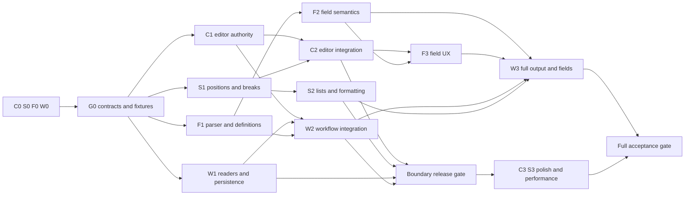

# A4Editor implementation programme

Status: **planning complete; implementation not started**. Prepared 10–11 September 2026 against `c660b47f1731a9262cf722197907e21f8e3e98fe`.

This is the execution plan for the [technical and UX review](../2026-09-10-a4-editor-technical-ux-review.md). The review owns evidence, reproductions, severity and A4E ticket IDs. This folder owns the proposed contracts, agent assignments, ordered changes and deployment gates. No application changes or deployments were performed while preparing these plans.

For the user's environment without delegation, use [manual instance prompts](manual-instance-prompts.md). Start CORE first, then manually start/resume the other instances using shared assignments and handoffs. That document replaces any automatic dispatch/messaging assumptions below and provides a shared-checkout protocol; the technical contracts, ownership and gates remain unchanged.

## Objective and first milestone

Make ordinary document writing safe across visual page boundaries. The first user-visible milestone must eliminate the reproduced loss of later pages after Enter and immediate typing, wrong-location Backspace after a manual break inside a list, cross-page Enter no-op, and misleading multi-page deletion. Field/workflow/output work must follow the same document contracts so it does not reintroduce these failures.

Keep the custom HTML-backed editor, existing A4 layout engine and canonical Oakcloud services. Do not introduce TipTap/ProseMirror as a replacement, a new persistence stack, or agent-specific generation logic. Extract responsibilities only where the implementation needs a clear owner and testable boundary.

## Read order for a fresh agent

1. Root and nearest `AGENTS.md`; this README.
2. Review sections A–C and the A4E tickets assigned to your packet. Read review H/J for shared behavior and baseline test commands.
3. [Shared contracts](contracts.md). Proposed signatures are design contracts, not APIs that already exist.
4. Your workstream plan: [editor core](editor-core.md), [document semantics](document-semantics.md), [fields](fields-and-templates.md), or [persistence/output](persistence-and-output.md).
5. [Verification and rollout](verification-and-rollout.md), particularly the gate for your packet.

The older August plans are historical context. This plan supersedes their task ordering and assumptions where the September review found new failures. Do not reinstall a plugin or invoke a missing skill merely because a historical plan names it.

## Working rules and authority

- Implement only the dispatched packet and prerequisites explicitly assigned to you. Preparing this plan does not start implementation or authorize a production deployment.
- Recheck the current branch before editing. The review baseline was clean application code; do not assume later concurrent changes are absent.
- Node must be 24. Use the repository's established tests and migration tooling. Never reset a database or alter an unrelated migration.
- Preserve authentication, permissions, tenant scoping, audit records, finalized-document locks, generation fingerprints and task/service boundaries.
- Use synthetic data in tests. Do not put credentials, real client content, tokens or screenshots containing sensitive data in plans, commits or logs.
- No timing workaround may require a user to pause typing or prevent ordinary input during every repagination.
- Do not mark source-only risks as fixed merely because a refactor looks plausible. Turn each into an executable regression or document the remaining release gate.
- Existing generated documents are snapshots. New field or template behavior must not silently regenerate them.

## Roles and parallel capacity

Use **four concurrent agents maximum, including the integrator**. The integrator also owns editor core implementation. Three worker slots handle semantics, fields, and persistence/output. An independent verification agent uses a freed worker slot at each gate; do not start a fifth concurrent agent.

| Role | Responsibilities | Plan |
| --- | --- | --- |
| I / CORE | Contract arbitration, integration branch, editor authority/input/history, toolbar wiring, final gates | [Editor core](editor-core.md) |
| S / SEMANTICS | Structural selection, pure commands, list/break representation, pagination and shared layout CSS | [Document semantics](document-semantics.md) |
| F / FIELDS | Field parser/registry, lossless definitions, scoped resolution, field panel UI | [Fields and templates](fields-and-templates.md) |
| W / WORKFLOW | Service/API/persistence, route and batch adapters, preview/save/drafts, HTML/PDF output and migrations | [Persistence and output](persistence-and-output.md) |
| Q / VERIFY | Independent reproduction and acceptance review of integrated commits; no concurrent production-file ownership | [Verification and rollout](verification-and-rollout.md) |

Planning parallelism does not mean four agents can safely edit the same editor file. The ownership below is a hard coordination constraint. A worker can propose a patch for another owner in its handoff, but that owner applies it after agreement.

## Exclusive file ownership

Paths are relative to repository root; directories include new files added within their stated responsibility. New shared contracts require integrator review before use.

| Owner | Exclusive production scope | Important boundary |
| --- | --- | --- |
| CORE | `src/components/documents/a4-page-editor.tsx`, `a4-editor-toolbar.tsx`; proposed editor-session/native-input/history modules; shared editor session contract types | No other agent edits these files. W supplies route adapter requirements; S supplies commands and projection mapping; F supplies field decoration/transactions. |
| S | `a4-pagination/model.ts`, `selection.ts`, `document-actions.ts`, `formatting.ts`, `engine.ts`, `measure.ts`, `layout.ts`, `a4-page-layout.ts`, `a4-page-content-css.ts`, `a4-font-faces.ts`; `a4-print-styles.ts`; `src/lib/document-page-breaks.ts` | S owns structural positions, hard-break semantics and browser-neutral style contract. W consumes these for PDF. |
| F | `src/components/documents/template-editor/*` except any route-level wrapper; `src/types/placeholders.ts`; `src/lib/template-placeholder-storage.ts`, `template-analysis.ts`, `placeholder-resolver.ts`, `document-generation-master-fields.ts`; proposed field parser/registry and shared content-policy definition | F owns field/domain meaning and sanitization policy data. W owns validation/API wiring and server DOM adapters; CORE owns editor sanitization/decoration wiring. |
| W | Template/partial and generated-document route pages; `src/components/documents/generation-batch/*`; document template/partial/generator/export services and batch service directory; their APIs/validation schemas; Prisma changes; server font adapter; pagination bundle build script and generated bundle | W owns each large route file in full. F must not edit template page or batch field form directly. CORE must not edit batch review to add props concurrently. |
| I | `package.json`, lockfile, test/configuration changes, integration documentation and ownership manifest | Worker requests these changes; only I applies them. W generates Prisma/bundle artifacts in its isolated worktree, then I reviews integration. |

Existing `src/hooks/use-unsaved-navigation-guard.tsx` remains unchanged unless W demonstrates a missing shared capability; W requests an explicit lease before changing a hook used outside documents. Service helpers outside the listed scope follow the same rule. Do not expand ownership by matching a broad filename substring.

Test ownership mirrors production boundaries, with named new files to avoid collisions:

- CORE: existing A4 component/toolbar tests; new `a4-input-sequences.browser.test.tsx` and `a4-editor-session.test.ts`.
- S: existing `__tests__/components/a4-pagination/*`; new `a4-boundary-semantics.browser.test.tsx`.
- F: template-editor component/lib resolver/storage tests; new scoped-field/grammar fixtures.
- W: route/batch/service/API/persistence/output tests and `batch-custom-field-form` tests.
- Q: new acceptance files after agreement. Existing `__tests__/browser/a4-page-editor.browser.test.tsx` is initially leased to CORE; Q proposes a focused patch if the blank-page test needs correction.

## Workspace and integration protocol

Prefer one `codex/` branch/worktree per active packet, created from the recorded integration commit. A spawned subagent shares the current checkout by default: isolated worktrees must be assigned explicitly. If worktrees cannot be used, enforce file leases in one checkout and reserve all git checkout/reset/staging, dependency installation and generated-output commands for I. Never run those operations concurrently in a shared checkout.

At dispatch, I records: packet ID, agent, starting commit, contract version, owned files, prerequisites, expected outputs and acceptance gate. Plans must be present in each worktree; untracked documentation is not automatically included in a new worktree.

On completion, the worker returns:

```text
Packet / baseline commit / resulting commit(s) or focused patch
Contract version consumed and exported interfaces
Files changed; any proposed changes in another owner's files
Behavior before/after; mapped A4E acceptance criteria
Commands actually run and results; blocked checks and exact reason
Compatibility, migration and rollout implications
Known risks; remaining packet dependencies
```

I reviews the diff and tests before integrating. Workers do not merge one another's branches or change an agreed contract silently. For a contract change, describe the change and impacted consumers, obtain the integrator's technical decision, update `contracts.md`, and publish one new common base. Dependent agents may continue independent tests/inventory while waiting.

After integration, rebase/restart the next dependent packet from that commit. Parallel integration order follows dependencies, not whichever branch finished first. No agent declares a feature complete from a branch-only test if route wiring or output compatibility is still pending.

Use this dispatch envelope for each later packet, alongside the initial prompts in the workstream plans:

```text
Implement packet: <C1/S1/F1/W1/etc.>
Working directory and branch: <assigned isolated worktree or explicit shared lease>
Start from integration commit: <verified commit>
Read: README.md, contracts.md at <contract version>, <workstream plan>,
      and review tickets <assigned A4E IDs>.
Prerequisites already integrated: <producer packet commits and exported APIs>
Exclusive writable scope: <owned files/tests; note any temporary leases>
Objective and ordered steps: <the named packet section in the workstream plan>
Required evidence: <packet acceptance and applicable G1/G2/G3/G4 gate>
Do not implement: <later packets or other owners' files>
Return: focused commit/patch, API examples, actual checks/results, compatibility
        implications and any exact blocked dependency using the handoff format.
```

I advances to the next authorized implementation wave when its technical gate passes; ordinary gate completion does not require asking the user to reconfirm the same implementation scope. Production rollout remains a separately scoped action.

## Work packets and dependency graph

| Packet | Objective | May start after | Required deliverable |
| --- | --- | --- | --- |
| C0 | Freeze shared interfaces, input event inventory and acceptance harness | This plan | Contract implementation locations and initial sequence regressions |
| S0 | Prove structural break/selection design on legacy and nested-list fixtures | This plan | Executable codec/projection proof; no production writer enabled |
| F0 | Inventory field grammar/types/legacy schemas and sanitizer differences | This plan | Compatibility fixtures and exact parser/type contract |
| W0 | Inventory writers, API consumers, output paths and deployment capabilities | This plan | Writer matrix, migration/rollout checklist and real output fixture |
| C1 | Canonical authority, native input revision safety and session history | G0 | Current snapshot API, zero stale-DOM overwrite, isolated history |
| S1 | Structural positions, semantic commands and v2 break readers/projection | G0 | C02/C03 adapters and tested pure operations |
| F1 | Shared parser/field registry/lossless adapters/content policy | G0 | C05/C06 modules and compatibility tests |
| W1 | Reader expansion, output fail-safe and persistence revision plumbing | G0; consume S1/F1 as available | Server reads old/new features, safe export, additive API/schema changes |
| C2 | Wire semantic commands/field hooks into editor; remove physical mutation path | C1 + S1 | Native cross-page tests pass with new contracts |
| S2 | List/Enter/indent/numbering and formatting correctness | S1 | Pure and native boundary/list regressions |
| F2 | Scoped field resolution, escaping and atomic lifecycle operations | F1 | Semantic field transactions and renderer integration request for W |
| W2 | Current-revision save, batch identity/layout, preview and draft integration | C1 + F1 + W1 | All route adapters use snapshot/concurrency contracts |
| C3 | Toolbar/capabilities, accessible focus and local print wiring | C2 + S2; F3/W3 for final integration | Clear contextual controls and consistent output entry point |
| S3 | Font/pagination parity and measured performance improvements | C2 + S2 + W1 | Full/incremental equivalence and bounded oversized behavior |
| F3 | Protected field UX, typed forms contracts and contextual discovery | C2 + F2 | Field panel complete; W applies batch/template route integration |
| W3 | Full field/preview/output integration and compatibility rollout readiness | W2 + F2 + S2; finish with F3/S3/C3 | Publish output/schema producer commits early; then end-to-end generation/output and migration acceptance |
| Q1/Q2 | Independent gates on integrated commits | The relevant packet set | Reproductions, semantic/PDF evidence and release decision |



## Actual parallel dispatch waves

| Wave | Integrator / CORE | Slot 2 | Slot 3 | Slot 4 | Wait/merge rule |
| --- | --- | --- | --- | --- | --- |
| 0 | C0 | S0 | F0 | W0 | Freeze G0 before production contracts diverge. Investigations/tests can run together. |
| 1 | C1 | S1 | F1 | W1 | W1 can build fail-safe/revision plumbing first; adopts reader/policy exports only after S1/F1 are integrated. |
| 2 | C2 | S2 | F2 | W2 | C2/W2 wait for C1 exports. Do not let W2 reimplement editor snapshot logic. |
| 3 | Integrate boundary gate | S verifies boundary/output mappings | F prepares F3 | Q1 replaces W after W1/W2 finish | W is paused/idle during Q1. Defects return to their owner; Q1 does not patch production files. |
| 4 | C3 | S3 | F3 | W3 | W3 owns all final route wiring; C3/F3 exchange typed interfaces, not overlapping edits. |
| 5 | Full integration/release evidence | Q2 in freed S slot | F fixes assigned defects | W fixes assigned defects | No performance work continues in S-owned files while Q2 acceptance is based on a supposedly stable commit. |

Slots may be reused as packets finish. A blocked agent should report the exact missing contract/commit and continue a listed independent task, not invent a second implementation. If an owner needs another slot to finish a release blocker, pause a later-phase task first.

W3 and C3 have an integration rendezvous, not a circular start dependency: W first publishes the shared print/schema/input producer commits from W3, then CORE consumes them in C3, then W/Q verify the complete route/output flow. F3 follows the same pattern for field panel exports. Do not wait for the producer packet's final end-to-end sign-off before publishing its stable interface implementation.

## Ticket coverage and completion ownership

The owner listed first signs off the ticket; collaborators provide specific acceptance evidence.

| A4E | Owner / packets | Completion dependency |
| --- | --- | --- |
| 001 | CORE C1/C2 | Q1 native rapid-input persistence evidence |
| 002 | S S1 + CORE C2 + W W1 | New break read/write/output compatibility gate |
| 003 | CORE C2 + S S1 | Native cross-page selection tests |
| 004 | CORE C2 | Scope/blank-page recovery tests |
| 005 | CORE C1 + W W2 | Two-item batch switch/history test |
| 006 | S S2 | Order-preserving list conversion |
| 007 | S S2 + CORE C2/C3 | Tab/toolbar equivalence |
| 008 | S S2 + W W3 | Imported/start/continue PDF parity |
| 009 | S S2 + CORE C2 | Enter inheritance and nested exit |
| 010 | S S2 | Empty paragraph and unit round-trip |
| 011 | S S1 + CORE C2 | Structural/Unicode/IME selection gates |
| 012 | CORE C2 + S S2 | Collapsed clear and mixed states |
| 013 | F F1/F3 + CORE C2 + W W3 | Atomic tokens/shared grammar through generation |
| 014 | F F2 + W W3 | Escaping and legacy rich-field compatibility |
| 015 | F F2/F3 + CORE C1 + W W2/W3 | Whole-snapshot lifecycle/history |
| 016 | F F1/F3 + W W3 | Typed defaults and batch form behavior |
| 017 | F F1/F2 + W W3 | Scoped partial rendering and lossless schema |
| 018 | F F1 + S S1/S3 + W W1/W3 + CORE C2 | Shared policy across all readers/writers |
| 019 | W W1/W3 | Failure-injected real PDF checks |
| 020 | W W3 + CORE C3 + S S3 | Local/server output assembly and settings |
| 021 | W W1/W2 + CORE C1 | Server concurrency plus exact client snapshot |
| 022 | W W2 | Draft/autosave/navigation recovery |
| 023 | F F1 + CORE C2/C3 + S S2 | Real clipboard import/undo |
| 024 | W W2 | Per-item contentJson preservation |
| 025 | CORE C3 | Staff discoverability and capability checks |
| 026 | CORE C3 + F F3 + W W3 | Keyboard/screen-reader route acceptance |
| 027 | W W2/W3 + F F1/F2 | Current preview and navigable diagnostics |
| 028 | S S3 + CORE C1 + W W3 | Measured performance and font/output parity |
| 029 | I + Q1/Q2; all owners | Stable integrated suite, no relaxed assertions |
| 030 | F F3 + CORE C3 + W W3 | Contextual field discovery/insertion |

## Staggered deployment recommendation

Implementation waves and production deployments are different. Several waves may integrate before the first user-visible release. Detailed procedures are in [verification and rollout](verification-and-rollout.md).

1. **D0 — compatibility and containment:** expand server/browser readers for the new break contract, add safe export failure behavior and additive revision support; keep new-format writers off. Optional page-action containment may ship after its own test. Do not claim cross-page editing is fixed yet.
2. **D1 — cross-page editing:** deploy C1/C2/S1/S2 and necessary W1/W2 adapters as one tested release. Enable new-format writes only after every reader/export worker supports them. This is the first release addressing the main user complaint. Preserve the field system's existing syntax while field work continues.
3. **D2 — fields and workflow:** enable protected field authoring, scoped/typed resolution, deliberate escaping policy, complete draft/preview/save lifecycle and final output contracts after compatibility tests. This closes the remaining field/workflow content-integrity tickets.
4. **D3 — usability and measured performance:** toolbar/accessibility refinements and proven pagination optimizations, followed by staff acceptance. Small independent accessibility/key-label improvements may ship earlier when they do not alter contracts.

No fixed dates are promised. Promotion is by acceptance gate. D1 may be a limited pilot while known field integrity work remains; it is not a declaration that every P0 in the review is resolved. Do not expand a pilot to untested document types. If the deployment system has no cohort controls, use a staging-only pilot and ship a complete gated release rather than inventing an unsafe partial rollout.

## Coordinator completion checklist

- [ ] Record a new baseline/ownership manifest and dispatch only Wave0.
- [ ] Freeze G0 contracts and codec proof; publish the common base.
- [ ] Dispatch Wave1 with exclusive leases and acceptance fixtures.
- [ ] Integrate producers before consumers; update contracts explicitly when evidence requires it.
- [ ] Require Q1's independent boundary gate before D1.
- [ ] Keep field/parser/save/output changes coordinated through W's route ownership.
- [ ] Require old/new format and concurrency compatibility before writer/validation enforcement changes.
- [ ] Complete Q2 and staff Journeys A–D; record real checks, not planned checks.
- [ ] Update ticket status and deployment evidence in this folder and the review without erasing historical baseline results.
