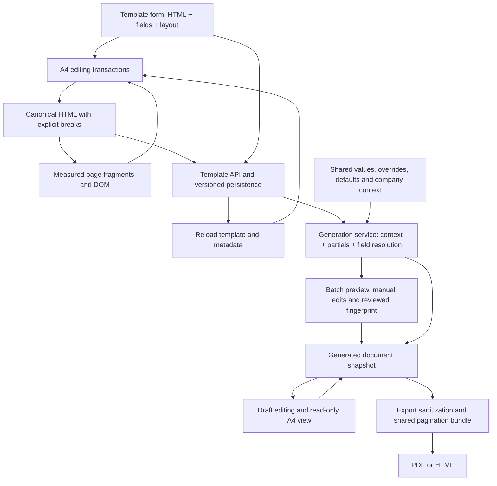

# A4Editor technical and usability review: implementation handover

Reviewed: 10 September 2026. Baseline: `c660b47f1731a9262cf722197907e21f8e3e98fe`.

Scope: Templates, template partials, Document Generation batch review, generated-document editing/viewing, field resolution, HTML/PDF export, and editor print. This is a review and implementation blueprint. No application fixes, migrations, or dependency changes were made.

Execution companion: the [parallel implementation programme](2026-09-10-a4-editor-implementation/README.md) adds shared contracts, per-agent work packets, exclusive file ownership and staged deployment gates. The review below remains the evidence baseline; the companion's interfaces are proposed implementation contracts, not already implemented APIs.

**Primary user complaint:** page breaks and Enter, Delete/Backspace, and lists become malformed across pages. Treat the boundary-editing failures below as the first implementation milestone, ahead of toolbar polish or additional features.

## A. Executive summary

The editor has a useful foundation: a shared A4 layout contract, a canonical HTML representation that excludes automatic page boundaries, logical selection bookmarks, pure editing commands, a pagination engine reused by PDF export, tenant-aware generation services, and substantial regression coverage. Replacing the entire editor is not justified by this review.

However, it is not yet reliable enough for users to trust normal editing of long business documents. A native keystroke can overwrite a newer logical edit with stale page DOM. In a visible, idle Chromium editor containing a three-page, 30-item list, Enter followed immediately by typing on page 2 left only items 1–13 in both the editor and its parent save value. This reproduced three times. Manual page-break insertion follows a different, physical-page mutation path: it duplicates a list item's identity across the break, restarts numbering, and can cause Backspace on the new page to delete text on the preceding page. These are content integrity defects, not cosmetic pagination problems.

The user experience also asks staff to manage the editor: distinguish several page actions, understand two kinds of indentation, repair editable field syntax, find common controls in an overflowing toolbar, and infer what save and preview states mean. The expert heuristic usability score is **2/5 overall**. This is not a score from a user study.

| Primary cross-page complaint | Reproduced result | First implementation ticket |
| --- | --- | --- |
| Enter, then immediate typing on page 2 | Three-page list shrank from 30 items to 13; the parent save value also lost the content | A4E-001, P0 |
| Manual break inside an item, then Backspace on the new page | Extra list item, restarted numbering, duplicate identity; Backspace deleted preceding-page text instead of the break | A4E-002, P0 |
| Enter with a selection spanning two pages | No change; selection remained | A4E-003, P1 |
| Delete current page on a soft continuation | Deleted the whole three-page section when another hard section existed | A4E-004, P0 |

The highest-impact work is:

1. Establish one authoritative edit transaction and revision before further pagination changes. Eliminate stale DOM overwrites and isolate history by document identity.
2. Make Enter, Delete/Backspace, list editing, and manual breaks operate on the logical document regardless of the visual page. Fix hard-break identities and selection mapping together.
3. Protect field references, make definitions and references change atomically, and align validation with resolution.
4. Preserve the same supported content and layout across editor, save/reload, generation, preview, and PDF.
5. Simplify controls, improve contextual state, and add familiar keyboard behavior after those guarantees hold.

### Evidence and confidence

Findings explicitly distinguish **reproduced**, **source-confirmed**, and **risk requiring a targeted runtime test**. A pure command/adapter probe proves its behavior, but does not by itself prove every production UI route reaches it. Existing tests that pass are recorded as passing; old remediation documents are context, not evidence that an old bug still exists.

| Review activity | Result and limits |
| --- | --- |
| Source review | Traced active template, batch, standalone document, generation, and output paths. A4Editor is custom `contenteditable`, not TipTap. |
| Focused Node 24 Vitest run | **307 tests passed in 21 files**. Formatting, page editor, pagination, template editor, placeholder storage, SSR, print styles, and export layout. |
| Focused Chromium Vitest browser run | **52 passed, 1 failed in 3 files**. Blank-page add/delete test failed; isolated rerun also failed, at its delete assertion rather than add assertion. This is an unresolved gate, not proof of one deterministic root cause. |
| Browser fixture | Mounted the actual A4PageEditor, field panel, CSS, layout, and command modules, with synthetic content and a controlled React parent. Native keyboard/pointer actions plus explicit DOM Range positioning. Confirmed boundary races, hard-break identity problems, list order reversal, field/formatting behavior, and document-switch history. |
| Authenticated template workflow | Created a disposable template, typed content, created/inserted a required date field, saved, reopened, replaced content with a list/table/manual-break fixture, and saved again. No existing business document was edited. |
| Generation workflow | Walked the batch picker and shared setup. Shared setup requires a primary company, including for the synthetic company-independent template. Used the canonical authenticated create-from-template API without a company for the output check; did not claim completion of the four-stage batch UI. |
| Resolved document and output | Created a DRAFT through the real service/API; the date resolved to “10 September 2026.” Read-only document view loaded. HTML export returned 200; PDF export returned 200 and two A4 pages. Rendered and inspected both PDF pages. Quote indentation and caption structure differed from editor content. |
| Cleanup | Discarded the one review batch and soft-deleted the review document and template through their canonical APIs; all returned 200, and subsequent reads returned 404. Ordinary audit/recycle-bin retention remains. No finalization, signing, emailing, or filing performed. |
| Not run | Full lint/typecheck/build (documentation-only change); production release smoke; Firefox/Safari; real IME, screen reader, touch; actual Word/Google Docs/Outlook clipboard transfers; offline/concurrent-user save failure injection; letterhead PDF parity; full service-agreement/task-launched generation journey. These remain explicit acceptance gates. |

The baseline browser suite already passes important simple cases: ordinary Enter and list splitting, empty-list exit, explicit break removal with Backspace/Delete, cross-page text replacement/deletion, nested-list continuation markers, table-row pagination, word-boundary pagination, scroll preservation, and selected-formatting regressions. The missing coverage is especially **sequences while a new pagination render is pending**, and manual-break insertion followed by edits to the resulting fragments.

## B. Current architecture

### Runtime and document representations

Oakcloud uses Next.js 15, React 19, TypeScript, Prisma 7/PostgreSQL, Vitest, and Chromium browser tests. Node must be `>=24 <25`; this review used Node 24.19.0 for tests because the default shell Node is 22.19.0.

A4Editor does not instantiate a TipTap/ProseMirror editor or its list/page-break extensions. Although TipTap dependencies exist in the repository, changing those extensions will not repair this editor. The editing host is one outer `contentEditable` surface containing several rendered A4 page-content elements. Page chrome is outside the editable text. Native browser input, custom `beforeinput` handling, explicit keyboard commands, and DOM transactions all participate in editing.

| Representation | Owner and role | Persistence rule |
| --- | --- | --- |
| Canonical HTML | Paragraphs/headings, inline markup, lists, tables, placeholder syntax, and explicit hard breaks | Stored in template/document `content`; automatic pages must never become stored breaks. |
| Runtime flow HTML | Canonical content augmented with `data-flow-id`, continuation attributes, and generated counter offsets | Temporary identity/projection metadata; stripped during serialization. |
| `PageData[]` | Editor state/ref holding fragments with page IDs, `hardBreakBefore`, and oversized flags | Derived from canonical content, but currently also acts as a write source; this dual role causes A4E-001. |
| DOM and selection | Browser editable DOM; bookmarks `{flowId, offset}` for anchor/focus | Selection is not stored in history; offsets count text only. |
| `contentJson` | Versioned metadata wrapper containing A4 layout and other feature metadata | **Not** a rich-text node tree. Preserve unknown keys when merging layout. |
| Field definitions | `DocumentTemplate.placeholders` / partial placeholder JSON | Separate from raw `{{...}}` references in HTML; must remain consistent. |
| Generated snapshot | Resolved HTML, layout metadata, placeholder context, template version, dependency metadata, document sections | Later edits change the draft snapshot; do not silently regenerate existing documents from updated templates. |

The default A4 canvas is 794 × 1123 CSS pixels, corresponding approximately to 210 × 297 mm at 96 dpi. Default margins are 20 mm on all sides, leaving approximately 642 × 971 px. Layout version 1 includes font family, font size, line height, paragraph spacing, and margins. Editor page-number visibility is separate local UI state. Physical pixel rounding alone is not evidence of a serious parity defect.

### Code map

Line numbers are baseline navigation hints; symbols are the durable reference.

| Ref | File / main symbols | Responsibility |
| --- | --- | --- |
| ED | [a4-page-editor.tsx][ED]: `A4PageEditor`, `parsePages` (734), `scheduleReflow` (839), `commitDocumentSurface` (1201), `commitUserTransaction` (1409), `handleKeyDown`, `handleBeforeInput`, `splitActivePageAtSelection` (2115), `handlePrint` | Editing host, DOM synchronization, history, selection, toolbar dispatch, pagination and local print. Approximately 2,955 lines. |
| TB | [a4-editor-toolbar.tsx][TB]: `ToolbarButton`, `A4EditorToolbar` | Formatting controls, selection-preserving mouse bridge, tables, lists, page controls. |
| MO | [model.ts][MO]: `hydrateFlowHtml`, `normalizeEditedFlowIds`, `reassemblePageFragments`, `stripFlowMetadata`, `ensureEditableCanonicalHtml` | Runtime identities and canonical/fragment round trips. |
| SE | [selection.ts][SE]: `captureFlowSelection`, `restoreFlowSelection`, `domPointForFlowPoint` | Text-offset bookmarks across page fragments. |
| AC | [document-actions.ts][AC]: `insertParagraphAtSelection`, `applyLogicalDelete`, `replaceFlowSelection`, `insertHardPageAtSelection`, `appendHardPage`, `deleteHardPageSection`, `removeHardPageBreak` | Canonical content mutations, structural Enter, deletion, insertion and table editing. |
| FM | [formatting.ts][FM]: `applyListToSelection` (1146), indent/outdent (1265/1290), sink/lift (1364 onward), list start (1479), `readLogicalFormatState` (1777) | Formatting/list commands and toolbar state. |
| EN | [engine.ts][EN], [measure.ts][ME] | DOM-measured pagination, paragraph/list splitting, tables, heading grouping and oversized fallbacks. |
| LA | [layout.ts][LA], [a4-page-layout.ts][PL] | Shared layout schema, normalization, metadata extraction/merge and geometry. |
| CSS | [a4-page-content-css.ts][CS], [a4-print-styles.ts][PS], [font faces][FF] | Editor and print styles, list counters, bundled font aliases. |
| PB | [document-page-breaks.ts][PB] | Hard-break serialization and normalization of legacy soft markers. |
| TE | [template editor page][TE] | Template/partial loading, form state, dirty guard, preview (1475), save (1543), field-definition updates (1353). |
| FP | [placeholder-panel.tsx][FP], [template-editor-panel.tsx][TP] | Field discovery, field form, syntax/builders, validation issue display. |
| FV | [template-validation.ts][FV], [template-field-catalog.ts][FC], [template-editor-state.ts][TS], [template-insertion.ts][TI] | Client validation, field catalog, removal helper and insertion adapter. |
| FS | [template-placeholder-storage.ts][FS], [template-analysis.ts][TA] | Editor/storage adapters, alternative field adapter, diagnostics, partial dependencies and field merging. |
| BW | [document-generation-batch-workspace.tsx][BW], [batch-review-workspace.tsx][BR], [use-document-generation-batch.ts][BH], [batch-custom-field-form.tsx][BF] | Four-stage workflow, item selection, preview editing, autosave/conflicts, field population. |
| MF | [document-generation-master-fields.ts][MF] | Shared-field catalog and value precedence. |
| GE | [generated-document edit page][GE], [generated-document view page][GV] | Standalone draft edits, draft recovery UI, save/export, read-only A4 preview. |
| DG | [document-generator.service.ts][DG]: `renderTemplateForGeneration` (293), `materializeDocumentFromTemplate` (649), `updateGeneratedDocument` (950), `finalizeDocument` (1020) | Canonical tenant-aware rendering, snapshots, persistence, status and audit boundaries. |
| DT | [document-template.service.ts][DT] | Template persistence/versioning, tenant scoping and deletion. |
| RS | [placeholder-resolver.ts][RS]: `resolvePlaceholders`, `processPartials`, `formatResolvedValue` | Handlebars-inspired custom resolver, partials/loops/conditions/modifiers and simple replacements. |
| EX | [document-export.service.ts][EX]: `exportToPDF`, `generatePDF`, `sanitizeExportPage`, `buildPaginatedSectionsHtml`, `buildPDFHtml`, `exportToHTML` | Puppeteer PDF and HTML output, sanitization, page assembly. |
| BP | [batch preview service][BP] and [batch service directory][BS] | Effective values, dependency fingerprints, reviewed state, preflight, revisioned persistence and execution. |
| DB | [schema.prisma][DB]: `DocumentTemplate` (882), `GeneratedDocument` (912), `DocumentGenerationBatch` (961), `DocumentGenerationBatchItem` (987), `DocumentDraft` (1107) | Durable data contracts. |

### Entry points and boundaries

- `/template-partials/editor?type=template&id=...` and `type=partial` share the editor. Template details hold document-level layout; partials inherit their destination layout.
- `/generated-documents/generate` uses the batch workspace. The current review editor changes `value` when active item changes, without a document identity key.
- `/generated-documents/[id]/edit` edits a DRAFT. `/generated-documents/[id]` uses A4PageEditor read-only. The older `generatePreviewHtml` export helper has no located runtime callers; its standalone layout is not treated as an active preview defect.
- APIs: `/api/document-templates`, `/api/document-templates/[id]`, `/api/document-templates/render-test`, `/api/template-partials`; `/api/document-generation-batches` and its item preview/review/preflight/generate routes; `/api/generated-documents`, `/[id]`, `/[id]/draft`, `/[id]/export/pdf`, `/[id]/export/html`, `/[id]/finalize`.
- Existing routes enforce authentication, permissions and session workspace/tenant identity; generation loads scoped templates/partials and records authoritative snapshots/audits. Preserve these boundaries. This review did not perform a penetration test or cross-tenant audit.

## C. End-to-end data flow



The `P → E` arrow is the critical weakness: native input re-reads a rendered projection that may lag behind the logical transaction. It must become a revision-aware native-input adapter, not an unrestricted replacement source.

1. **Load:** query template/partial; convert stored fields to editor definitions; extract layout from `contentJson`; hydrate runtime flow IDs; measure and render pages. Legacy soft markers normalize away, while `.page-break[data-break-type="hard"]` remains explicit. Metadata adapters preserve many legacy fields, but unsupported types and renames have defects below.
2. **Edit:** native input commits live page HTML; toolbar and structural commands operate on canonical HTML and bookmarks; `scheduleReflow` defers measurement for two animation frames. It reassembles all fragments, measures the full content and publishes rendered pages. Soft list fragments carry continuation IDs and counter offsets. This works in many settled-state tests.
3. **Save template:** delayed `onChange` updates form HTML. Save sends form content, field definitions and merged layout metadata. Template service persists and increments version. There is no expected-version write contract comparable to batch revisions. Successful mutations navigate back to the template list.
4. **Test preview:** template editor calls `render-test` with content and mock context/custom data. Its current payload does not include the full unsaved definition/default/layout/composition contract. The UI consumes preview HTML but not all returned diagnostics. Test preview is separate from the generation preview contract.
5. **Populate generation fields:** batch derives fields from template plus partial definitions, combines shared values and item overrides, and previews through the canonical renderer. Effective custom value order is item value, prefixed item value, document override, master/shared value, template default. Required-value completeness and reviewed fingerprints are useful safeguards.
6. **Resolve:** load tenant-scoped template and dependencies; build company/contact/party/service context; expand partials, loops/conditions and modifiers; resolve values; collect diagnostics and section anchors. Field values can change content length and require fresh pagination. Simple strings currently enter HTML without universal escaping.
7. **Materialize:** preserve resolved or manually edited content, metadata/layout, template version, input context and dependency snapshot. Service-agreement/task integrations stay on canonical service paths. Batch review invalidates reviewed state on edits and confirms replacing manual content during refresh.
8. **Edit/view document:** generated document view uses the same A4 component in read-only mode. Standalone draft save calls editor `getContent`, but dirty/save/navigation protections differ from Templates and batch. Finalization locks editing; it was not invoked in this review.
9. **Output:** PDF service builds sanitized hard sections, loads a generated browser bundle of the same pagination engine, measures, assembles physical pages and prints with Puppeteer. HTML export is returned in a JSON payload containing HTML and sections. Local editor print builds a hidden iframe from currently rendered pages and uses separate timing/filtering. These are different output paths and must share fidelity tests.

## D. User journeys

### Journey A — Create, save and use a template

**Performed:** authenticated creation; named a disposable resolution; typed paragraphs; created a required date field with a default; inserted it at a remembered caret; saved and reopened; pasted a synthetic heading/list/nested-list/quote/table/manual-break fixture; saved again; generated through the canonical API and inspected output. Heading/list controls and nesting were separately exercised in the real-component fixture. Company/client insertion was traced and fixture-tested; an actual company was not attached to this synthetic document.

The creation screen makes fields available without leaving the workflow, and save/reload preserved the inserted date reference, definition and layout. But sequential typing merged intended paragraphs into one, and typing “Meeting date” generated internal key `m` until manually corrected. A staff member should not need to repair that key. The field is displayed as editable syntax. Page creation has several overlapping actions. Export resolves the date and retains the hard break but changes supported formatting. Main tickets: A4E-001, 002, 013–018, 024–027.

**Desired journey:** name template, write with familiar controls, choose “Insert field,” define and insert a labeled field in one flow, use “Page break” only for an intentional new page, see missing data beside the field, save a known revision, and preview with explicitly labeled sample values. No HTML, flow IDs or syntax knowledge should be necessary.

### Journey B — Edit an existing template

**Performed:** reopened the saved review template, edited and replaced its content, inserted the custom field, and saved again. List conversions, indent, Enter, selection, and page-break combinations were exercised against the actual editor fixture. Existing customer templates were read through source/compatibility contracts, not modified.

Prepending two paragraphs to an existing list reverses their order. Indent changes spacing instead of list hierarchy; Tab leaves the editor. Mid-paragraph Enter drops block alignment/indentation. At a visual boundary, settled Enter can work, while immediate typing can discard later pages. A manual break within a list creates separate numbering and duplicate identities, so later deletion affects the wrong location. “Delete current page” on the second soft page of a three-page section deletes all three pages when another hard section exists. Main tickets: A4E-001–004, 006–010.

**Desired journey:** identical commands and selection behavior before/after a visual page boundary; spacing and list structure survive edits; explicit breaks are visible and removable; deleting a page never silently deletes additional pages.

### Journey C — Generate and adjust a document

**Performed:** selected the disposable template in the batch UI, reached shared setup, observed mandatory company selection and no shared fields for a single template. Avoided attaching unrelated company data; created the company-independent synthetic document through the existing create-from-template API. Read-only A4 view and actual two-page PDF/HTML exports were inspected. Batch manual adjustment/review was traced and its same-editor value switching reproduced in the component fixture, not represented as a completed batch UI run.

Shared-value precedence, stale-preview fingerprints and review gating are strengths. However, the same editor retains undo history across active items, per-item edited layout metadata can be discarded, and custom types mostly use generic text inputs. The standalone draft screen offers recovery plumbing but its autosave callback is unused. Test preview and generation preview convey different completeness information. Main tickets: A4E-005, 014–019, 022–024, 027–029.

**Desired journey:** choose documents and context, enter human-labeled typed values, inspect missing values in place, make manual edits, review exactly that revision and export matching content. Changing a document in the queue must restore that document's own history and layout.

### Journey D — Recover from mistakes

**Performed:** keyboard undo/redo and selected-formatting/browser regression tests; fixture history across document changes; collapsed Clear formatting followed by typing; wrong-location page break, nested-list exit and accidental page deletion probes. Field definition deletion/rename recovery was traced through form/editor state and adapter probes.

Undo is present but snapshots contain HTML only, are not grouped into user-intent transactions, do not restore the original caret, and survive document changes. It cannot atomically restore field definitions with their references. “Clear formatting” can show a cleared state yet keep subsequently typed text bold. Removing a break after splitting a list does not have reliable semantic identity. Main tickets: A4E-002, 005, 010, 012–015, 021–023.

**Desired journey:** one undo reverses one deliberate action and returns the caret; redo restores it; fields and their definitions recover together; paste can be undone in one step; failed saves retain edits and explain recovery. A user should never need to inspect markup to recover content.

### Formatting and interaction coverage

| Area | Current support and observed limits |
| --- | --- |
| Paragraphs / headings | Paragraph plus H1–H3 toolbar choices; sanitizer accepts H1–H6. End-of-heading Enter retains the heading; middle Enter loses block styles. Higher headings loaded from paste have no matching choice. |
| Bold / italic / underline | Explicit range/collapsed commands; selected toggle and pending-format regression tests pass. Mixed selection state samples one endpoint; collapsed clear is incorrect. |
| Strike-through | `<s>`/`<strike>` survive supported HTML; no dedicated toolbar command. Treat as a support-contract decision, not a broken visible button. |
| Font / color / alignment | Supported explicit formatting and toolbar controls. Global layout defaults live separately. No mixed-value presentation; some CSS-derived heading state is misleading. |
| Line / paragraph spacing | Document-level layout settings; no selection-specific spacing controls. Make scope clear before adding more options. |
| Lists / indent | UL/OL, nested-list toggle, marker style, start number, margin indent. Common settled operations pass; semantic Tab/outdent and robust cross-page sequences do not. No explicit “continue numbering” action. |
| First-line indent | Not an exposed capability. Do not implement with spaces/tabs; defer a dedicated control unless real templates require it. |
| Tables | Paste/insert, add row/column and resize; rows paginate atomically. A simple empty-cell typing probe passed. Keyboard cell navigation and tall-row behavior need fuller coverage. |
| Fields | System/custom discovery, insertion, custom definition creation and builders exist; field bodies remain editable text and can be split/corrupted. |
| Keyboard | Ctrl/Cmd+A, undo/redo and boundary delete are intercepted. Enter uses a canonical command except the cross-page selection path. Tab/Shift+Tab are not list commands. Other native shortcuts, arrows, cut and IME need browser parity tests. |
| Paste | HTML allowlist sanitization; plain text becomes paragraph lines. Synthetic list/table paste tests pass. Actual Office/Docs/email clipboard normalization is unverified. |

## E. Usability assessment

Scale: 1 = unreliable or difficult for ordinary work; 2 = substantial assistance/workarounds; 3 = usable with notable friction; 4 = dependable and easy; 5 = consistently clear, efficient and forgiving. Scores are an expert assessment of this build, not population measurements.

| Area | Score | Why below 4 / most important problem | What reaches 4–5 |
| --- | --- | --- | --- |
| Ease of learning | 2 | Technical field syntax, several page actions, two indentation concepts | Labeled field insertion, one page-break concept, contextual indent and concise help. |
| Ease of everyday use | 2 | Users must wait for layout and repair structural surprises | Safe typing at any speed, predictable lists and no content loss. |
| Formatting predictability | 2 | Enter drops block properties; mixed state and clear behavior mislead | Stable inheritance, uniform/mixed states, range and collapsed tests. |
| List usability | 1 | Rapid cross-page editing loses items; break splits restart numbering; Tab exits | Unified list transactions, semantic nesting, continuous numbering and reliable recovery. |
| Page layout usability | 2 | Clear page canvas, but boundary commands can affect the wrong location/section | Pages purely derived; manual breaks have consistent selection/deletion rules. |
| Field insertion usability | 3 | Catalog/search and remembered caret help; raw fields can be malformed | Atomic labeled fields, clear source/details and confirmed insertion location. |
| Custom-field usability | 2 | Generated key bug; rename/delete consequences unclear; types inconsistent | Stable identity, typed inputs, reference-aware rename/delete and defaults preview. |
| Toolbar discoverability | 2 | Long horizontal strip; common actions compete with rare list/page controls | Compact primary groups and accessible contextual menus. |
| Error prevention | 1 | Preventable content loss and malformed fields reach save/render | Transaction invariants, protected fields, current-revision validation and safe delete scope. |
| Error recovery | 2 | HTML-only history crosses documents; field definitions are outside undo | Per-document history of complete edits, caret restoration and draft recovery. |
| Visual feedback | 2 | Active/mixed state, reflow disabling and preview completeness are unclear | Accurate state and short actionable inline messages, without per-keystroke noise. |
| Keyboard behavior | 2 | Tab mismatch; cross-page Enter no-op; hard-break Backspace wrong-target case | Familiar, tested commands independent of page layout, with IME and focus coverage. |
| Template authoring | 2 | Integrated editor/fields are useful, but unsafe save/field lifecycle | One coherent revision for content, definitions, defaults and layout; dependable preview. |
| Generated-document confidence | 2 | Real PDF changes quote/caption structure; output paths differ | Shared schema and layout, actual PDF parity fixtures and explicit failure states. |
| Overall usability | 2 | Content integrity undermines otherwise useful functionality | Complete the boundary-editing and data-integrity gates before feature expansion. |

## F. Findings and implementation-ready tickets

Each A4E entry is both a finding and a ticket: it states the user problem/current and expected behavior, scope, evidence/reproduction, affected code/root cause, technical and UX requirements, dependencies, risks, acceptance criteria and tests. P0 follows the requested definition of content/data integrity; it is not a claim of a security incident. P1 denotes broken core editing/severe UX; P2 workflow/usability; P3 enhancement.

### A4E-001 — Native input can overwrite a pending edit and discard later pages

**Priority / area / scope:** P0; edit state, Enter and pagination; all editable A4 surfaces. **Evidence: reproduced**, including three controlled cross-page trials and authenticated single-page typing.

**Current / impact / expected:** Enter followed immediately by typing can collapse paragraphs or remove later pages. A user reasonably expects a new paragraph/list item and all untouched text to remain, regardless of reflow timing.

**Reproduce:** mount the 30-item fixture in J. Place the caret after `Item 14 ` on page 2. Verify three pages and `aria-busy=false`. Press Enter and immediately type `NEW`. At character delays 0, 10 and 40 ms, all three trials ended with only 13 list items, no Item 14–30 and no `NEW`; parent `value` equaled `getContent`, so the loss was saveable. The delay applies between typed characters, not between Enter and the first character. Waiting four layout frames after Enter produced the expected 31 items. On one page, `RAPID` + Enter + `SECOND` + Enter + `THIRD` became one paragraph.

**Root cause / affected code:** [ED] `parsePages:734`, `scheduleReflow:839`, `commitDocumentSurface:1201`, `commitUserTransaction:1409`. A structural command reparses canonical HTML into **hard sections**, replacing `pagesRef` immediately but leaving the old **soft-page DOM** visible for two animation frames. For a three-page single section, the ref temporarily has one entry using the first page ID. Native input then maps old page elements against that new ID map, ignores old pages 2/3 and replaces the canonical section with page 1's stale fragment. Reflow generation cancellation does not protect this write.

**Implementation / UX requirements:** introduce one authoritative canonical document and edit revision; commit the edit and selection synchronously, then derive pages. Native input must be interpreted against its rendered revision and mapped into that document, or reconciled with a proven input transaction. Never reconstruct a new canonical document by matching stale soft-page IDs to hard-section IDs. Do not make users pause typing or disable the editable host during every reflow. Keep IME composition intact.

**Dependencies / risks:** foundational for A4E-002–005, 008–013, 021 and 027. Changes touch every command, native paste/input, undo and selection. Preserve all existing browser tests and soft-page serialization rules.

**Acceptance / tests:** Enter then immediate typing anywhere in a 1/3/30-page document preserves every untouched character, list item and field; result matches the settled equivalent. Repeat before/after Backspace/Delete, Bold, field insertion, paste and break removal while delaying render/measurement. Assert canonical text/order, parent save value and reopen, not just page count. Add native browser regressions without a layout wait between consecutive user actions; add transaction revision unit tests. This is the first release gate.

### A4E-002 — Manual breaks split list identity and cause wrong-location deletion

**Priority / area / scope:** P0; manual breaks, lists, selection and Delete/Backspace. **Evidence: reproduced** with a collapsed caret and a cross-page selection.

**Current / impact / expected:** a break in the middle of a list creates an extra list item and restarts numbering. Backspace at the start of the new page can remove text before the break instead. A selection spanning pages places the break at an unrelated page end. Users expect a break at their caret/selection and deletion that affects that boundary only.

**Reproduce:** use the 30-item fixture. At offset 8 of Item 14 on visual page 2, click Insert page break. Canonical HTML becomes an OL with 14 items, a hard break, and another OL with 17 items: 31 items instead of 30; the second OL has neither `start` nor a durable continuation setting. The two pieces of Item 14 share a `data-flow-id`. At the beginning of its continuation on new page 3, Backspace removes the space after `Item 14` on page 2 and leaves the hard break. Separately select the final ten characters on page 1 through `Item 14 ` on page 2; Insert page break places it after Item 26, at page 2's end.

**Root cause / affected code:** [ED] `splitActivePageAtSelection:2115` clones the physical page DOM. Cross-page common ancestors fail `editor.contains`, so the fallback is page-end. Clones retain flow IDs; [MO] hydration only creates missing IDs. [SE] combines duplicate-ID fragments into text offsets; [AC] logical deletion resolves the resulting offset against the wrong canonical element. Splitting a list creates independent list containers without durable numbering/continuation intent. An exported canonical `insertHardPageAtSelection` exists, but the toolbar path bypasses it.

**Implementation / UX requirements:** route break insertion through the single transaction owner using a canonical bookmark; remove the physical-page fallback. Define break-inside-item semantics explicitly: preserve one logical list item and numbering across the page, or implement a documented equivalent that reassembles losslessly. Do not blindly wire the existing pure function: it also clones structure and needs the same identity/list invariant tests. Give new semantic nodes unique IDs; allow shared IDs only for projections of one node. Ctrl/Cmd+Enter and toolbar must use the same command. Show a small “Page break” marker and a non-destructive remove action.

**Dependencies / risks:** A4E-001 and 011. Preserve old hard-break HTML, nested lists, partially selected content, heading/table boundaries, counter styles, field tokens and undo. A mere ID-renaming patch will not restore list continuity.

**Acceptance / tests:** break insertion at a caret/selection on any visual page has identical semantic results; it never silently falls back elsewhere. A split list keeps its item count, text/order and numbering through save/reload and PDF. Backspace at the continuation start removes the break without deleting a character; Delete before it is the forward equivalent. Undo/redo restores content, caret, break and numbering in one action. Cover collapsed, forward and backward selections, three-level lists and an item spanning several soft pages.

### A4E-003 — Enter and Shift+Enter are swallowed for cross-page selections

**Priority / area / scope:** P1; selection replacement and keyboard editing. **Evidence: Enter reproduced; Shift+Enter source-confirmed path.**

**Current / impact / expected:** selecting text across two pages and pressing Enter does nothing; the selection remains. The same selection within one page is replaced and split. Users cannot predict whether Enter will work based on invisible handler branches.

**Reproduce:** select the end of Item 13 on page 1 through the beginning of Item 14 on page 2 in J's fixture; press Enter. Canonical HTML and selected text remain unchanged. Compare the same text-sized selection within a page. Repeat Shift+Enter as the implementation regression.

**Root cause / affected code:** [ED] `handleBeforeInput` handles `selectionSpansPages` first, calls `preventDefault`, accepts deletion or plain text replacement, then returns for `insertParagraph`/`insertLineBreak`. The later canonical Enter branch is unreachable. [AC] already has forward/reversed selection replacement tests for Enter, but UI routing bypasses it.

**Implementation / UX requirements:** normalize all input intents before testing visual location; use the same paragraph/line-break command for a selection on one or several pages. Preserve selection direction for caret restoration. Unsupported input should not silently disappear.

**Dependencies / risks:** A4E-001, 011; composition and non-cancelable beforeinput need a separate safe adapter, not blanket prevention.

**Acceptance / tests:** Enter replaces a cross-page selection with the same paragraph/list split as an equivalent canonical selection on one page; Shift+Enter inserts one line break. One undo restores selected content and caret. Test forward/backward selections across paragraphs, list items, fields and hard breaks using actual keyboard events.

### A4E-004 — “Delete current page” deletes a whole multi-page section

**Priority / area / scope:** P0; page actions and error prevention. **Evidence: reproduced.**

**Current / impact / expected:** when a document has more than one hard section, the toolbar allows Delete current page on a soft continuation. Clicking it can remove several pages. A staff member reading that label expects the visible page only.

**Reproduce:** append a hard break and `<p>Keep final section</p>` to the three-page list fixture. Click within visual page 2, then Delete current page. All 30 items disappear; only the final section remains. The action is disabled for a document with only one hard section, so that precondition matters.

**Root cause / affected code:** [ED] `handleDeletePage:1465` resolves `hardSectionIndexForFragment`; [AC] `deleteHardPageSection` removes the entire section; [TB] labels the command “Delete current page.” Page chrome is somewhat more explicit, but toolbar semantics are still misleading.

**Implementation / UX requirements:** remove destructive section deletion from the everyday page toolbar. Prefer Remove page break (retains content) and Delete blank page when applicable. If section deletion remains necessary, expose “Delete section (3 pages)” in a contextual menu with scope highlighted and one meaningful confirmation. Do not define deletion by transient physical page boundaries unless content selection is explicit.

**Dependencies / risks:** A4E-002, 005, 025. Preserve blank-page deletion and undo; avoid excessive confirmations on ordinary break removal.

**Acceptance / tests:** no control labeled current page can silently delete additional pages. Removing a break retains text; deleting an empty page removes only the blank page; deliberate multi-page deletion identifies the affected pages before commitment and can be undone. Test first/middle/last hard sections with soft continuations.

### A4E-005 — Undo history crosses document identities and omits recovery state

**Priority / area / scope:** P0; batch editing and undo/redo. **Evidence: value-swap reproduced; active-item reuse source-confirmed.**

**Current / impact / expected:** Undo after switching documents can restore content from the previous document into the active one. HTML-only snapshots also lose original caret and exclude layout/field definitions. Users expect each document's undo to affect only that document.

**Reproduce:** mount editor with `DOC_A`; type ` edited`; update its controlled `value` to `DOC_B` without remounting; invoke Undo. The probe restored `<p>DOC_A edite</p>`. [BR] reuses the component in exactly this value-switch pattern, with no `key` or explicit document identity. Full two-item authenticated batch replay remains an acceptance test.

**Root cause / affected code:** [ED] external-value effect (~1104) reloads pages but retains `historyRef` (1131); undo/redo reparses snapshots and chooses a page rather than restoring original selection. [BR] active-item A4PageEditor at307. Definition changes in [TE] are outside editor history.

**Implementation / UX requirements:** require a document/session identity in the editor adapter. Keep separate histories per identity or reset on explicit document replacement; do not reset history on every controlled echo. Store transaction before/after selection and relevant document metadata; group typing bursts and make paste/field insertion/page break single actions. Expose canUndo/canRedo to controls. A keyed remount is an immediate containment option, provided pending edits flush before switching.

**Dependencies / risks:** A4E-001; coordinate field/layout history with A4E-015/024. Remounts must not discard unsaved outgoing edits or reset history on normal server echoes.

**Acceptance / tests:** switching A→B→A never applies another document's content/history; the chosen retention policy is consistent. Undo returns the caret and viewport near the reversed edit, one action reverses one deliberate change, and buttons disable accurately. Test batch item switching, refresh, template replacement, layout edits and field-definition undo.

### A4E-006 — Converting paragraphs before an existing list reverses their order

**Priority / area / scope:** P0; lists/content order. **Evidence: command/browser fixture reproduced.**

**Current / impact / expected:** selecting paragraphs A and B immediately before list item C and clicking the matching list type produces B, A, C. Document clauses can silently change order; conversion must preserve reading order.

**Reproduce:** `<p>A</p><p>B</p><ul><li><p>C</p></li></ul>`; select A/B; apply bullets. Repeat OL.

**Root cause / affected code:** [FM] `applyListToSelection:1146`, `nextList` branch inserts each selected block before the current first child during forward iteration.

**Implementation / UX requirements:** construct the new item fragment in selection order and insert it once, or iterate safely. Preserve inline marks, field references and selection. Test merging with a previous list, next list, both, and lists with different attributes; compatible-list merging must be deliberate.

**Dependencies / risks:** can be fixed independently; integrate under A4E-001 transaction contract. Risk to adjacent-list merging and selection direction.

**Acceptance / tests:** A/B/C order remains A/B/C for bullets and numbers, forward/backward selections, save/reload and generation. Assert text sequence, not just item count. Add a failing-before unit regression and native toolbar test.

### A4E-007 — Indent, nesting and Tab use conflicting meanings

**Priority / area / scope:** P1; list hierarchy and indentation. **Evidence: reproduced and source-confirmed.**

**Current / impact / expected:** Indent applies `margin-left:2em` to a list item instead of nesting it. Tab moves focus to Add New Page; Shift+Tab is normal focus navigation. A separate nested-list toggle sinks a top-level item but lifts an already nested one, so repeated use does not progressively deepen the list. Users cannot infer which control changes spacing versus level.

**Reproduce:** put caret in the second list item; click Indent and inspect unchanged list nesting with a new margin. Press Tab; focus leaves the editor and HTML remains unchanged. Try the separate nested-list action twice. A multi-item sink probe correctly produced sibling nested items; do not reintroduce the previously fixed staircase bug.

**Root cause / affected code:** [FM] indent/outdent target margin CSS; `sinkSelectionToSubList`, lift and `toggleNestedListToSelection` are separate semantics. [ED] key handler has no Tab/Shift+Tab list branch. [TB] exposes both concepts without clear context.

**Implementation / UX requirements:** one contextual Increase/Decrease indent command: inside a list sink/lift the selected items; outside a list change paragraph indentation. Tab/Shift+Tab inside lists call those commands; elsewhere preserve accessible focus navigation unless a documented document-editing policy is chosen. Tables require their own cell-navigation rule. Show a level only when useful; do not add a permanent technical hierarchy control.

**Dependencies / risks:** A4E-001/011; list structure fixes must precede toolbar simplification. Preserve item order, nested children, numbering and existing explicit paragraph indents; no spaces/invisible tab characters as structure.

**Acceptance / tests:** Tab nests one level and Shift+Tab reverses it; toolbar does the same. Impossible first-item nesting is disabled/no-op with clear context. Multi-item selections remain siblings and can reach/recover from supported deeper levels. Test mixed UL/OL, boundaries, fields, save/reload and PDF.

### A4E-008 — List conversion and numbering controls lose intent

**Priority / area / scope:** P1; list type, restart/continue and pasted numbering. **Evidence: command probes and output inspection.**

**Current / impact / expected:** switching UL/OL rebuilds the list without its attributes; a selection in one item can affect the whole list. Changing “start” in the middle restarts the entire list. Imported `<ol start="5">` renders from 1 under custom counters unless its companion CSS variable is set, and export drops `start`. There is no explicit continue-numbering action. Legal/administrative clause numbering cannot be trusted to retain intent.

**Reproduce:** select the second item of an indented/attributed list and change type; set start to10 from the middle item; load `<ol start="5">` without `--list-start`. The review template stored start5, but its PDF displayed 1, 1.1, 2.

**Root cause / affected code:** [FM] `applyListToSelection` creates a fresh list tag without copying compatible attributes; `applyListStartToSelection:1479` targets the whole nearest OL. [CS]/[PS] counter reset depends on `--list-start`; [EX] allowlist removes `start`. Runtime `--flow-list-start` is correctly transient, but cannot substitute for durable list semantics.

**Implementation / UX requirements:** define list start/continuation at the semantic list level, normalize imported `start`/item values consistently, and preserve indentation/marker style when switching types. Provide contextual “Restart numbering here” and “Continue numbering” only where applicable; specify whether selected-item conversion splits the list. Keep automatic continuation separate from user-defined numbering.

**Dependencies / risks:** A4E-002/007/018. Preserve historical alpha/bold markers and multi-level numbering; changes affect existing templates and PDF counters.

**Acceptance / tests:** changing type retains text, level and applicable formatting; restart at an item affects that item and following items as labeled; continue joins the correct preceding sequence. Imported start5 and nested numbering display identically in edit, reload, generation and PDF. Test 9→10 and three-level marker widths near page boundaries.

### A4E-009 — Enter loses block styling and handles heading/list exits unexpectedly

**Priority / area / scope:** P1; paragraph and list editing. **Evidence: command/browser probes reproduced.**

**Current / impact / expected:** splitting a centered, indented paragraph creates an unstyled second paragraph. Enter at the end of a heading creates another heading. Enter in a lone empty nested item produces a paragraph inside the parent item rather than a sibling at the expected outer level. This makes writing require repeated repairs.

**Reproduce:** `<p style="text-align:center;margin-left:4em">AlphaBeta</p>`, caret after Alpha, Enter → styled Alpha plus plain Beta. End of `<h1>Heading</h1>`, Enter → another H1. Empty nested OL item under Parent, Enter → `<ol><li><p>Parent</p><p><br></p></li></ol>`.

**Root cause / affected code:** [AC] `splitBlockAtDomPoint` creates the same tag without copying semantic block attributes; empty-list exit helper manipulates nested lists as if they were top-level. Existing common list Enter tests pass but do not define these combinations.

**Implementation / UX requirements:** define a behavior table for start/middle/end Enter. Middle split inherits paragraph alignment/indent; end-of-heading normally becomes body text; empty nested-list Enter lifts one level before exiting the outer list. Preserve explicit inline typing marks according to the chosen familiar policy and maintain valid `li` child structure.

**Dependencies / risks:** A4E-001/007/011. Avoid blanket attribute copying of IDs or transient flow markers; keep table cells and conditional/loop wrappers valid.

**Acceptance / tests:** users continue typing without resetting alignment/indent; heading exit is predictable; two Enter presses exit a simple list, and nested exit proceeds one level at a time. Same behavior before/after soft pages and manual breaks, with bold text and adjacent fields. Include Backspace to reverse each structural split and undo/redo.

### A4E-010 — Empty paragraphs and indent units do not round-trip predictably

**Priority / area / scope:** P1 for empty-line loss; P2 for indent-unit normalization. **Evidence: pure probes reproduced.**

**Current / impact / expected:** an otherwise empty document with two explicit blank paragraphs normalizes to one. `margin-left:1rem` plus Indent becomes `3em`; arbitrary repeated indent is unbounded. Users see intentional spacing disappear or pasted indents change unexpectedly.

**Reproduce:** pass `<p><br></p><p><br></p>` through [MO] `ensureEditableCanonicalHtml`; result is a single editable paragraph. Apply indent to `1rem`; the helper treats it as em. Compare px values at a non-16px font.

**Root cause / affected code:** [MO] empty-content detection counts text/media/table/hard-break but not explicit line/paragraph structure. [FM] `indentedMarginLeft:1572` uses `/em$/`, matching `rem`, and assumes a 16px conversion for px. No semantic bounds are enforced.

**Implementation / UX requirements:** distinguish an absent document from user-authored blank paragraphs. Normalize paragraph indent into a documented unit/level at import, with safe bounds derived from usable page width; preserve unknown styles until migration is deliberate. Keep first-line indent out of scope unless separately specified.

**Dependencies / risks:** A4E-001/007/023. Blank-page sentinels and whitespace cleanup must not erase intentional authoring.

**Acceptance / tests:** two intentional blank paragraphs survive edit/save/reopen, while a genuinely absent document gains one caret target. Indent/outdent round-trips em/rem/px inputs and cannot push all text outside the usable page. Check different fonts/margins and print.

### A4E-011 — Text-only bookmarks cannot distinguish structural caret positions

**Priority / area / scope:** P1; selection, line breaks, fields, lists and tables. **Evidence: `<br>` round-trip reproduced; other zero-text boundaries require targeted tests.**

**Current / impact / expected:** a caret immediately after a line break can restore before it. Empty cells, empty blocks and future atomic fields can share the same text offset as adjacent content. A user expects formatting, insertion and deletion to act at the visible caret.

**Reproduce:** in `<p>A<br>B</p>`, position the caret after `<br>` using a DOM child boundary. Capture and restore the selection. Both sides have text offset1; restoration chooses the end of text A before the break. A simple native typing probe in an empty middle table cell passed; this finding does not claim all empty-cell typing is broken.

**Root cause / affected code:** [SE] `FlowPoint` contains only `flowId` and numeric offset; `Range.toString()`/`textContent` ignore `<br>` and structural positions. Restore walks text nodes. [MO] assigns nested identities to `li`/`tr`, not cells or all nested paragraphs. Hard-break clone identity conflicts compound the problem in A4E-002.

**Implementation / UX requirements:** represent positions using stable semantic node identity, child/text offset and boundary affinity, or an equivalent typed position model. Explicitly map these positions into rendered fragments. Distinguish before/after a break, field, cell and empty paragraph. Never silently redirect an invalid selection to a different page; recover to a clearly defined nearby position with a short status message only when necessary.

**Dependencies / risks:** coordinate with A4E-001/002/013. The model can remain HTML-backed initially; this is not permission for a whole-editor rewrite. Preserve reverse selections, emoji/graphemes, IME and cross-page dragging.

**Acceptance / tests:** caret capture→reflow→restore preserves insertion position around `<br>`, empty cells, empty list items, adjacent fields and manual breaks. Typing a marker after restoration confirms its exact location. Test keyboard arrows, Home/End, Shift selection, mouse drag, RTL/multilingual text and grapheme deletion; assert no split emoji or composition loss.

### A4E-012 — Clear formatting and active toolbar state mislead users

**Priority / area / scope:** P1 for collapsed Clear; P2 for state presentation. **Evidence: reproduced and source-confirmed.**

**Current / impact / expected:** Clear formatting at a collapsed bold caret visually clears state but newly typed text remains bold. Mixed selections report the anchor's formatting; CSS-derived heading bold is not always reflected. A user cannot tell what the next character or selection will receive.

**Reproduce:** load `<p><strong>CLEARTEST</strong></p>`, caret at the end, Clear formatting, type X. The result is `<strong>CLEARTESTX</strong>`. Select text with two fonts/weights and observe the single-endpoint state. Existing selected-clear/toggle tests pass and must remain passing.

**Root cause / affected code:** [ED] collapsed remove-format branch clears pending state instead of installing an explicit neutral typing format. [FM] `readLogicalFormatState` samples one endpoint; a uniform-range helper exists but is not the complete toolbar-state contract.

**Implementation / UX requirements:** distinguish “clear selected text” from “reset typing format”; apply a neutral mark patch at a collapsed caret. Derive uniform/mixed state over the selection, show a neutral mixed label for font/size, and use accurate toggle semantics. Explain scope in tooltips without adding dialogs.

**Dependencies / risks:** A4E-001/011. Preserve color/italic on a bold-only toggle and preserve unrelated formatting outside a selection.

**Acceptance / tests:** after collapsed Clear, subsequent text uses default body marks while prior text is unchanged. Clearing a selection affects only that range. Mixed selections and headings show accurate state; clicking the control has a consistent result. Test across pages, fields and lists, then save/reload.

### A4E-013 — Editable placeholder syntax can be corrupted without a validation error

**Priority / area / scope:** P0; fields, template validation and generation. **Evidence: client probes and authenticated render-test API reproduced.**

**Current / impact / expected:** applying formatting to part of a field can split its syntax; generation leaves it unresolved without reporting a missing field. Spaced syntax accepted by validation can also remain literal. Users expect fields to behave as complete recognizable objects and invalid fields to be identified before use.

**Reproduce:** content `<p>{{custom.<b>note</b>}}</p>` with known custom key note returns no client issues; `render-test` returns unchanged content, empty missing list and empty blocking errors. `<p>{{ custom.note }}</p>` behaves the same. These were authenticated 200 responses using synthetic content. This does not prove every finalization route accepts every malformed form; its validation must be covered separately.

**Root cause / affected code:** [FP]/[TI] insert raw syntax into editable HTML. [FV] regex validation skips tokens whose content no longer matches its key grammar. [RS] simple replacement matches contiguous unspaced keys. [TA] has another extraction/diagnostic grammar. Neither a node boundary nor one shared parse result protects the reference.

**Implementation / UX requirements:** render a field as an atomic inline token with a human label and details on selection. Maintain stable reference identity and export compatible legacy `{{key}}` syntax. One parser must own supported syntax, whitespace, modifiers and malformed-token diagnostics across validation and rendering. Format the whole token, not pieces of its syntax. Treat legacy malformed references as visible repairable errors; never guess a different field silently.

**Dependencies / risks:** A4E-001/011/015/017. Preserve legacy simple fields, modifiers, loops, partials, conditional attributes and service fields; blocks/loops cannot all be replaced by simple inline chips. Avoid changing resolved generated-document snapshots.

**Acceptance / tests:** users cannot partially delete or format a field's internal key. Whole-field delete/undo works. Split/spaced/dangling/unknown syntax is either intentionally supported by the shared parser or shown with a repair action before save/generation. Test adjacent fields; bold/heading/list/table fields; cross-page selection; field insertion undo; long/multiline/empty values; and finalization validation.

### A4E-014 — Plain field values are interpreted as HTML

**Priority / area / scope:** P0; resolved content integrity. **Evidence: authenticated render-test API reproduced with benign markup.**

**Current / impact / expected:** a text field containing `A & B <em>literal</em>` becomes HTML with italic literal text rather than preserving the user's characters. A string can introduce document structure and change layout. This is a trust-boundary concern as well as a fidelity bug; executable exploitation was not attempted.

**Reproduce:** render `<p>{{custom.note}}</p>` with that value. The API returns `<p>A & B <em>literal</em></p>` and no errors. Multiline text preserves a literal newline; empty string resolves to empty content and is not listed as missing by the simple resolver.

**Root cause / affected code:** [RS] `formatResolvedValue` escapes the special letter-address path but returns ordinary string values directly; simple/modifier replacements interpolate them into HTML. Type/schema context is not driving a universal text-versus-trusted-markup distinction.

**Implementation / UX requirements:** insert ordinary field values as escaped text, with one explicit newline policy. Give intentional rich output such as partials, generated tables and formatted addresses a distinct trusted/sanitized representation; do not solve by escaping the entire template. Required/optional/empty rules belong to typed field validation, not markup side effects.

**Dependencies / risks:** A4E-013/016/018. Existing templates may rely on HTML-valued fields; inventory and explicitly migrate/allowlist those uses with compatibility tests. Preserve company names containing ampersands, quotes and angle brackets.

**Acceptance / tests:** text values display their literal characters in preview, generated document and PDF; no new markup/links/images can be introduced by plain text values. Intentional rich fields keep supported formatting. Test modifiers, attributes, loops, ampersands, multilingual text, multiline values and legacy address/service fragments.

### A4E-015 — Custom-field rename/delete does not update one recoverable document

**Priority / area / scope:** P0; field lifecycle and persistence. **Evidence: source-confirmed; storage rename probe reproduced.**

**Current / impact / expected:** renaming a key leaves old HTML references; a loaded field can save a new key with its old `path`. Deleting a definition immediately removes simple references without explaining their locations and cannot restore the definition through editor undo. Users expect label changes to retain values and referenced-field deletion to explain its consequences.

**Reproduce:** load stored `{key:'custom.old',path:'custom.old'}`, rename to new, serialize: output key is `custom.new`, path is still `custom.old`. In [TE], rename keeps the same field ID, so removal detection never rewrites old tokens. Deletion compares IDs and calls `removeCustomPlaceholderReferences` on form content. Legacy inference may reintroduce an old reference as an inferred field on reload. Full UI lifecycle replay should be the first implementation test.

**Root cause / affected code:** [TE] `handleCustomPlaceholdersChange:1353`, [TS] removal regex, [FS] preserved `storagePath`, [FC] legacy inference. Content, definitions, title-date key and partial linkings are independent state updates; runtime definition IDs are recreated on load.

**Implementation / UX requirements:** separate stable identity from editable label and legacy key. Prefer label rename without key changes; an explicit key migration must rewrite all parsed references, paths, title-date selection and linkings atomically. Before deleting a used field, show its usage count and concise options to remove references or keep a visible unresolved reference. One undo restores the complete change. No dialog is needed for deleting an unused field.

**Dependencies / risks:** A4E-005/013/017/021. Preserve definitions from services/system sources and old stored paths; do not casually regenerate keys or erase dependencies.

**Acceptance / tests:** label rename preserves references/values; approved key rename leaves no stale path/reference/linking; delete explains affected uses and is undoable with the definition. Save/reopen cannot silently recreate a supposedly removed field. Cover fields in modifiers, loops, partials, title-date settings and duplicate labels.

### A4E-016 — Custom-field creation and value inputs do not honor their types

**Priority / area / scope:** P1 for inconsistent values; P2 for creation friction. **Evidence: live key-generation bug; UI/source type handling confirmed.**

**Current / impact / expected:** typing “Meeting date” generates key `m`. Defaults are generic strings; batch Date has a date control, but textarea/boolean/number/currency mostly render as text inputs. Users must understand internal keys and format values themselves. A boolean string such as “No” is not equivalent to false in the resolver's truthiness rules.

**Reproduce:** create a field and type its label sequentially; observe the key stop after its first character. Review each type in [BF] and compare with Date. Validate invalid number/date defaults and boolean strings during implementation; these combinations were source-inspected, not all submitted in the live app.

**Root cause / affected code:** [FP] label change uses `previous.key || normalizeKey(label)`, locking the generated key at the first keystroke. Defaults lack type-aware controls. [BF], [MF], [RS] and stored definitions transport largely string values without one field-type validation/display contract.

**Implementation / UX requirements:** generate the key at commit or continue deriving until explicitly edited; hide it under advanced details by default. Use textarea, date, numeric/currency input and Yes/No boolean selection. Validate defaults and supplied values through one type registry, including missing/empty/false/zero distinctions. Keep creating and inserting a field as a single optional action.

**Dependencies / risks:** A4E-014/015/017/027. Do not silently reinterpret existing string values; define migration/coercion rules and retain source values when conversion fails.

**Acceptance / tests:** a new label produces a complete stable key; duplicate normalized keys are prevented. False and zero remain valid values, required empty values receive specific guidance, multiline fields allow multiple lines, and invalid typed defaults cannot masquerade as complete. Template test preview and batch preview agree for all six supported types.

### A4E-017 — Field adapters and partial collisions do not share one identity contract

**Priority / area / scope:** P1; legacy compatibility, partials and field definitions. **Evidence: adapter probes reproduced; partial wrong-value consequence source-backed and requires end-to-end regression.**

**Current / impact / expected:** a stored `list` definition round-trips through the editor as `text`; legacy required defaults differ between adapters. Template and partial fields with the same key are exposed under different generated keys, while the partial HTML still references its original key. Users can enter a value for a field that is not the value used in that fragment.

**Reproduce:** [FS] storage→editor→storage of `custom.items` type list returns type text (options survive). [FS] defaults missing required to true; [TA] custom-only adapter defaults it false. Merging template note with a partial named review-partial containing custom.note creates field key `review-partial_note`, but the partial content remains `{{custom.note}}`. [BP] resolves values under the merged keys then calls [DG]; [RS] expands unchanged partial HTML. No remapping was found in that path.

**Root cause / affected code:** [FS], [TA] `mergeTemplateAndPartialPlaceholders:182`, [MF], [BP], [RS]. Two conversion policies and key-based aliasing substitute for a stable scoped field identity. The merge also walks directly referenced partial definitions, so nested dependency field discovery needs explicit coverage.

**Implementation / UX requirements:** create one lossless definition adapter/registry with explicit legacy versions and typed support. Preserve unknown types unchanged unless a user intentionally converts them; mark unsupported authoring operations. Bind partial references to scoped identities and resolve alias/link mappings in the render context, not just the input catalog. Reuse existing partial dependency resolution and tenant checks.

**Dependencies / risks:** A4E-013/015/016. High compatibility risk for service/composition templates, nested partials, linked fields, old list/conditional definitions and defaults.

**Acceptance / tests:** opening and saving a template without changing its fields preserves every definition's meaning. Two partials and the parent may each have note with distinct values that resolve correctly; linked fields intentionally share values. Cover nested/missing/circular partials, key collisions with hyphens, source/path/category/options metadata and title-date selection. Add service-level render tests before changing the merge policy.

### A4E-018 — Editor and export sanitize different document schemas

**Priority / area / scope:** P0 for silent structure removal; output fidelity and legacy documents. **Evidence: actual saved content, HTML export and rendered PDF compared.**

**Current / impact / expected:** the editor supports blockquote/caption/tfoot and list start attributes that output strips. Conversely, export accepts images/sup/sub that the editor strips on load/save. A document can change just by passing through another screen.

**Reproduce:** the review template contained an indented blockquote, table caption and `<ol start="5">`. Stored generated HTML retained those structures. Export HTML removed the quote/caption wrappers and start attribute; both PDF pages were inspected: quote indentation disappeared and caption text was left-aligned as ordinary text above the table. Numbering displayed 1/1.1/2. The numbering also has an editor CSS cause in A4E-008. Test legacy img/sup/sub open/save in a dedicated fixture before implementation.

**Root cause / affected code:** [ED] `sanitizeHtml:120`, [AC] replacement sanitizer, [EX] HTML and PDF allowlists (`sanitizeExportPage:448`), plus duplicated styles [CS]/[PS]. Section anchor IDs accepted by output are not in the editor allowlist, another metadata-sensitive round-trip case requiring a sections-navigation regression.

**Implementation / UX requirements:** define one versioned supported document schema and sanitizer policy reused by import, editor, save and output. Preserve valid structures/attributes such as caption, tfoot, scope and list start. Resolve images/sup/sub support deliberately: preserve/render compatible legacy content, or warn and prevent destructive save rather than silently dropping it. Keep sanitization at trust boundaries; do not simply allow all tags/styles.

**Dependencies / risks:** A4E-008/013/014/017/023. Inventory stored templates/generated snapshots first; compare normalized semantics before and after conversion. No bulk rewrite of existing documents.

**Acceptance / tests:** open/save with no edits does not remove supported content; generation and export preserve headings, quotes, captions, footer rows, numbering, fields and relevant section anchors. Add sanitizer contract tests and a real PDF fixture with page screenshots and extracted text/order. Explicitly test legacy content outside the current toolbar's creation capabilities.

### A4E-019 — PDF pagination failures can silently fall back to clipped output

**Priority / area / scope:** P0 risk; PDF integrity. **Evidence: source-confirmed fallback mechanism; failure injection not run. Normal two-page export succeeded.**

**Current / impact / expected:** if browser pagination fails, export logs a warning and continues using initial hard-section containers. Those containers have a fixed content height and hidden overflow. A multi-page section can therefore be clipped while the request still succeeds. Users expect a complete document or an actionable export failure.

**Reproduce / validation needed:** inject a throw or missing pagination function into the PDF pagination stage for a long single hard section. Export and compare a unique sentinel at the end. This failure mode was traced, not forced in the live server.

**Root cause / affected code:** [EX] `generatePDF` pagination try/catch (~258), `buildPDFHtml:503`, `buildPaginatedSectionsHtml:480`; [PS] `.print-page .content` fixed height/overflow hidden. Initial sections are not a proven natural-flow fallback. The server consumes [generated pagination bundle][GB], so source/bundle drift must also be guarded.

**Implementation / UX requirements:** fail export explicitly when pagination cannot produce a verified result, or implement and test a truly non-clipping natural-flow fallback. Retain the document and provide Retry; log a correlation identifier without content. Generate/check the pagination bundle in the build workflow. Font readiness must precede measurement, not merely PDF capture. Verify letterhead reserves space using the same layout contract.

**Dependencies / risks:** A4E-018/028. Preserve oversized-block handling, header/footer behavior, draft watermark, permissions and exports of existing snapshots. Do not promise exact letterhead parity until tested.

**Acceptance / tests:** forced pagination/font/bundle failure never returns a successful clipped document. A normal long document retains every sentinel exactly once. Test oversized table rows, hard breaks, long values, letterhead on/off, cold font cache and generated bundle freshness. A failed export explains what happened and how to retry.

### A4E-020 — Local print has separate filtering and transient page settings

**Priority / area / scope:** P1; local print versus downloaded PDF. **Evidence: source-confirmed; local print fault cases not invoked.**

**Current / impact / expected:** local print deletes any element whose inline style contains `page-break-before` or `page-break-after`, even if it is an ordinary paragraph with text or `avoid`. It prints after a fixed 200 ms, removes its frame later, and uses local page-number visibility that is not persisted or honored by server PDF. Users cannot confidently predict output from the controls they see.

**Reproduce / validation needed:** print a paragraph with `style="page-break-before:avoid"`; inspect the print iframe and text retention. Toggle Page #, save/reopen/export, and compare local print/server PDF. The current code makes these outcomes identifiable; the browser print dialog was not operated during review.

**Root cause / affected code:** [ED] `handlePrint:2609`/`stripBreakElements`, local `showPageNumbers`; [LA], [EX], [PS]. Broad CSS-substring deletion and independent rendering/timing contracts duplicate output behavior.

**Implementation / UX requirements:** strip only explicit structural break markers after pagination, never content-bearing elements. Share print assembly with export and await fonts/layout readiness. Decide whether page numbers are a document setting or a clearly labeled screen-only setting; if a document setting, persist and respect it everywhere. Communicate draft watermark/letterhead differences explicitly.

**Dependencies / risks:** A4E-002/018/019/024. Preserve native print focus, cleanup and browser cancellation; do not destroy the frame before print completion.

**Acceptance / tests:** paragraphs survive all supported break CSS; page counts/content/order agree between local print and downloaded PDF within documented rendering tolerances. Settings survive reload when labeled as document settings. Test cold fonts, slow print readiness and cancel/retry.

### A4E-021 — Save does not consistently commit and acknowledge a specific edit revision

**Priority / area / scope:** P0 risk; template and standalone document persistence. **Evidence: source-confirmed; network/concurrency races require injected tests.**

**Current / impact / expected:** template save reads delayed parent form content, and standalone save can clear dirty state after edits made during an in-flight request. A user can receive success or navigation while their latest work is not the saved revision. Template/document updates have no expected-version conflict check comparable to batches.

**Reproduce / validation needed:** delay editor change emission, then type/format and immediately Save/Ctrl+S; delay the API response, continue editing, let it succeed; edit the same template in two sessions and save both. These timing cases were source-inspected, not asserted as completed live-network reproductions.

**Root cause / affected code:** [TE] `handleSave:1543` reads `formData.content`; preview/save callbacks and mutation success navigate using independent dirty state. [GE] `handleSave:165` reads `getContent` but then unconditionally clears unsaved state after completion. [DT]/[DG] increment/store content without expected-version input. [BH] already offers useful revision/conflict patterns, though local edits during its persistence also need tests.

**Implementation / UX requirements:** expose an editor snapshot/flush API returning canonical content, selection-independent revision and layout. Save a complete snapshot including definitions; acknowledge only that revision. Keep newer local edits dirty and prevent automatic navigation from discarding them. Serialize duplicate saves. Add optimistic concurrency to template/document update contracts using a forward-compatible revision field or existing version where appropriate; return a recoverable conflict without overwriting either draft.

**Dependencies / risks:** A4E-001/005/015/024. Database/API contract changes need explicit migration and permission/tenant tests; do not accidentally require expectedVersion from legacy callers without a transition.

**Acceptance / tests:** immediate Save persists the latest edit; typing while saving remains visibly unsaved until separately persisted; repeated Ctrl+S does not create duplicates; failed/conflicting saves retain local content and offer retry/reload/copy. Verify stored data and reopened UI under delayed requests, two clients and layout/field edits.

### A4E-022 — Standalone document draft recovery is not backed by active autosave

**Priority / area / scope:** P1; draft safety and navigation. **Evidence: source-confirmed.**

**Current / impact / expected:** the edit page has draft recovery support and an `_handleAutoSave` callback that is never called. It registers beforeunload but lacks the shared SPA navigation guard used by Templates/batches. Staff can leave via an in-app link without the same protection and may expect a recoverable draft that was never created.

**Reproduce / validation needed:** edit a disposable DRAFT; wait; inspect the draft endpoint; navigate using an internal Back/link and reopen. Run a controlled browser-crash/recovery test only against synthetic content.

**Root cause / affected code:** [GE] `_handleAutoSave:149`, draft fetch/recovery, `beforeunload` (~230), Link navigation; `/api/generated-documents/[id]/draft`; [BH] and [TE] use [shared unsaved guard][UG].

**Implementation / UX requirements:** either wire debounced revision-aware draft autosave with visible status or remove misleading recovery expectations until it exists. Adopt the shared unsaved navigation guard, preserving authorized successful-save navigation. Keep drafts scoped to user/document/tenant and reconcile them against the current server revision.

**Dependencies / risks:** A4E-001/021; stale drafts must not overwrite newer finalized/revised documents. Reuse the existing draft service/API, not a parallel storage implementation.

**Acceptance / tests:** internal and external navigation cannot silently discard unsaved work; autosaved drafts recover after reload/crash when the UI promises it; the UI distinguishes local changes, draft saved, and document saved. Test save success/failure, restore/discard, stale draft, permissions and finalized-document rejection.

### A4E-023 — Paste sanitizes markup without a clear normalization or loss policy

**Priority / area / scope:** P2; paste/import and consistency. **Evidence: source-confirmed; synthetic HTML/plain-text probes and existing paste tests. Actual Office/Docs/email transfers untested.**

**Current / impact / expected:** HTML paste applies a tag allowlist but retains broad inline styles and has no targeted Word/Docs/email structure normalization. Plain text becomes paragraphs. Unsupported structures can disappear without feedback, and pasted list starts/indents inherit the inconsistencies already identified. Users expect recognizable headings/lists/tables and a simple way to discard unwanted styling.

**Reproduce:** use HTML clipboard fixtures containing nested lists, start values, margin units, headings, links, tables and unsupported image/sup/sub structures; compare pasted semantics. Do not substitute these synthetic fixtures for real `text/html` payloads from Word/Docs/Outlook in release testing.

**Root cause / affected code:** [ED] `clipboardHtml:352`, `sanitizeHtml`, `replaceTypedPageBreaks`; [AC] replacement sanitizer; [FM], [PB]. Literal aliases such as `[pagebreak]` are also converted on commit and need a compatibility policy so ordinary text is not unexpectedly structural.

**Implementation / UX requirements:** define “Keep supported formatting” and “Paste plain text,” with one import normalizer. Retain supported semantic structure, normalize fonts/spacing into the document policy, and report material unsupported-content loss once with Undo/alternative paste. Preserve legacy break aliases on import through an explicit parser; avoid unconditional text replacement during typing where it can surprise authors.

**Dependencies / risks:** A4E-002/008/018. Preserve clipboard safety, links, nested-list order, field tokens and table cells. Avoid adding a confirmation dialog to every paste.

**Acceptance / tests:** real Word, Google Docs, Outlook/email, website and plain-text paste produce valid predictable structure; a single undo restores the prior document. Test multiple lines→list conversion, indentation, mixed formatting, unusual fonts, colors, links, tables, long content and cross-page replacement. Unsupported structures cannot silently erase meaningful text.

### A4E-024 — Batch review drops per-item layout metadata

**Priority / area / scope:** P1; document switching, edited metadata and generation fidelity. **Evidence: source-confirmed.**

**Current / impact / expected:** active layout is derived from the template instead of the item's edited metadata. Every content edit sends `editedContentJson:null`; layout changes create a fresh minimal wrapper. Existing item-specific metadata can be lost or displayed using template defaults. Users expect their document's layout to travel with its content.

**Reproduce / validation needed:** load/resume a batch item with `editedContentJson` containing non-default margins and unrelated metadata, edit one word, save/resume and generate. Compare metadata before/after. This is especially relevant to resumed/API-created state, since the batch UI exposes fewer layout controls than Templates.

**Root cause / affected code:** [BW] `activeLayout:303`; [BR] A4PageEditor `onChange:309` passes null JSON; `onLayoutChange` constructs `{version:1,layout}`; [BH] persists supplied item state.

**Implementation / UX requirements:** compute effective layout from edited item metadata first, template metadata second; use [LA]'s existing merge helper and preserve unknown keys. Content edits must not implicitly clear layout. Flush outgoing content/metadata before changing active item.

**Dependencies / risks:** A4E-001/005/021. Preserve service-agreement/title/date metadata and source-template defaults; do not mutate a template when changing a generated draft.

**Acceptance / tests:** per-item margins/font/metadata survive typing, switching, save/resume and generation. Unrelated JSON keys remain intact; each item previews and exports with its own effective layout. Add reducer, component and service materialization regressions.

### A4E-025 — Toolbar hierarchy and page controls impose unnecessary trial and error

**Priority / area / scope:** P2; discoverability and contextual controls. **Evidence: desktop fixture screenshot and source review.**

**Current / impact / expected:** a long horizontally scrolling toolbar puts common paragraph/font controls among numerous list/page controls. Add Page, Add blank page and Add New Page overlap. Undo/redo and some list/table actions lack applicability states; reflow disables controls without a clear distinction between busy and impossible. Users hunt for basic actions and cannot infer effects.

**Reproduce:** open the editor with its field panel at desktop width and inspect the clipped horizontal toolbar; compare the several add-page actions, indent versus nested list, start/marker controls, and table actions outside a table. Narrower layouts need dedicated acceptance screenshots.

**Root cause / affected code:** [TB] fixed row of controls; [ED] separate top/bottom page actions and partial capability props. Toolbar command semantics are not a complete capability/state model.

**Implementation / UX requirements:** keep Undo/Redo, paragraph style, essential marks, alignment and lists/indent prominent. Group infrequent font/list details and page actions in labeled menus; place table actions contextually. Keep one obvious Insert field entry and one Page break action. Use plain titles (“Increase list level” when in a list), accurate disabled states and a brief explanation when needed. Follow existing Oakcloud compact controls and spacing, not a new design system.

**Dependencies / risks:** semantics in A4E-002/004/007/008/012 and capabilities in A4E-005 precede final arrangement. Preserve selection on pointer and keyboard activation, including menus and color/font inputs.

**Acceptance / tests:** at supported desktop/laptop widths the common writing actions are visible without horizontal hunting; no duplicate page action has a different hidden meaning. Irrelevant table/list actions disable or appear contextually. Test pointer down/up, canceled clicks, keyboard activation, selection retention and overflow menus. Use a short staff task study to confirm discoverability.

### A4E-026 — Keyboard and accessibility semantics are incomplete

**Priority / area / scope:** P2; accessible editor/toolbar, focus and status. **Evidence: source/DOM inspection; assistive-technology testing not performed.**

**Current / impact / expected:** the editable surface lacks an accessible multiline text-editor name/role; navigation arrows lack names; the toolbar does not expose a coherent toolbar keyboard pattern. Menu/dialog focus behavior and busy announcements need refinement. Keyboard and screen-reader users cannot consistently locate controls or understand state.

**Reproduce / validation needed:** inspect surface and toolbar accessible names, then complete formatting, field insertion, list indentation and page navigation using only the keyboard. Test the table picker open/Escape/return focus sequence with a screen reader. The review did not infer accessibility from screenshots alone.

**Root cause / affected code:** [ED] surface/page navigation/live state, [TB] toolbar wrappers and table portal, [FP] field form labels. Its mouseDown command bridge also needs keyboard-equivalent testing.

**Implementation / UX requirements:** name the editor and expose multiline editing semantics; label page navigation; adopt an appropriate grouped toolbar focus strategy and pressed/mixed states; manage menu entry/exit/return focus. Announce meaningful save/error/field changes, not every repagination keystroke. Retain visible focus and usable target sizes. Use the [WAI-ARIA toolbar pattern](https://www.w3.org/WAI/ARIA/apg/patterns/toolbar/) as a reference, then test the actual browser/editor combination.

**Dependencies / risks:** A4E-007/011/025. Do not override Tab globally and trap users; list/table navigation and accessible escape routes must coexist.

**Acceptance / tests:** a keyboard-only user can identify the editor, apply formatting, insert a field, remove a break and return to writing without lost selection. Automated accessibility checks plus manual screen-reader/focus tests pass on supported platforms; busy status is not continuously noisy.

### A4E-027 — Template preview and validation do not expose the current complete result

**Priority / area / scope:** P1; authoring feedback and generation confidence. **Evidence: source-confirmed; malformed-field API probes in A4E-013.**

**Current / impact / expected:** Test preview does not submit the full unsaved field-definition/default/layout/composition contract and ignores several server diagnostics. Validation “focus issue” actions are disabled because issues have no flow ID. Failed/stale preview content lacks a clear repair path. Users cannot tell whether the current template is actually ready.

**Reproduce / validation needed:** create a required field with default, preview without manually duplicating its sample data, introduce a missing partial/unknown field, and change content while preview is in flight. Compare the payload and visible diagnostics. Client validation produces issues without a `flowId`; [TP] disables focus buttons when it is absent.

**Root cause / affected code:** [TE] `handlePreview:1475` sends mock content/context rather than a complete revision snapshot, consumes only preview content, and has no robust request/revision matching. [FV] issue creation, [TP] disabled issue navigation, [ED] preview-mode transition. Batch preview has stronger fingerprints and replacement safeguards that should be reused where appropriate.

**Implementation / UX requirements:** preview the exact content/definition/layout revision; use explicitly labeled sample data and apply defaults consistently. Render structured missing/invalid/partial diagnostics with field labels and actionable locations. Map parser locations to stable selections. Cancel/ignore stale requests; retain a known last preview marked stale while loading, and provide Retry after failure. Explain “Meeting date is required. Enter a value in Fields” rather than raw syntax/internal IDs.

**Dependencies / risks:** A4E-013/016/017/021/024. Preserve service/composition test context and permission-scoped partial resolution; do not substitute production company data for clearly labeled sample values.

**Acceptance / tests:** preview reflects latest unsaved content, default and layout; stale responses cannot replace newer results; missing/invalid fields and partials are visible and navigable; error/retry preserves edits. Test long/empty/multiline fields, unknown syntax, slow/out-of-order requests and save→reopen→preview consistency.

### A4E-028 — Full synchronous pagination and font/layout assumptions need bounded behavior

**Priority / area / scope:** P2, with P1 consequences if typing stalls; pagination performance and layout explanations. **Evidence: source review plus limited timing sample.**

**Current / impact / expected:** every edit reassembles and measures the whole document synchronously; all pages render. In one fixture sample, 40 paragraphs/6 pages took ~18 ms and 200 paragraphs/30 pages ~128 ms for pagination alone. This is not a benchmark/SLA and excludes React/input overhead. Font changes can invalidate earlier measurements; heading grouping and oversized blocks have limits that users do not understand.

**Reproduce / validation needed:** benchmark the same content after fonts are ready, under supported CPU/browser conditions; measure input-to-paint and reflow separately. Test a heading plus a following block taller than a page, and one table row/keep-together block taller than the usable height.

**Root cause / affected code:** [ED] `scheduleReflow` full pass and duplicated local measurer; [EN]/[ME] synchronous DOM measurement; [FF] font loading; [EN] grouping moves heading plus whole next block only when that group fits an empty page. Tables split by row, oversized blocks scroll/warn; there are no full widow/orphan rules.

**Implementation / UX requirements:** first remove dependence of input correctness on reflow timing. Then measure and optimize affected-block pagination, cache measurements by content/layout/font revision and limit unnecessary React work. Await/reflow on font readiness. Define modest heading keep-with-next/widow behavior and a clear oversized-content message with a remedy. Do not put DOM measurement in a worker without replacing its measurement dependency.

**Dependencies / risks:** A4E-001/002/011/019. Incremental pagination must match full pagination; virtualization must not break cross-page selection/accessibility. Avoid speculative optimization before measurements.

**Acceptance / tests:** typing remains correct/responsive during slow reflow; performance budgets are set using representative devices and 1/10/30-page fixtures. Cold/warm fonts produce stable final breaks. Oversized content remains present and exportable with clear guidance. Heading/list/table movement is predictable; compare incremental and full results property-by-property.

### A4E-029 — The regression suite misses action sequences and has an unresolved page test

**Priority / area / scope:** P1 release gate; test reliability and scope. **Evidence: tests actually executed.**

**Current / impact / expected:** 307 focused non-browser tests pass; 52/53 browser tests pass, yet rapid cross-page input loses content. The blank-page test fails with different add/delete assertions between combined and isolated runs. Passing snapshot/unit coverage is insufficient assurance for staff editing long documents.

**Reproduce:** run J's exact browser command. `adds and removes a persistent blank page with one action` failed at line1572 (expected two pages, got one) in the combined run; isolated rerun failed at line1591 (expected one page, got two). Many tests use `act` and fixed layout-frame waits, which can serialize away races. The blank-page test also focuses a page child rather than the outer focusable editor and exercises a custom mouseDown/click bridge; these are investigation leads, not a proven root cause.

**Root cause / affected code:** [browser editor tests][BT], [browser control tests][BC], [browser field tests][BFTEST], Vitest browser setup; [ED]/[TB] event and timing contracts. Coverage is strong on individual settled actions, weaker on native action sequences and persistence/output comparisons.

**Implementation / UX requirements:** add failing reproductions before refactoring, using native input without artificial inter-action idle waits. Expose a reliable revision/idle signal for final assertions. Separate harness/focus defects from application defects and keep both visible. Add semantic invariants, actual save/reload and real PDF tests. Do not delete or relax the flaky test merely to turn CI green.

**Dependencies / risks:** begins with A4E-001–004; remains a gate for every phase. Avoid tests that only mirror the chosen implementation or assert page count without content.

**Acceptance / tests:** repeated runs pass the blank-page scenario through native pointer and keyboard activation, with exactly one action per change. The new race and break-list tests fail against this baseline and pass after fixes. A full matrix in J verifies content/order, selection, list continuity, explicit break count, persistence and output.

### A4E-030 — Field discovery exposes implementation syntax and inconsistent catalogs

**Priority / area / scope:** P2; discovery, creation/insertion and error guidance. **Evidence: field-panel UI and source review.**

**Current / impact / expected:** categories/search exist, but raw keys, syntax examples and builder snippets occupy prominent space. Resolver-supported roots and panel-known fields differ. Service/agreement constructs can appear outside their relevant composition; modifier snippets introduce generic `{{field}}` that must be repaired. Custom recents are stored but looked up only in the system field list. Users should find the intended value by its business meaning, not its internal path.

**Reproduce:** insert a custom field and revisit recents; compare [FC]/[FP] catalog with supported roots in [TA]/[RS]; inspect modifier/builder defaults and standard versus service template panels. Avoid claiming every supported resolver field should appear in every context.

**Root cause / affected code:** [FP], [FC], [template-builders.ts][FB], [TA], [RS]; parallel catalogs and key-based recent lookup. Insertion API returns void, so the panel cannot reliably confirm whether the saved selection was usable.

**Implementation / UX requirements:** use one contextual field registry with label, source, description, type, availability and stable identity. Present Company, Contact/Client, Document and Custom fields using business language; show technical key in details. Let users choose a field before applying a modifier; insert a valid result. Make recent fields include custom entries and remove deleted ones. Show “Insert here”/selection restoration feedback without jumping to a different location.

**Dependencies / risks:** A4E-013/015–017/025/027. Preserve advanced loops/partials through an advanced section; do not hide capabilities needed by existing templates or change canonical resolution paths.

**Acceptance / tests:** a new staff member can locate company name/contact address, create-and-insert a required custom field, and identify where each value comes from without syntax knowledge. Search and recents return valid available fields; irrelevant service fields are filtered/labeled; insertion into heading/list/table/adjacent fields lands at the intended caret or gives a clear recovery action.

## G. Quick UX wins

These are small, focused work packages, not substitutes for the content-integrity fixes. “Small” describes relative scope, not a delivery estimate.

| Change | Ticket | Relative scope | Preconditions / observable benefit |
| --- | --- | --- | --- |
| Correct generated custom-field keys; move technical key into advanced details | A4E-016 | Small | Typing a label creates a usable complete field without manual repair. |
| Relabel/remove misleading destructive page action | A4E-004 | Small containment | Staff see the true section scope; this does not fix break/list corruption. |
| Label navigation buttons and editable surface | A4E-026 | Small | Keyboard/screen-reader users can identify actions and editor. Validate actual focus behavior. |
| Fix custom recents and use field labels in messages | A4E-030 | Small | Recently used custom fields remain findable; avoid changing resolution contracts. |
| Surface returned preview diagnostics with Retry | A4E-027 | Small–medium | Missing values/partials are explained. Reliable location links depend on parser/selection work. |
| Accurate Undo/Redo and table/list capability states | A4E-005/025 | Small–medium | Controls stop promising impossible actions; requires real history/capability signals. |
| Consolidate page controls and group advanced list options | A4E-025 | Medium | Reduces hunting after the semantics of those actions are fixed. |
| Show a compact save state: Unsaved / Saving / Saved / Save failed | A4E-021/022 | Medium | Only valuable when tied to acknowledged revisions; never label newer edits saved. |

Do not treat per-keystroke “Repaginating…” notices, longer waits, disabling typing, removing failing tests, or adding confirmation dialogs around routine editing as solutions to A4E-001/002.

## H. Architectural recommendations

### What should remain

- Keep canonical HTML compatibility, shared layout normalization and the existing generation/persistence services. Preserve tenant/permission checks, audited changes, DRAFT/FINALIZED semantics, batch revisions/fingerprints, dependency snapshots and task/service integration boundaries.
- Keep automatic pagination derived. Preserve the existing list/table/paragraph pagination work and the passing regressions unless a test proves a required change.
- Keep the template field panel integrated with authoring, with advanced partial/conditional capabilities available to users who need them.
- Keep the A4PageEditor public component/ref interface stable initially through an adapter. Introduce explicit new contracts incrementally rather than changing every caller at once.

### Immediate fixes versus structural work

| Category | Work | Why this level is needed |
| --- | --- | --- |
| Immediate bug fixes | A4E-006 order reversal; A4E-009 inheritance/exit cases; A4E-010 normalization; A4E-012 clear state; A4E-016 key generation | Local command/adapter bugs have bounded fixes, but should use the eventual common transaction path. |
| Immediate containment | A4E-004 destructive scope; A4E-005 document identity reset; A4E-019 fail-safe export | Prevents silent damage while deeper contracts are corrected. Containment must preserve pending edits and recoverability. |
| State/command refactor | A4E-001–003, 005, 011, 021 | Page arrays cannot be both a derived projection and an unrestricted canonical write source. One revision-aware transaction owner is necessary. |
| Document/field contract | A4E-008, 013–018, 024 | List continuation, field identity/types, explicit breaks and supported HTML must have lossless meanings across screens/services. |
| Pagination/output improvements | A4E-002, 018–020, 028 | Shared semantics, fonts, sanitization and error handling matter more than isolated CSS adjustments. |
| UX improvements | A4E-007, 016, 022, 025–027, 030 | Familiar commands, meaningful state and reduced control clutter make the reliable core usable. |
| Longer-term enhancements | Optional first-line indent, richer list styles, document outline/navigation, sophisticated widow/orphan control | P3 candidates only after observed core workflows reach 4/5. No blanket feature expansion or track-changes rewrite is proposed. |

### Proposed edit transaction contract

Retain HTML-backed commands if feasible, but make their ownership explicit:

```text
Document session identity
  └─ authoritative canonical content + stable semantic identities
     + content/metadata revision + selection + pending typing marks
       └─ one command/input transaction
          ├─ next content + next selection + history entry
          ├─ current snapshot available to save immediately
          └─ asynchronous pagination projection tagged with its source revision
```

An HTML tree held by the transaction owner can satisfy this contract initially. It need not be persisted as a new JSON rich-text schema immediately. The important constraints are:

1. A native event is associated with the DOM revision it came from. It cannot replace newer canonical content by serializing stale physical pages.
2. Formatting, Enter, Delete/Backspace, paste, field insertion and breaks use the same transaction boundary. View-level page IDs are never document positions.
3. A semantic node has a stable identity through a transaction/history chain. Separate new nodes receive separate identities. Rendered fragments of the same semantic node may share a mapping identity, but that mapping cannot accidentally alias two independent nodes across a hard break.
4. Selection includes structural positions and affinity. History restores content and selection together. Save observes the current canonical revision without waiting for all pages to render.
5. Reflow has a source revision; stale results are discarded. Reflow may move content visually, but never edits document content, field definitions or undo history.
6. Field-definition/layout changes participate in a coherent document snapshot/history policy. Templates and generated documents may expose different controls, but their storage contract is consistent.

A short-term native-DOM reconciliation patch must prove these same invariants under delayed render, not merely add another timeout or ref. React batching/`flushSync` alone is not a document model; if used as a bridge, keep its scope small and test input/IME/performance carefully.

### Cross-page behavior specification for implementation

The same logical document should produce the same edit result whether it fits on one page or is paginated into several. This table is the primary product contract for the user's reported complaint.

| Action and context | Required visible result | Content/structure invariant |
| --- | --- | --- |
| Enter in a paragraph that continues onto the next page | Split at the visible caret; continue typing in the new paragraph | Preserve before/after text exactly, inherited block style, unrelated later pages and fields. |
| Enter mid-list item on any page | Split into two sibling items at the same level | Increase item count by exactly one; retain nested children according to the documented split rule and renumber once. |
| Enter at end of non-empty list item | Add the next item; caret moves into it | Exactly one new item; no duplicated marker or lost continuation. |
| Enter in an empty nested item | Move out one list level | One deliberate level change; no orphan paragraph/list or deletion of siblings. |
| Enter again in an empty top-level item | Exit to a body paragraph | Text outside that empty item is unchanged; list remains valid. |
| Enter/Shift+Enter over a cross-page selection | Replace selection with paragraph/line break | Identical to the same canonical selection on one page; preserve unselected edges. |
| Backspace at start of a soft continuation of one paragraph/item | Delete the previous logical character or apply the defined item-boundary merge | Do not delete a page object or introduce a hard break; never target a different item's text. |
| Delete at end of a soft fragment | Forward equivalent of Backspace | Delete one grapheme/defined boundary, retain remaining fragments and fields. |
| Backspace immediately after / Delete immediately before a manual break | Remove the explicit break; content flows together | First action removes the break without losing text. Preserve/rejoin list continuation intent. A subsequent action may merge paragraphs as ordinary editing dictates. |
| Delete/Backspace over a selection spanning pages | Remove only selected content | Preserve unselected start/end text, list hierarchy, table boundaries and later content. |
| Tab/Shift+Tab in selected list items | Increase/decrease list level | Same command as toolbar; selected items stay in order as siblings. |
| Insert manual break inside a list item | Continue that logical item on the next page | No extra item/marker; retain its number, descendants and restart/continue intent after reload/export. |
| Insert manual break across a selection | Replace selection at its logical start according to the defined break command | Never fall back to the end of a visual page; preserve unselected content. |
| Remove a break or blank page | Remove the named boundary/blank page | No unintended deletion of a multi-page section. |
| Undo after any above action | Restore content, selection, numbering and break state | One user action, one reversible transaction, within the same document. |
| Type immediately after any above action | Text appears at the resulting caret | Correctness is independent of animation-frame, font-loading and pagination timing. |

### Long-term break and list representation

Keep a manual break as an explicit document concept and automatic pages as projections. The existing top-level hard-break HTML is a compatibility format, not a sufficient reason to split a list into unrelated lists. The implementation decision must support a break **inside a logical paragraph/list item** while retaining that item's identity and numbering.

Two incremental approaches are possible: a typed internal break position with lossless HTML import/export, or a versioned HTML representation with durable semantic continuation information around existing top-level break markers. Choose through the A4E-002 regression fixture. In either case, distinguish durable semantic information from ephemeral `data-flow-*` measurement metadata, keep one parser/serializer, and ensure existing top-level hard breaks still load identically. Merely persisting `--flow-list-start` is insufficient: it captures one layout's measurement, not numbering intent.

Explicit break markers should display a small “Page break” indicator outside document text, selectable/removable by familiar keyboard actions. Do not make ordinary users manage “hard sections,” continuation IDs or measured fragments.

### Compatibility and migration

1. Assemble a read-only representative corpus of templates, partials and generated DRAFT/FINALIZED snapshots before schema changes. Include simple and service/composition templates, old soft markers, `[Remove Page]`, typed break aliases, OL start/alpha/bold numbering, nested lists, tables/captions/footers, images/sup/sub, custom/system/service field definitions, partial linkings and unknown metadata keys. Use synthetic or approved redacted samples in tests.
2. Establish semantic round-trip comparisons: visible text/order, block types, nesting/numbering, field references/definitions, explicit break intent, layout and metadata. Do not compare serialized HTML byte-for-byte when harmless attribute ordering changes.
3. Introduce adapters/version markers only where needed. Read old and new formats during transition; write the new format only on an intentional compatible save. Display repair guidance for unsupported/malformed legacy structures instead of dropping them.
4. Preserve original content on conversion failure and provide an export/copy recovery route. Do not run a bulk template/document rewrite during editor deployment.
5. Existing generated documents are historical snapshots. Do not re-resolve them from a modified template merely because the editor/parser changes. Finalized documents stay locked through existing service checks.
6. If optimistic concurrency requires schema/API changes, use a forward migration and compatible rollout, regenerate Prisma and run scoped persistence/tenant tests. Do not edit historical migrations or apply unrelated drift.
7. Keep rollback feasible: versioned readers, feature-gated editor changes if already supported by the app, preserved snapshots and deployment artifacts. A rollback must still read documents authored during the rollout, or writes must remain in the compatible format until all readers are ready.

### Duplication and fragile logic to consolidate

- [ED] is both orchestration, native-input adapter, mutation dispatcher, measurer, serializer and print renderer. Extract along those existing responsibilities after adding reproductions; do not move code merely to reduce line count.
- `splitActivePageAtSelection` duplicates canonical break command responsibilities and must be removed from the active mutation path.
- Editor/replacement/export sanitizer policies and editor/print CSS must share a tested contract.
- Local `createPageMeasurer` and exported [ME] are parallel measurement implementations. Centralize actual geometry/font setup while preserving environment-specific sanitization and DOM lifecycle.
- [FS]/[TA] field adapters and [FV]/[TA]/[RS] syntax interpretation need a common contract, without discarding source-specific metadata.
- Template test preview and generation preview should use the same semantic render/diagnostic inputs; batch revision/fingerprint protections should remain authoritative.
- `_handleAutoSave` is inactive plumbing; `generatePreviewHtml` has no located active callers. Verify external/public consumers before removing dead utilities; do not mistake them for the active document-view path.
- The generated pagination bundle needs reproducible generation and a freshness check so server export cannot silently lag source changes.

## I. Proposed implementation sequence

Do not begin with a broad UI redesign. Each phase should leave a small reviewable diff and preserve the passing baseline tests.

| Phase | Tickets / work | Exit gate and dependencies |
| --- | --- | --- |
| 0 — Lock down reproductions and compatibility | A4E-029; J fixtures; representative legacy corpus | Capture failing boundary/history/output regressions before changing code. Diagnose blank-page test focus/event behavior. |
| 1 — Stop content loss | A4E-001, 004, 005, 006; safe snapshot contract from021 | No stale DOM overwrite, cross-document undo or hidden multi-page deletion. Rapid boundary fixture must retain all content. |
| 2 — Make cross-page commands consistent | A4E-002, 003, 009, 011; break/list semantic decision | H behavior table passes for Enter, Delete/Backspace, selection and manual breaks. No duplicate semantic identities. |
| 3 — Lists, indentation and formatting | A4E-007, 008, 010, 012 | Familiar nesting and numbering survive multi-page edits, save/reload and generated output. |
| 4 — Preserve field/content contracts | A4E-013–018, 030; output schema work starts here | Shared parse/definition/type/sanitizer contracts; protected fields; compatibility corpus passes. Escaping changes have explicit legacy handling. |
| 5 — Persistence and workflow safety | A4E-021, 022, 024, 027 | Revisioned save/preview, draft recovery and per-item metadata. Test in-flight edits and conflicts before claiming saved-state reliability. |
| 6 — Output fidelity and pagination resilience | A4E-019, 020, 028;018 parity fixtures | Real PDF/HTML/local print preserve content and layout; failure cannot return clipped success; fonts/bundle/letterhead verified. |
| 7 — Toolbar and accessibility | A4E-025, 026 and remaining quick wins | Common actions discoverable; keyboard/assistive-tech flows work; controls accurately reflect capabilities. |
| 8 — Regression and staff acceptance | A4E-029; complete J/K | Full relevant checks, real clipboard/browser/device coverage, journeys A–D with staff, and no unresolved P0/core boundary P1. |

Low-risk label/key/accessibility fixes may accompany earlier phases when independent. Do not postpone A4E-018/019 content-loss prevention solely because comprehensive output polish is later. A later coding session should split these tickets into coherent changes rather than one editor-wide mega-PR.

## J. Testing strategy and recorded baseline

### Commands actually executed

The following commands used the bundled Node 24 executable. A first sandboxed test launch could not access the required parent filesystem path for the compiler; the same targeted tests were rerun with the approved execution boundary. That launch problem is not an application failure.

```powershell
$a4Node = 'C:\Users\Scofieldkoh\.cache\codex-runtimes\codex-primary-runtime\dependencies\node\bin\node.exe'

& $a4Node node_modules/vitest/vitest.mjs run `
  __tests__/components/a4-page-editor.test.tsx `
  __tests__/components/a4-editor-toolbar.test.tsx `
  __tests__/components/a4-pagination `
  __tests__/components/template-editor `
  __tests__/components/template-editor-page.test.tsx `
  __tests__/components/a4-page-editor-ssr.test.tsx `
  __tests__/components/a4-print-styles.test.ts `
  __tests__/services/document-export-layout.test.ts `
  __tests__/lib/document-page-breaks.test.ts `
  __tests__/lib/template-placeholder-storage.test.ts

& $a4Node node_modules/vitest/vitest.mjs run --config vitest.browser.config.ts `
  __tests__/browser/a4-page-editor.browser.test.tsx `
  __tests__/browser/a4-page-editor-controls.browser.test.tsx `
  __tests__/browser/template-editor-placeholder-panel.browser.test.tsx

& $a4Node node_modules/vitest/vitest.mjs run --config vitest.browser.config.ts `
  __tests__/browser/a4-page-editor.browser.test.tsx `
  -t 'adds and removes a persistent blank page with one action'
```

Results: first command **21 files / 307 passed**, about 15.00 seconds. The substring-style file filter also includes the partial/service-placeholder component test. Second command **3 files / 52 passed / 1 failed**, about 17.41 seconds. Third command **1 failed / 46 skipped**, with the differing assertion described in A4E-029. These counts are the baseline, not a claim that the newly documented defects have regression tests or fixes yet.

### Reusable primary boundary fixture

Use the actual editor with default Arial 11pt, line-height1.5, 20mm margins and loaded fonts. The review fixture produced three physical pages with items 1–13, 14–26 and 27–30. On another environment, locate the first item of the second page rather than hard-coding Item14 unless the fixture has identical font/geometry.

```ts
const list = '<ol>' + Array.from({ length: 30 }, (_, index) =>
  `<li><p>Item ${index + 1} ${'Boundary review text '.repeat(10)}</p></li>`
).join('') + '</ol>';

const twoSections = list
  + '<div class="page-break" data-break-type="hard"></div>'
  + '<p>Keep final section</p>';
```

For A4E-001, mount and await initial readiness only; focus the outer `[data-testid="a4-document-surface"]`, position a DOM Range at offset8 of the first paragraph on page2, then issue native Enter and immediately type `NEW`. Do **not** insert `act`/reflow waits between those actions. Await readiness only for final assertions. Reproduce with a real pointer-placed caret as a second path so programmatic range setup is not the only selection test.

Assert that the full expected text/order is preserved and the item count increases from30 to31; all parent/ref/server/reopened values must agree. Keep the slow/control case as a diagnostic comparison, not as a user workaround. Add deletion/formatting/break/field actions to the same sequence harness and inject delayed rendering/measurement/font readiness.

For A4E-002, insert a break at that same caret. Check item count stays30, text/order and list numbering remain stable, identities are valid and Backspace at the new continuation removes the break. Repeat Delete from the preceding page. Check a selection spanning the boundary inserts at the selection, never the end of the focus page.

For A4E-004, use `twoSections`, place the caret on page2 and invoke the existing delete action. The baseline leaves only Keep final section. The replacement UI/command must pass its newly explicit scope and recovery rules.

### Automated layers

| Layer | Add/extend | Essential assertions |
| --- | --- | --- |
| Pure model/commands | Existing `__tests__/components/a4-pagination/{model,selection,formatting,document-actions,engine}.test.ts` | Text/order conservation; valid list hierarchy; correct restart/continuation; explicit break intent; unique semantic identities; structural caret round-trip; transaction inverse/redo. |
| Component and integration | Existing page/editor/toolbar/template/field suites, plus batch review and save workflows | Document identity isolation, metadata preservation, active/disabled state, complete field lifecycle, current-revision snapshots and stale-response rejection. |
| Native browser | Existing three browser files, with sequence-focused fixtures | No forced idle wait between user actions; keyboard and pointer paths; reflow delay; selection/scroll; immediate Save; multi-page malformed-list reproductions. |
| Service/API | Existing document generator, resolver, batch, template and export suites | Typed/escaped values, required/default/false/zero behavior, partial collision mapping, legacy metadata, tenant/permission/status preservation, optimistic conflicts. |
| Actual output | Add real Puppeteer PDF fixtures alongside export-layout tests | Extract every sentinel exactly once and in order; correct page count/break intent; render PNGs and compare numbering, margins, quote/caption/table structure and letterhead. HTML-string tests alone are insufficient. |
| Failure injection | Editor render/reflow; save/preview network; export bundle/font/pagination | Edits remain recoverable, stale work cannot overwrite new work, and output either remains complete or fails clearly. |
| Accessibility/performance | Browser accessible tree + keyboard + manual AT; measured traces | Named controls/editor, focus/selection retention, no noisy announcements, supported-device input latency and stable final pagination. |

Property-style tests should generate edits around flow positions, compare the canonical result of paginated versus unpaginated equivalents, and assert text/field/break invariants. Avoid equating generated flow IDs or exact browser HTML serialization with user-visible correctness. Native composition and Unicode deletion need grapheme-aware fixtures.

### Required combination matrix

| Combination | Automated expectation | Manual / output check |
| --- | --- | --- |
| Bold/italic/underline + partial selection + page boundary | Only intended range changes; mixed state accurate; caret restored | Toolbar and actual PDF marks match. |
| Heading + field + long next block at page end | Field stays atomic; heading policy and text preservation hold | No unexplained isolated heading or clipped value. |
| Bullets/numbering + field | Insertion/replacement/undo preserves list and reference | Populated field inherits intended formatting. |
| Nested list + soft boundary | No duplicate marker, reordering or wrong level | Multi-digit and 3-level numbering align. |
| Nested list + manual break + Backspace/Delete | One semantic item continues; removal retains content/numbering | Save/reopen and PDF match. |
| Enter/Shift+Enter + cross-page selection | Selected content replaced once; untouched content retained | Forward/backward mouse selections behave the same. |
| Enter/Delete/format + immediate typing while reflow pending | Latest canonical transaction wins; no page disappears from save value | Rapid normal typing on representative laptops. |
| Tab/Shift+Tab + multiple list items | Sibling order/level preserved, toolbar equivalent | Keyboard navigation can exit editor deliberately. |
| Table + empty cells + page boundary | Correct cell selection/typing; rows retained | Tall row and caption/footers readable in PDF. |
| Adjacent fields + heading/list/table formatting | Atomic identity, correct insertion position | Labels/details are readable without technical keys. |
| Long/multiline/empty/false/zero fields | Type/default/required behavior consistent; no raw HTML injection | Predictable paragraph spacing and long-value pagination. |
| Rename/delete + fields in modifiers/partials | References, definitions and paths change atomically | Usage guidance and one-step undo. |
| Missing/duplicate custom fields + nested partials | Scoped identity, required diagnostics, no silent wrong value | Staff can locate and fix each issue. |
| Break insert/remove + Undo/Redo | Same content, caret, list numbering and explicit break count restored | No unexplained blank page; one action per undo. |
| Paste + Word/Docs/email/web/plain text | Normalized supported structure; paste is one undo action | Real app clipboard payloads; fonts, links, lists, tables and spacing. |
| Existing template → save/reopen → generate | Lossless semantic round-trip of supported legacy data | Compare original and new PDF/layout before rollout. |
| Edit A → switch B → Undo → switch A | No content/history contamination; outgoing edits flushed | Queue labels and save state identify the correct document. |
| Save/preview during edits + delayed/out-of-order response | Acknowledge correct revision; preserve newer dirty work | Recovery message has a clear next step. |
| Cold fonts / failed pagination / stale bundle | Stable final layout or explicit failure, never clipped success | Downloaded PDF with/without letterhead and draft watermark. |

### Manual staff acceptance

Ask representative administrative/corporate-secretarial/operations staff to perform Journeys A–D on synthetic documents without developer coaching. Observe completion, misclicks, repairs, unexpected page/list movement and whether they can explain field/save state. Suggested success criteria: no lost content, no repair of raw syntax, no guessing which indentation/page action to use, successful recovery by Undo, and no unexplained preview/output discrepancy. Re-score E after fixes; target at least4/5 for everyday use, lists, keyboard, error prevention/recovery and generated-document confidence. Record actual participants/results rather than presenting this review's heuristic score as user research.

Before release, run appropriate Node24 lint, typecheck, focused tests, browser tests and production build under the repository's established workflow. Add the relevant PostgreSQL/integration checks if persistence or revisions change. Run the real clipboard/Firefox/Safari/IME/screen-reader/letterhead cases that were not completed in this review. Preserve unrelated working-tree edits and do not claim blocked checks passed.

### Related records and standards

The [August reliability remediation plan](../superpowers/plans/2026-08-09-a4-editor-reliability-remediation.md) and [second-round verification](../superpowers/plans/2026-08-10-a4-editor-second-round-fix-verification.md) explain earlier fixes and coverage. Do not reopen their historical findings without current evidence. Current passing tests in this review already cover several of those fixes.

Native editing behavior varies across browsers. The [W3C Input Events Level 2 working draft](https://www.w3.org/TR/input-events-2/) provides the input-intent/composition/target-range model relevant to the proposed adapter; it is a working draft, not a guarantee of uniform browser support. Validate actual target browsers instead of relying on specification text alone. The [WAI-ARIA toolbar pattern](https://www.w3.org/WAI/ARIA/apg/patterns/toolbar/) informs focus and control semantics; test it in the full editing workflow.

## K. Sequential implementation checklist

- [ ] Read this review, the current root/nearest `AGENTS.md`, and the existing [Design Guidelines](../guides/DESIGN_GUIDELINE.md). Recheck source symbols against the current branch; preserve concurrent changes.
- [ ] Confirm Node24 and establish the focused test baseline. Reproduce and diagnose the blank-page browser test without weakening assertions.
- [ ] Add the rapid three-page list regression, wrong-location manual-break/Backspace regression, cross-page Enter regression and multi-page delete-scope regression.
- [ ] Add document-switch history and template/document save-revision regressions. Verify failures before implementation.
- [ ] Capture the compatibility corpus and semantic invariants for old templates, partials, generated snapshots, numbering, breaks, field definitions and unknown metadata.
- [ ] Fix the transaction authority/revision boundary so native input cannot overwrite pending canonical edits. Keep typing and IME functional during reflow.
- [ ] Isolate undo/redo by document identity and flush outgoing edits on batch switches. Preserve caret/history intent.
- [ ] Correct/remove misleading destructive page actions and fix the list-prepend order bug.
- [ ] Replace the physical-page break mutation path with a tested canonical break operation; resolve list continuation identity and numbering, not only CSS symptoms.
- [ ] Unify Enter/Shift+Enter/Delete/Backspace routing for one-page and cross-page selections. Implement the behavior table in H.
- [ ] Upgrade structural selection mapping around breaks, line breaks, empty cells and fields; verify Unicode/IME and reverse selections.
- [ ] Make list indent/outdent and Tab/Shift+Tab consistent; fix Enter inheritance/list exit, blank paragraphs, unit normalization and collapsed clear behavior.
- [ ] Implement restart/continue/type-conversion semantics and shared list counter normalization across editor/output.
- [ ] Establish a shared supported-HTML/sanitizer contract; preserve or explicitly handle legacy structures rather than silently dropping them.
- [ ] Implement protected field references and one parser/diagnostic grammar while retaining supported legacy syntax, partials and advanced blocks.
- [ ] Make custom-field label/key changes and deletion reference-aware, atomic and recoverable; fix key generation and typed defaults/value controls.
- [ ] Consolidate lossless definition adapters and partial field identities/linkings. Verify legacy service/system metadata and nested dependencies.
- [ ] Escape ordinary resolved text; explicitly classify intentional rich output and test compatibility before rollout.
- [ ] Make template/standalone save acknowledge exact revisions; implement conflict handling and recoverable drafts/navigation using existing APIs/guards.
- [ ] Preserve batch edited layout/metadata and preview the complete current snapshot with actionable, navigable diagnostics.
- [ ] Make PDF/local print share content/schema/layout contracts; remove broad content-deleting print filters and fail safely on pagination errors.
- [ ] Check generated pagination bundle freshness, font readiness, oversized blocks, letterhead, page numbers, watermark and actual PDF text/layout.
- [ ] Measure representative long-document performance; optimize only with equivalence tests and without coupling typing to reflow completion.
- [ ] Simplify toolbar/field discovery, contextual states, accessible labels/focus and save/error feedback using existing Oakcloud components.
- [ ] Complete automated combinations, real clipboard tests, supported-browser/IME/accessibility checks and staff Journeys A–D. Re-score usability.
- [ ] Run required repository checks appropriate to the changes and record actual results/remaining gates. No unresolved content-loss or core cross-page defects at release.
- [ ] Review migration/rollback compatibility, tenant/permission/audit protections and final diff. Update this handover with completed ticket IDs, verification evidence and any deliberately deferred P2/P3 items.

[ED]: ../../src/components/documents/a4-page-editor.tsx
[TB]: ../../src/components/documents/a4-editor-toolbar.tsx
[MO]: ../../src/components/documents/a4-pagination/model.ts
[SE]: ../../src/components/documents/a4-pagination/selection.ts
[AC]: ../../src/components/documents/a4-pagination/document-actions.ts
[FM]: ../../src/components/documents/a4-pagination/formatting.ts
[EN]: ../../src/components/documents/a4-pagination/engine.ts
[ME]: ../../src/components/documents/a4-pagination/measure.ts
[LA]: ../../src/components/documents/a4-pagination/layout.ts
[PL]: ../../src/components/documents/a4-pagination/a4-page-layout.ts
[CS]: ../../src/components/documents/a4-pagination/a4-page-content-css.ts
[PS]: ../../src/components/documents/a4-print-styles.ts
[FF]: ../../src/components/documents/a4-pagination/a4-font-faces.ts
[PB]: ../../src/lib/document-page-breaks.ts
[TE]: <../../src/app/(dashboard)/template-partials/editor/page.tsx>
[FP]: ../../src/components/documents/template-editor/placeholder-panel.tsx
[TP]: ../../src/components/documents/template-editor/template-editor-panel.tsx
[FV]: ../../src/components/documents/template-editor/template-validation.ts
[FC]: ../../src/components/documents/template-editor/template-field-catalog.ts
[TS]: ../../src/components/documents/template-editor/template-editor-state.ts
[TI]: ../../src/components/documents/template-editor/template-insertion.ts
[FS]: ../../src/lib/template-placeholder-storage.ts
[TA]: ../../src/lib/template-analysis.ts
[BW]: ../../src/components/documents/generation-batch/document-generation-batch-workspace.tsx
[BR]: ../../src/components/documents/generation-batch/batch-review-workspace.tsx
[BH]: ../../src/components/documents/generation-batch/use-document-generation-batch.ts
[BF]: ../../src/components/documents/generation-batch/batch-custom-field-form.tsx
[MF]: ../../src/lib/document-generation-master-fields.ts
[GE]: <../../src/app/(dashboard)/generated-documents/[id]/edit/page.tsx>
[GV]: <../../src/app/(dashboard)/generated-documents/[id]/page.tsx>
[DG]: ../../src/services/document-generator.service.ts
[DT]: ../../src/services/document-template.service.ts
[RS]: ../../src/lib/placeholder-resolver.ts
[EX]: ../../src/services/document-export.service.ts
[BP]: ../../src/services/document-generation-batch/preview.service.ts
[BS]: ../../src/services/document-generation-batch/
[DB]: ../../prisma/schema.prisma
[GB]: ../../src/components/documents/a4-pagination/pagination-bundle.generated.ts
[UG]: ../../src/hooks/use-unsaved-navigation-guard.tsx
[FB]: ../../src/components/documents/template-editor/template-builders.ts
[BT]: ../../__tests__/browser/a4-page-editor.browser.test.tsx
[BC]: ../../__tests__/browser/a4-page-editor-controls.browser.test.tsx
[BFTEST]: ../../__tests__/browser/template-editor-placeholder-panel.browser.test.tsx
