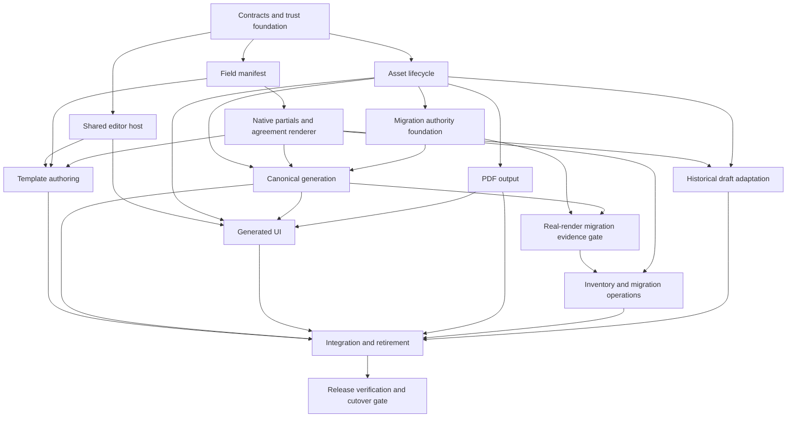

# OakDoc replacement: implementation and parallel-agent handover

Date: **26 September 2026**. Reviewed baseline: **`6aa660a9`**, including the inline generated-document editor added during the review. Status: **planning complete; implementation not started by this task**. No application tests or production migrations were run for this documentation change.

Read the [replacement specification](../oakdoc-a4-retirement-readiness.md) first. It owns decisions D01-D07, gaps G01-G15, contracts C01-C06 and acceptance A01-A08. This plan owns packet scope, dependencies, file leases and evidence. It supersedes the September A4 implementation programme's direction and scheduling; historical A4 regressions remain useful acceptance fixtures.

## 1. Handover rules

1. Read root/nearest `AGENTS.md`, the spec, this plan, relevant existing services/tests and the design/service/RBAC guides. Recheck HEAD and uncommitted changes before implementation; concurrent work is possible.
2. Preserve the POC and recent production additions. In particular, reuse `saveGeneratedOakDocDocument`, `OakDocGeneratedDocumentEditor`, reviewed-asset materialization, the native agreement renderer and the Microsoft Graph converter.
3. Implement only the assigned packet. No deployment, migration apply, signing send or production seed run is implied by a code packet. Use disposable data for integration checks.
4. Use existing generation, task, agreement, signing and filing services. Adapters stay thin. No agent-only alternative workflows.
5. One owner edits each shared file at a time. Contracts and producer commits precede dependent implementation. A stub may support parallel development, but a stubbed consumer is not completed integration.
6. Record exact commands, commit, results, skips, environment requirements and artifact hashes. Never report mocks or skipped database tests as a real output/tenant-race release pass.
7. Four active agents maximum including the integrator. Independent QA uses a freed worker slot. Isolated worktrees/branches (`codex/` prefix) are preferred; if sharing a checkout, maintain the file leases below and never reset another agent's changes.

## 2. Decisions and readiness before dispatch

Confirmed: OakDoc replacement; Microsoft 365 conversion reuse. Preserve historical originals and canonical business boundaries. Keep existing manual signing placement; automatic signature-coordinate extraction is not added scope.

D04 was confirmed by the owner on 2026-09-26: existing A4 drafts become reviewed OakDoc copies on next edit, keeping the original. P8/M2 can inventory and design without an answer; do not perform real draft migration or call final rollout ready until policy is resolved. The default plan can be implemented behind the conversion boundary, with U1/L1/I2 coordinating relation transfer. No other user clarification is required to start foundation work.

Implementation refinements to resolve in C0: exact native metadata version/schema; partial and clause snapshot persistence; transactional mapping uniqueness; typed error DTOs; limits; reference performance environment. The integrator can settle these from repository constraints without repeatedly asking the user. Record choices here before workers publish incompatible producers.

## 3. Contract freeze deliverables (C0)

C0 implements the smallest common contract foundation before feature packets. Suggested new paths below are **proposed**, not existing files. Preserve existing exported APIs with adapters where possible.

| Contract | Canonical owner/location | Freeze requirement |
| --- | --- | --- |
| Engine/capabilities | Integrator: `src/lib/document-editor/document-engine.ts` | Valid A4 / valid OakDoc / invalid-or-unsupported distinction; no malformed-native fallback; status/permission/connector/mode capability policy |
| Shared DTOs | Integrator: proposed `src/types/oakdoc.ts` | Snapshot/save acknowledgement, manifest, render diagnostics, asset identity, migration evidence; no duplicate per-feature types |
| Request validation | Integrator: `src/lib/validations/{document-template,generated-document}.ts` and native extension schema | Reserved metadata protection, expected revisions, exact error details, optional batch linkage |
| Native trust | Integrator: proposed `src/lib/document-editor/oakdoc-package-policy.ts`, server adapter as needed | Bounded ZIP/XML inspection, supported/unsupported content policy, authoritative inspected manifest |
| Persistence | Integrator: `prisma/schema.prisma`, one forward migration, `src/lib/storage.ts` | Reuse existing models; optional native partial metadata/clause snapshots; recovery/PDF/evidence references; no wholesale document-table replacement |
| Render | DTO contract owned by integrator; L2 implementation in `oakdoc-generation.service.ts` | Exact source identity and frozen context; structured diagnostics; one output fingerprint |
| Migration | Contract owned by integrator; M1 implementation in migration modules | Unique source mapping; server evidence bound to definition hashes; workspace modes and CAS |

The shared shape must express these fields (names may follow existing types, semantics must remain):

```ts
type OakDocSnapshotIdentity = {
  sessionKey: string;
  writerInstanceId: string;
  localRevision: number;
  baseRevision: number;
};
type OakDocSaveReceipt = OakDocSnapshotIdentity & {
  operationId: string;
  revision: number;
  assetSha256: string;
  updatedAt: string;
  batchRevision?: number;
};
type OakDocDiagnostic = {
  code: string;
  severity: 'error' | 'warning';
  stage: 'import' | 'template' | 'render' | 'review' | 'output';
  message: string;
  controlTag?: string;
  part?: string;
};
```

Asset identity includes tenant/entity ID, engine, schema version, private key, size, SHA-256 and optional template provenance. Template provenance must be nullable for blank/imported standalone documents; do not force a fake template ID into current v1 metadata. Server transport never trusts client-supplied keys/hashes/tenant ownership. Manifest reuses existing `PlaceholderDefinition` semantics with native binding/scoping extensions. Migration evidence includes run ID/checker version/scenario manifest hash/source and target definition hashes/dependency hashes/result/artifact references/actor/time. Define server-owned preview context retention and redaction; no business contents in logs.

### Transport adaptation map

| Existing boundary | Planned change | Compatibility / owner |
| --- | --- | --- |
| `POST /api/document-templates`, `PUT /:id` multipart | Extend validated metadata, placeholders and native manifest; retain file upload/version checks | L1 service; integrator route/schema seam |
| Template JSON metadata update | Allow intended user settings; reject server-owned asset/evidence namespaces | Integrator seam, L1 service guard |
| `GET /api/generated-documents/:id?format=docx` | Keep scoped integrity-checked native download | L1; private no-store headers |
| `PUT /api/generated-documents/:id?format=docx` | Extend current raw-DOCX standalone/batch routes with explicit revision presence, operation/snapshot acknowledgement and coherent validation | Existing route already supports both; do not build another save API. Missing query value must not become revision zero through `Number(null)`. |
| `/generated-documents/:id/draft` | Add native recovery payload/asset behavior to existing sequenced workflow | L1; retain legacy recovery reads |
| Template test/render-test and generated preview/validate | Discriminated engine responses with native preview identity/diagnostics | L2 through integrator seams; preserve legacy response compatibility |
| `/generated-documents/:id/export/pdf`, `/bulk-download` | Delegate to canonical engine-aware output; no route-only guard | O1 |
| Migration PATCH actions | Keep link/preference actions with CAS; deprecate client-passed validation result in favor of server run request/status | M1 service, integrator route seam; old self-reported passes cannot promote |

C0 exits with compilable contracts, versioned synthetic DTO fixtures, package-policy tests, documented forward migration/backward-read strategy and named module exports. If schema evidence does not require a new table, do not add one speculatively. A schema change requires generated Prisma client plus disposable-Postgres migration verification; never edit historical migrations or apply unrelated drift.

## 4. Exclusive production-file ownership

Each packet owns its corresponding tests unless a QA-only fixture/test file is explicitly leased. A subtree listing does not override a narrower owner. Changes outside a lease are requests to the integrator, not concurrent edits.

| Owner | Exclusive scope | Transfer / exclusions |
| --- | --- | --- |
| Integrator | Shared types/engine/schema/validation/storage, Prisma schema/migrations (not M2's seed files), package/lock/config, API route seams except O1 export routes, final task/signing/activation routing, documentation | Workers supply typed adapters and route patch requests. Integrator alone applies shared seam changes. |
| E1 then E2 | `oakdoc-editor.tsx`, proposed common editor host/session hooks/panels; `oakdoc-section-compatibility.ts`; template-authoring route/list/workflow UI | E1 initially also owns both generated host files for extraction; transfers them to U1 after merge. No service/schema edits. |
| S1 then S2 | Native field/schema/context/condition/repeater/signature/partial transform modules; S2 `template-partial.service.ts`, `service-agreement/{oakdoc-renderer,snapshot,draft.service,types,canonical}.ts`, native master content | Excludes `document-engine.ts`, package-policy and migration modules. S2 supplies integration adapter to L2, not edits to generator. `service-agreement/activation.service.ts` integration belongs to I2 after L2 validation. |
| L1 then L2 | `oakdoc-template.service.ts`, `document-template.service.ts`, `oakdoc-generation.service.ts`, `document-generator.service.ts`, `document-draft-workflow.service.ts`, `document-generation-batch/*`, finalization helper | M1 requests reserved-metadata/duplicate changes through L1. L2 starts only after L1 merges. O1 uses exported asset reader. |
| O1 | `document-export.service.ts`, `microsoft-graph-document-conversion.service.ts`, PDF/HTML export routes, bulk-download adapter and native rendition helper | Existing e-sign callers wired by I2 after producer merge. Does not edit generated services. |
| M1 then M2 | `oakdoc-migration.ts`, semantic compare/package diagnostic migration adapters, `oakdoc-migration.service.ts`; M2 consolidated/template migration services, definitions/scripts and seed updates | API/schema changes through integrator. L1 owns `document-template.service.ts`. Seed/pipeline routing coordination with I2. |
| U1 | Generated detail/edit/list/generate pages, `generation-batch/*` components/hooks, `oakdoc-generated-document-editor.tsx`, native review wrapper | Starts after E1 extraction/lease transfer. E2 alone owns template pages. Does not duplicate native host logic. |
| P8 | Proposed draft-conversion adapter, historical static-view adapter and conversion fixtures | Requires L1/S2 contracts. UI/task/batch changes requested from U1/I2; no independent relation manipulation. |
| Q1/Q2 | Independent regression/evidence fixtures and assigned acceptance tests | Read-only production review; defects returned to packet owner. No secret fixture data. |

The integrator records a lease transfer with merged commit + owner + file list. Resolve tests with overlapping scope similarly. Contract changes require producer update/consumer impact note before merge; no worker may silently change a shared type to fit local implementation.

## 5. Dependency graph and four-slot dispatch



| Wave | Integrator slot | Worker 1 | Worker 2 | Worker 3 | Merge/exit rule |
| --- | --- | --- | --- | --- | --- |
| 0 | C0 contracts/schema decisions | UI/fixture inventory | Generation/composition fixture inventory | Migration/consumer inventory | Inventories read-only; freeze C0 before feature producers diverge. |
| 1 | Shared route/schema adapters + review | E1 common host | S1 manifest | L1 persistence | Merge producer contracts and run boundary tests. |
| 2 | Apply seams and integrate | S2 native partials/agreement | O1 PDF/output | M1 authority foundation | E1/S1/L1 merged. O1 uses stable verified-asset reader. M1 real-render evidence is still pending. |
| 3 | Integrate production render/API seams; close M1 real-render gate after L2 | E2 authoring | L2 generation | Q1 independent boundary review | E2 consumes merged S2; integrator takes M1 integration lease after foundation merge; Q1 reviews stable snapshots. |
| 4 | Routing/relationship adapters | U1 generated UI | M2 scoped migration/seed operations | P8 history/draft conversion | L2 and M1 merged. P8 conditional on D04; if omitted, slot verifies historical viewers. |
| 5 | I2 end-to-end integration and cleanup | Q2 independent release checks | Assigned defect owner | Assigned defect owner | Freeze candidate for QA; changes invalidate affected evidence, not unrelated passed suites. |
| 6 | Operator-led staged rollout evidence | QA smoke | Migration operator support | Available for defects | No automatic production action. Release gates and environment access required. |

Useful early parallelism: corpus/consumer inventories and DTO fixtures can start before producers finish. Implementation depending on a contract waits for its merged version. Do not run L1/L2, E1/U1 or S1/S2 concurrently in shared files. O1 and M1 may work in parallel because their service files are separate.

## 6. Dispatch-ready work packets

### E1 — One native editor host and safe acknowledgement

**Depends on:** C0/C02. **Closes:** G01; A01/A04.

Read `oakdoc-editor.tsx`, `generation-batch/oakdoc-review-editor.tsx`, `oakdoc-generated-document-editor.tsx`, `oakdoc-section-compatibility.ts`, existing A4 snapshot acknowledgement/navigation patterns and the normal-delete investigation. Extract a reusable native host without changing Word semantics or rebuilding toolbar logic.

Implement session identity, snapshot serialization, local/form revision acknowledgement, dirty/conflict/recovery events and guarded replacement. Install the existing narrow section repair in every host. Remove duplicated host-level save/loading/keyboard behavior; retain route-specific persistence adapters. Do not let a refetch or save response replace newer local content. Preserve input during network saves and meaningful status/focus. Expose typed panel slots/native command adapters for E2 and U1.

Tests: type during delayed save; save A/switch B/late A response; remote refetch while dirty; repeated save conflict; import cancellation; tab warning; internal leave choices; template/batch/standalone section deletion/undo/save/reopen; IME composition and selection restoration. Test actual native input in browser, not only mocked `save()`.

**Done:** all three current consumers use the shared host and acknowledgement contract; no content loss/reload on newer local revisions; producer commit and browser fixtures ready for U1. Transfer generated host file leases after merge.

### S1 — Shared native manifest and field semantics

**Depends on:** C0/C03. **Closes:** G02/G03; A02.

Read existing typed placeholder storage/runtime/registry plus OakDoc field/context/schema/condition/repeater/signature modules. Define native bindings for stable existing field IDs and types. Expose selected contact, multiple directors, agreement/resolution fields and existing signature definitions. Remove duplicated UI/server allowlists through a shared registry consumed by panels and generation.

Implement required/default/format/options/linking behavior with escaping and tenant-safe context adapters. Make unavailable required collections distinct from intentionally empty collections. Reuse multi-block conditions and generic repeater range APIs. Specify supported nesting combinations; diagnose unsupported nesting with a location instead of guessing. Inspect headers/footers and preserve unknown definitions while blocking unsupported used fields.

Tests: round-trip field definitions including omitted-v-explicit required and unknown metadata; scalar/custom/date/number/currency/options; explicit party choices; missing versus empty collections; zero/one/many repeats; nested scopes; multi-row conditions; protected signatures; unsupported field/condition diagnostics.

**Done:** one exported manifest/resolution contract and fixture set; E2 can build panels and L2 can render without local registries. No client data grants trusted-rich privileges.

### L1 — Asset lifecycle, metadata boundaries and recovery

**Depends on:** C0/C01/C04/C05. **Closes:** G02/G08/G09/G14; A04/A05.

Read all native template/materialization/download/save code including new `saveGeneratedOakDocDocument`, batch preview/draft save, generated CRUD/clone/finalization and sequenced draft services. Centralize bounded validation, verified reads, immutable uploads and commit-aware compensation. Extend rather than replace the existing raw-DOCX save route.

Protect reserved namespaces in template and generated generic mutation paths. Native clone copies bytes into the new document scope and resets lifecycle/evidence authority; template duplication clears migration/link authority while preserving immutable asset isolation. Add native blank/imported-document representation without fake template IDs. Metadata saves preserve composition/title-date/folder/placeholder settings.

Native save checks DRAFT, supplied expected canonical revision and, for a batch-associated preview, the batch revision/fingerprint transactionally. A caller cannot bypass batch freshness by selecting the standalone route. Finalization races must lose cleanly. Recovery stores separate assets and sequenced identities with bounded retention; canonical save acknowledges only submitted recovery revisions. Audit/storage cleanup must distinguish before versus after commit. Retain referenced older assets; track orphan cleanup separately.

Tests: missing revision (including missing query value), tenant/hash/prefix failure, reserved-field forgery, corrupted native metadata, clone/download, two writers, batch-bypass attempt, save-v-finalize, uploaded asset then DB failure, committed DB then audit/catalogue failure for each writer (including `saveGeneratedOakDocDocument`), ambiguous response retry, stale autosave/cleanup and user/tenant recovery isolation. Exercise real PostgreSQL CAS paths.

**Done:** exact bytes remain readable after all injected post-commit failures; clones and recovery work; all writers respect engine/status/revisions; exported asset reader is stable for O1. Hand service file leases to L2.

### S2 — Native partials and Service Agreement composition

**Depends on:** S1 plus C0 schema migration. **Closes:** G04/G13; A03.

Read `TemplatePartial`, `template-partial.service.ts`, agreement draft/item snapshot logic, native renderer and its limited `htmlToWordBlocks` bridge. Implement native partial upload/read/update/duplicate APIs through integrator-owned seams and existing service/tenant boundaries. Preserve versions and field links. Add tagged pinned references, dependency resolution/cycle limits and structurally correct OOXML merge.

Extend `renderServiceAgreementOakDoc` to use native clause snapshots/overrides, retaining domain normalization. Declare the supported HTML migration subset; unsupported images/merged tables/nested numbering/links produce diagnostics, not silently flattened clauses. Do not recompute fee rules independently. Expose a composition adapter/result to L2 with dependency hash, diagnostics and required signer roles.

Tests: styles/numbering ID collisions, reused media/relationship IDs, nested/absent/cross-tenant partials, partial edited after pinned reference, two entities with different same-valued fees, negotiated SOW, one-off/recurring/tax/currency semantics, structural slot count/location and signer-role preservation.

**Done:** native partials author/render without HTML authority; actual renderer fixtures preserve business/layout semantics; S1 leases are retained by S2 until producer merge. E2/L2 consume the adapter, not renderer internals.

### O1 — Native PDF and output provenance

**Depends on:** C0 and L1 verified asset reader. **Closes:** G06; A06.

Read `document-export.service.ts`, all `exportToPDF` callers, Graph conversion service, current PDF route guard, bulk export and Word-upload conversion tests. First add fail-closed native dispatch at PDF/HTML service boundaries so internal callers cannot render sentinel HTML. Then convert verified native bytes through the existing Graph service.

Persist/reuse renditions by exact document/revision/DOCX hash/output policy/connector identity. Preserve public `PDFResult` compatibility; add internal provenance needed for signing. Validate/count PDF pages with a parser. Reject unsupported native layout overrides. Add bounded requests/cancellation/throttle retry and cleanup reconciliation; keep primary error and cleanup failure distinguishable. Reconcile capability probe/provider selection. Never expose connector credentials or document payloads in errors.

Tests: export via direct service, HTTP, mixed ZIP and e-sign caller; malformed native metadata; missing/wrong-tenant assets; Graph unavailable/403/429/timeout/non-PDF; cleanup failure after successful conversion; stale cached rendition; input edited during conversion; unsupported HTML; native headers/letterhead duplication. Mocked tests precede a synthetic real-connector PDF smoke.

**Done:** one output authority for every caller; provenance available to I2; real conversion and visual fixture evidence recorded when environment exists. Lack of connector access is an explicit release blocker, not a reason to implement a second provider.

### M1 — Trusted validation and deterministic migration authority

**Depends on:** C0, L1 reserved-metadata protections; actual-render integration completes after L2. **Closes:** G10/G11/G15; A07.

Read migration metadata/readiness/service/resolver, semantic/package/Service Agreement parity helpers and existing duplicate behavior. Replace caller passes with a server validation runner over exact definition identities. Record immutable evidence/run artifacts; existing v1 asserted passes are non-authoritative for cutover. Migration API seams receive run requests/results through integrator changes.

Add strict source/target existence/engine/tenant/activity checks, one authoritative target, version-CAS and definition-hash comparisons. Metadata-only preference/activity updates preserve evidence only when current hashes match. Test the stale-pass sequence: validate, edit target, set LEGACY, set OAKDOC; it must still fail until rerun. Missing source version is a blocker, not an omitted check.

Strengthen semantics with cardinality/order/forbidden-content and entity-value associations. Empty scenario requirements cannot certify a pair. Build adapters to real legacy/native generators, avoiding fixtures that fabricate both sides from one helper. Visual/PDF review remains separately evidenced.

Tests: forged generic/PATCH pass, stale toggles, concurrent validate/edit, absent/deleted/inactive/wrong-engine source/target, duplicate links, copied evidence, changed dependent partial, metadata-only revision, idempotent run retry and tenant isolation. Add migration-control API/service/Postgres suites absent at baseline.

**Done:** state promotion requires trustworthy current evidence and unique mapping; producer contract ready for M2/routing. Renderer-dependent integration remains visibly incomplete until L2 is merged.

### E2 — Production template and partial authoring

**Depends on:** E1/S1/L1; complete native partial UI after S2. **Closes:** G02/G03/G13; A01/A02/A03.

Own template list/workflow routing and panels, preserving old deep links. Make native authoring canonical, with blank/import/edit/duplicate, full metadata, fields/linking, multi-block conditions/repeaters, signature roles, partial insertion/dependency display and issue focus. Reuse design components and searchable company picker.

Replace local Generate copy with the canonical test/preview adapter. It may use C0 DTO fixtures during development but cannot ship separate client resolution. Support mock/real context and blocking diagnostics; download preview without changing master bytes. Adapt existing `AISidebar` insertion/replacement through captured native selection/version and safe text/rich-content handling. Preserve activation defaults; readiness is a separate migration gate.

Tests: metadata-only save, full field round-trip, partial reference update, keyboard insertion/focus, validation issue location, stale AI selection, blank/import, save conflict/navigation, tenant switch and old-link routing. Verify master never changes during preview.

**Done:** all existing operational template/partial authoring tasks have a native path. L2 integration test proves preview and production generation use the same contract before release.

### L2 — Canonical generation and lifecycle validation

**Depends on:** L1/S1/S2 and M1 authority foundation. **Closes:** G03/G04/G07/G12; A03/A04/A05.

Extend existing OakDoc generation, batch preview/render-input/materialization and finalization helpers. Complete company/contact/multiple-party/custom/agreement context using canonical domain services. Dispatch Service Agreement composition to S2. Resolve requested template IDs through M1's approved mapping adapter at the new-generation boundary (integrator wires task/route seams).

Pin master/version/hash/dependencies and frozen context into preview. Include actual source identity in fingerprints; template/config/agreement changes invalidate preview. Preserve the existing reviewed-asset shortcut only when server evidence and current revision/hash match. Revalidate actual reviewed bytes and required business/signature controls before finalize/activation; don't merely test placeholder HTML or old top-level arrays.

Integrate single generation, template tests and batch via one renderer. Native recovery/save does not unexpectedly regenerate. Shared generation errors are structured/locatable. Retain folder snapshot, selected-party and task provenance.

Tests: every supported context input, empty/missing sources, actual agreement renderer call, failed required control after manual editing, unknown headers/footers fields, stale template/read race, config change after review, changed source-data snapshot policy, exact saved bytes finalized, inactive/broken mapping and cross-tenant selection.

**Done:** the same reviewed context yields matching server test/preview/generated semantics; finalize/activation cannot bypass native validation. Integrate M1 real-render evidence now.

### U1 — Generated-document and batch UI integration

**Depends on:** E1/L1/L2, O1 capabilities. **Closes:** G05; A01/A04/A08.

Reuse the new inline generated editor, now reduced to a shared-host adapter. Make the separate edit URL engine-aware; it must never mount A4 for native bytes. Integrate standalone native blank/import/save/recovery/clone, final read-only view, finalize/unfinalize status, downloads/print and comments. Preserve existing permission gates and task return links.

Update batch completeness, review item switching, navigation/dirty handling, resume and results to C0/L2 contracts. Remove misleading engine badges/selectors from final operational flow while preserving migration diagnostics for administrators. Enabling a capability requires successful service support, not just changing `inlineEdit` or `pdfExport` booleans. Integrate P8 historical dispositions with explicit preserved-source review.

Tests: detail edit while save in flight, toolbar finalize with unsaved edits, direct edit URL, permission-limited/read-only user, refresh recovery, clone, batch switches, connector unavailable, native versus legacy history, retained comments and old task return navigation. Disabled actions explain blockers and cannot bypass them via direct API.

**Done:** generated lifecycle routes share the host and service contracts, with no unexpected A4 editing path.

### M2 — Inventory, migration CLI, seeds and rollout controls

**Depends on:** M1 including its L2 real-render evidence gate, plus S2; P8 only for draft conversion apply. **Closes:** G12/G13; A07/A08.

Inventory every source and consumer in spec section 7, including inactive templates still named by tasks, unfinished generation sessions, service variants and edited source templates. Build a stable-ID manifest with source/target/dependency hashes, expected revisions, scope/operator, dispositions and per-item results. No operational data contents in reports.

Replace implicit all-workspace/earliest-user CLI mutation with dry-run default and explicit apply using manifest hash. Add resumable operation journal/idempotency, scope validation, reserved-name collision failure, per-item errors and no-overwrite handling. Do not call generated seed content a migration of a customized source without parity proof.

Update `migrate-oakdoc-templates.ts`, older agreement seed and onboarding seed so reruns preserve customized native assets/activity and select approved native IDs. Coordinate pipeline/task validation changes through I2; do not rewrite published action snapshots. Add audited mode/mapping cutover and rollback with expected revisions/definition fingerprints. Current preference/deactivation version pitfalls must stay covered.

Tests: dry-run performs zero uploads/DB writes; explicit workspace/operator; manifest changed between plan/apply; partial failure/resume; duplicate name/pair; missing assets; customized native seed rerun; old task IDs; mode change race; rollback after native documents created; original records unchanged. Run against disposable PostgreSQL/object storage, never production during coding.

**Done:** reports account for every operational item and can safely resume; proposed commands/runbook appear in existing operations documentation only once implemented. Real production inventory remains an operator gate.

### P8 — Historical viewer and draft adaptation

**Depends on:** L1/S2, D04 policy. **Closes:** historical part of A04/A08.

Implement sanitized static historical viewing/archived-PDF selection that does not mount A4PageEditor. Keep the original read/export path isolated. For the assumed draft policy, provide bounded current-content conversion or explicit native import/re-author comparison; never regenerate from current template data. Inventory the supported conversion subset before promising automatic conversion.

Create linked new drafts with source ID/revision/hash and method/warnings. Review acceptance is explicit; unsupported content prevents acceptance until repaired. A conversion job must detect source edits and avoid duplicate targets on retry. Provide relation-transfer requests to canonical task/batch services, preserving source provenance. No conversion of already-signed/finalized/in-signing records.

Tests: manual edits retained, unsupported tables/images/numbering do not disappear, source modified during conversion, retry, approval/reject/cancel, original comments/history/export intact and no duplicate task outcomes. If D04 selects read-only history, omit automated converter but retain static viewer and clear native-copy routing.

**Done:** no original historical record is relabeled/replaced; chosen legacy-draft policy has a tested path and reportable unsupported cases. Unhandled operational cases block cutover rather than revive A4 editing silently.

### I2 — Downstream integration and A4 retirement

**Depends on:** merged E2/L2/O1/M2/U1/P8 plus Q1. **Closes:** G06/G12/G15; A06/A08.

The integrator wires canonical route/task/pipeline/e-sign seams in `src/services/tasks/action-registry.ts`, `src/services/tasks/pipeline.service.ts`, task e-sign preparation, `esigning-envelope.service.ts` and existing completion/filing services. Old requested template IDs resolve approved replacements for new runs without altering immutable snapshots. Existing batches remain bound.

Ensure PDF attachment checks exact document revision/hash, preparation invalidation handles edit/unfinalize, recipients/roles remain correct, completed agreements activate services through existing code and signed PDF/certificate filing uses original route snapshots. No auto-send/activation change.

Review `service-agreement/activation.service.ts` explicitly: its existing unresolved-data eligibility check is conditional on DRAFT status. Native validation evidence must remain mandatory for finalized documents entering activation, with a regression proving a finalized document carrying invalid/stale native evidence cannot activate services. This strengthens validation without adding a new activation workflow.

Enforce oakdoc-only at every canonical legacy writer/generator, including blank/clone/restore/seed/direct API. Remove A4PageEditor/toolbar/editor-bridge imports from active routes after all replacements land. Delete editor-only code only after dependency scan; preserve narrowly allowlisted historical output helpers and shared utilities. Replace A4-specific smoke gates only when native equivalents cover the retired path; unrelated rich-text editors remain.

Update existing API/database/environment/runtime/design guides where implemented behavior changes. Record any added schema, connector configuration or operational command. Keep this plan's evidence matrix current.

**Done:** A01-A08 integration evidence exists, no operational A4 writer/mount remains, historical output is retained and a tested rollback release is identified. This is code readiness, not permission to deploy.

### Q1 / Q2 — Independent verification

Q1 reviews merged contracts/host/persistence/output/migration foundations at wave 3. Use a separate worker slot and read-only production review; convert plausible static risks into failing-before/passing-after tests. Give defects back to owners, avoiding overlapping fixes.

Q2 verifies the frozen integrated candidate: actual renderers, browser input, Postgres races, Microsoft 365 PDF, signing preparation/completion and filing, complete inventory dry run, cutover rehearsal and rollback. Use synthetic data and test connector/library; no external email/send required unless the test operator explicitly authorizes the scenario. Record any unavailable environment as a release blocker.

**Done:** acceptance report names commit/runtime/environment/corpus hashes, commands/results/skips, semantic/PDF visual evidence, remaining defects and go/no-go per gate. QA does not promote itself based on unit mocks or empty comparisons.

## 7. Validation commands and evidence

These are commands for implementation, **not checks run during this planning task**. Run from repository root on Node 24. First verify command availability and test environment guards at the implementation baseline. Do not let an integration suite silently skip and count it as passed.

```powershell
node --version
npm run test:run -- __tests__/lib/oakdoc-section-compatibility.test.ts __tests__/lib/oakdoc-fields.test.ts __tests__/lib/oakdoc-conditions.test.ts __tests__/lib/oakdoc-generic-repeaters.test.ts
npm run test:run -- __tests__/services/oakdoc-generation.service.test.ts __tests__/services/oakdoc-batch-draft.service.test.ts __tests__/services/document-generation-oakdoc-reviewed-asset.test.ts
npm run test:run -- __tests__/services/service-agreement-oakdoc-renderer.test.ts __tests__/services/microsoft-graph-document-conversion.service.test.ts
npm run test:run -- __tests__/lib/oakdoc-migration.test.ts __tests__/services/oakdoc-consolidated-migration.service.test.ts __tests__/services/oakdoc-template-migration.service.test.ts
```

Owners add their new regression files to packet validation and the final native smoke command. Reuse existing tests under `__tests__/api`, `__tests__/services`, `__tests__/components` and `__tests__/browser`; do not create a second framework.

```powershell
npm run test:browser -- __tests__/browser/document-generation-batch.browser.test.tsx
npm run test:run -- __tests__/integration/document-generation-batch.postgres.test.ts --maxWorkers=1
npm run test:stage3:postgres
npm run test:esigning:postgres
npm run lint
npm run typecheck
npm run test:run
npm run build
```

The database commands require disposable PostgreSQL and their documented opt-in settings. Read each integration suite's guards and assert executed test counts. Add native migration/lifecycle concurrency tests and the shared-host browser suite to the final run. A build also runs assistant registry checks/Prisma generation; preserve concurrent unrelated work and report unrelated failures accurately.

For O1/Q2, use synthetic DOCX on an explicitly configured test connector to obtain actual PDF bytes; inspect pages and page count and retain hashes. Unit Graph mocks prove request/cleanup behavior, not layout/signing fidelity. Use the browser testing skill for rendered UI implementation checks. Validate no production writes or real recipient sends occur in rehearsal.

Final import audit starts with:

```powershell
rg -n "A4PageEditor|a4-page-editor|a4-editor-toolbar|a4-editor-semantic-bridge" src
rg -n "exportToPDF|exportToHTML|createDocumentFromTemplate|createBlankDocument|resolvePreferredMigratedTemplate" src scripts prisma
rg -n "DocxEditor" src/components/documents
git diff --check
git status --short
```

Interpret results, do not require every `A4` string to disappear. The first scan must have no active editor consumers after cleanup; the final scan should show one low-level application host with thin wrappers. Maintain an explicit historical-output allowlist and test its restricted use.

## 8. Cutover runbook and rollback gates

| Gate | Required evidence | Failure action |
| --- | --- | --- |
| R0 Contract readiness | C0 decisions/types/migration strategy, package policy, owner leases | Do not start incompatible producers. |
| R1 Integrity | E1/L1 plus Q1: save races, asset compensation, engine/tenant guards, clone/recovery | Keep compatibility mode; fix owning packet. |
| R2 Workflow completeness | S1/S2/E2/L2/U1/O1, actual agreement and PDF outputs, direct service guards | Block affected templates/workspaces; no silent legacy fallback. |
| R3 Migration readiness | M1/M2/P8 evidence, all sources/dispositions/old IDs/pending workflows inventoried, D04 settled | Resolve blockers; do not apply bulk switching. |
| R4 Staging rehearsal | Q2 full synthetic lifecycle, real converter, historical checks, dry-run/apply/resume/rollback | Revert staging mode or candidate; retain all native assets. |
| R5 Workspace cutover | Backups, connector health, manifest hash/current identities, operator/reason, tested rollback release/window | Abort stale manifest; record partial progress for resume. |
| R6 Editor retirement | Oakdoc-only service policy, zero active A4 editor imports, bounded archive compatibility, monitoring clean | Roll back deployment to tested compatibility release if required; never delete new records. |

Operator sequence after code readiness:

1. Capture database/object-storage recovery point and current routing/mode. Verify a restore procedure, not just backup existence.
2. Run scoped dry-run inventory and real-render/evidence checks. Reconcile each required template/partial, task reference, pending draft/batch/session and connector.
3. Review manifest; apply additive conversions/links with explicit actor/hash/revisions. Re-run report until every required item is ready or explicitly dispositioned. Do not overwrite custom sources.
4. Enable one staging/pilot workspace in `oakdoc-primary`. Verify new generation, edited DOCX, PDF, e-sign preparation/completion and filing plus old document reads.
5. Monitor document/export failures, conflicts, missing assets, unresolved-control blocks, conversion temp cleanup and legacy-route use. Use IDs/codes/timings only, never client text. Any missing/changed content or wrong-tenant access is an immediate stop.
6. Move remaining approved workspaces using their own current manifests. Keep rollback window defined by operator, not an arbitrary time guessed by an agent.
7. Enable `oakdoc-only`; verify old clients/scripts cannot create/edit/generate legacy content. Merge/remove editor code in the separate retirement release only after this gate, with archive compatibility documented.

Rollback before R6: restore prior mode/mappings using journal and CAS; new OakDoc documents remain native/readable. Do not blindly toggle preference to carry stale evidence. Rollback after R6: deploy tested compatibility release with additive schema/native readers intact. Recheck pending jobs and connector temp cleanup; do not delete successfully committed artifacts. The rollout cannot claim full replacement while operational required templates still depend on A4 writing.

## 9. Ready-to-use agent assignment and handoff

Dispatch one packet per worker using this template, replacing every bracketed value:

> Implement packet [ID/name] from `docs/plans/2026-09-26-oakdoc-replacement-implementation.md` and its linked specification. Baseline/integration commit: [SHA]. Your exclusive files are [paths]; producer contracts are [commits/exports]. Reuse canonical services and preserve tenant/revision/asset rules. Do not edit shared/schema/routes outside your lease; send a concrete integration request instead. Acceptance IDs: [Axx]. Run [targeted checks] on Node 24, then return changed files/commit, interface changes, test results and untested blockers. No production data migration/deployment/send. Preserve concurrent changes.

Worker handoff must include:

- Packet, base and result commits; changed files and explicit lease release.
- Exports/DTOs produced or consumed; compatibility/migration/environment requirements.
- Acceptance IDs closed, command output summary/counts and evidence artifact paths/hashes.
- Failure-path tests and unavailable environments; distinguish skipped from passed.
- Remaining integration requests with exact owner/file/symbol; no vague “wire later” completion claim.

Integrator merge checklist: inspect focused diff; verify current producer contracts; integrate seams; run affected boundary tests; record status/evidence; then release downstream work. Re-run broader checks only when changes/failures justify them, with final repository gates at the integrated candidate.

## 10. Implementation tracking

| Packet | Status | Evidence / next dependency |
| --- | --- | --- |
| C0 | Done (PR #62) | `src/types/oakdoc.ts`; engine states A4/OAKDOC/INVALID in `document-engine.ts`; `oakdoc-reserved-metadata.ts`; `oakdoc-package-policy.ts`. Tests: `__tests__/lib/oakdoc-package-policy.test.ts`, `oakdoc-reserved-metadata.test.ts`, `document-engine-state.test.ts`. Schema/partial contract (C06) not started. |
| L1 | Done (PR #62) | Save receipts, Idempotency-Key retries, required revision (428), post-commit cleanup, native clone, finalization re-inspection. Tests: `__tests__/services/oakdoc-generated-lifecycle.test.ts`, `__tests__/api/generated-document-docx-save-route.test.ts`. |
| O1 | Done, mocked (PR #62) | `oakdoc-output.service.ts`; Graph timeouts/retries/typed errors. Tests: `oakdoc-output.service.test.ts`, `document-export-oakdoc-dispatch.test.ts`. Real Microsoft 365 conversion smoke still needs a connected workspace. |
| E1 / U1 | Done, unit level (PR #62) | `OakDocEditorSession`, `OakDocDocumentHost`, shared section-delete guard, engine-aware edit route. Tests: `__tests__/components/oakdoc/`. Browser smoke not run. |
| M1 | Foundation done (PR #62) | Server-run static checks, evidence bound to definition hashes, unique mapping, caller-submitted passes refused. Tests: `__tests__/services/oakdoc-migration-authority.test.ts`, `__tests__/api/document-template-migration-route.test.ts`. Real-render comparison (`renderCheck`) stays `pending` until L2. |
| S1 | Done (PR #62) | `oakdoc-field-registry.ts` is the one list of supported tags and their contexts; the server derives a template's field manifest from its DOCX bytes and ignores client `fieldTags`. Tests: `__tests__/lib/oakdoc-field-registry.test.ts`. |
| L2 | Done, unit level (PR #62) | Generation takes selected contact, agreement and resolution context, reports unsupported fields and missing context as diagnostics, and batch preview blocks on them; the fingerprint includes the template and agreement hashes. Tests: `__tests__/services/oakdoc-generation-context.test.ts`. |
| S2 | Agreement composition and native partials done, unit level (PR #62) | Service Agreement templates compose services, fees and the entity appendix during generation (`__tests__/services/oakdoc-service-agreement-generation.test.ts`). Native partials (C06): additive migration `20260926120000_template_partial_native_asset` adds `template_partials.content_json` (not applied anywhere); partial versions are content-addressed and never deleted; templates and nested partials pin partial ID/version/hash in `oakDocPartials` (reserved key) and keep pins until explicitly refreshed; generation expands only pinned bytes, merging missing styles, renumbered lists, links, images and unique IDs, dropping section properties and notes, and reporting missing, cyclic, too-deep or inline references. `oakdoc-partials.ts`, `oakdoc-partial.service.ts`, routes `POST /api/template-partials/oakdoc` and `GET/PUT /api/template-partials/[id]/oakdoc`. Tests: `__tests__/lib/oakdoc-partials.test.ts`, `__tests__/services/oakdoc-partial.test.ts`, `__tests__/api/template-partial-oakdoc-route.test.ts`. Not done: native SOW clause snapshots on agreement items. |
| E2 | Partial insertion done, unit level (PR #62) | The OakDoc template editor lists Word partials, inserts a reference after the caret paragraph (`insertOakDocPartialReference`), marks partials in use and warns about missing ones (`oakdoc/oakdoc-partial-panel.tsx`). Tests: `__tests__/components/oakdoc/oakdoc-partial-panel.test.tsx`, `__tests__/lib/oakdoc-partials.test.ts`. Not done: pin refresh control, canonical preview adapter, AI sidebar adaptation, old-link routing. |
| P8 | Draft conversion done, unit level (PR #62) | D04 confirmed 2026-09-26. `oakdoc-html-import.ts` (shared with the agreement renderer) converts A4 HTML and reports what it cannot carry over (images, merged cells, nested tables/lists, unfilled placeholders as errors; link targets, list numbering, styles as warnings) plus a text-preservation check. `oakdoc-draft-conversion.service.ts` makes one linked OakDoc copy per A4 draft (source ID/revision/hash, method, diagnostics), never touches the original, refuses finalized/signed/in-signing sources, detects source edits and reuses the copy on retry. Accepting needs every error acknowledged and an unchanged original; rejecting soft-deletes the copy; a pending copy cannot be finalized. Route: `POST /api/generated-documents/[id]/oakdoc-conversion`. Tests: `__tests__/lib/oakdoc-html-import.test.ts`, `__tests__/services/oakdoc-draft-conversion.test.ts`, `__tests__/api/generated-document-oakdoc-conversion-route.test.ts`. The document page has a Convert to OakDoc action for A4 drafts and a review panel on the copy (confirm each problem, accept, or reject); tests: `__tests__/components/oakdoc/oakdoc-conversion-review.test.tsx`. Not done: static historical viewer, task/batch relation transfer (U1/I2). No conversion has been run. |
| M2 | Inventory and CLI done, unit level (PR #62) | `oakdoc-rollout.service.ts` builds a per-workspace inventory (template mappings, A4 document dispositions, unfinished A4 batch items) and a hash-bound draft-conversion manifest; apply re-checks the hash, requires an active operator and reports per-item results. `scripts/oakdoc-rollout.ts` is dry-run by default; `migrate-oakdoc-templates.ts` now needs an explicit workspace, operator and `--apply`. Tests: `__tests__/services/oakdoc-rollout.test.ts`, `__tests__/scripts/oakdoc-rollout-cli.test.ts`. Not done: operation journal beyond per-item idempotency, audited mode cutover/rollback, onboarding seed preservation, disposable PostgreSQL rehearsal. Bulk conversion runs only with the owner's approval of that run. |
| I2 / Q1 / Q2 | Not started | Needs L2/M2 evidence; A4 code removal waits for the owner's go-ahead. |
| R5/R6 | Not authorized/executed by this planning task | Production inventory, release gates and operator rollout |

Documentation preparation is complete when the spec/plan links, source baseline and packet ownership are reconciled. That does not certify application readiness or retire A4 in the running product.
