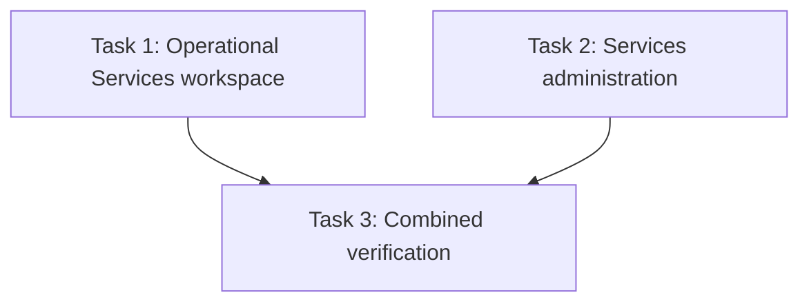

# Services UI Standardization Implementation Plan

> **For agentic workers:** REQUIRED SUB-SKILL: Use superpowers:subagent-driven-development (recommended) or superpowers:executing-plans to implement this plan task-by-task. Steps use checkbox (`- [ ]`) syntax for tracking.

**Goal:** Standardize the operational Services workspace and Services administration page to the established Companies and Document Vault page patterns without changing behavior.

**Architecture:** Keep the existing Services tab and panel boundaries, but replace the custom page rhythm with the shared Oakcloud list-page composition: responsive page padding, one page header, compact desktop controls, mobile-safe touch targets, consistent filter spacing, and `table-container` data surfaces. The operational and administration pages remain separate implementation tasks because they do not share runtime state and can be reviewed independently.

**Tech Stack:** Next.js 15 App Router, React 19, TypeScript, Tailwind utility classes, existing Oakcloud UI components, Vitest, Testing Library, Vitest Browser/Playwright.

**Spec:** `docs/superpowers/specs/2026-08-17-services-administration-deadlines-billing-design.md`

**Visual references:**

- `src/app/(dashboard)/companies/page.tsx:609` — list-page shell, header, actions, and section spacing.
- `src/app/(dashboard)/processing/page.tsx:1560` — Document Vault shell, responsive action group, filters, and table framing.
- `docs/superpowers/mockups/2026-08-17-services-workspace-mockups.md` — required Services composition for views 1–7.
- `docs/guides/DESIGN_GUIDELINE.md` — typography, spacing, table, and mobile touch-target rules.

## Global Constraints

- Work in the current worktree as explicitly requested; do not create another worktree.
- Use `gpt-5.6-luna` with `max` reasoning for implementation tasks.
- Preserve all routes, query-string state, permissions, data fetching, mutations, table preferences, dialogs, keyboard behavior, and responsive card/table switching.
- Use the Companies and Document Vault list-page shell verbatim where applicable: `p-4 sm:p-6`, page header `mb-6`, title `text-xl sm:text-2xl font-semibold text-text-primary`, description `mt-1 text-sm text-text-secondary`, and action groups `flex flex-wrap items-center gap-3`.
- Use 32px compact controls on desktop (`sm:min-h-8` or an existing `size="sm"` component) and retain at least 44px width and height on mobile (`min-h-11`, `min-w-11` where the control is icon-only).
- Keep major page sections 24px apart (`mb-6`) and related controls 8–16px apart (`gap-2`, `gap-3`, `gap-4`). Do not stack parent and child spacing utilities to create double gaps.
- Use existing `Button`, `FormInput`, `Pagination`, `FilterChip`, responsive card, and `table-container` patterns where they already fit. Do not add a parallel design-system abstraction.
- Desktop data tables use `table-container`, `text-xs font-medium` headers, and `px-4 py-3` body cells unless an existing denser embedded surface requires otherwise.
- Do not add hero cards, gradients, decorative page-title icons, new product behavior, or unrelated refactors.
- Apply test-driven development: add or update a browser/layout assertion, observe the expected failure, then implement the smallest styling change that passes it.
- Stage and commit only the files named by the active task.

---

## File and responsibility map

### Operational Services workspace

- `src/components/services/services-workspace.tsx` — Companies/Document Vault page shell, page header, and compact responsive tabs.
- `src/components/services/roster/service-roster.tsx` — roster toolbar hierarchy, compact filters, contextual actions, and section spacing.
- `src/components/services/roster/service-roster-table.tsx` — shared table-container framing and Companies-style cell rhythm.
- `src/components/services/deadlines/deadline-workspace.tsx` — deadline header/actions, view toggle, filter-to-table spacing, and column controls.
- `src/components/services/deadlines/deadline-filters.tsx` — compact desktop inputs/selects with mobile touch targets.
- `src/components/services/deadlines/deadline-table.tsx` — table-container framing and Companies-style header/body padding.
- `src/components/services/billing/billing-workspace.tsx` — remove doubled section spacing and align content blocks to the list-page rhythm.
- `src/components/services/billing/billing-filters.tsx` — Companies-style compact toolbar spacing and desktop control sizing.
- `src/components/services/billing/billing-table.tsx` — table-container framing and standard table padding.
- `__tests__/components/service-roster.test.tsx` — compact responsive column-control contract.
- `__tests__/components/services-workspace.test.tsx` — unchanged functional tab behavior plus page-shell semantics.
- `__tests__/browser/services-billing.browser.test.tsx` — shared operational page geometry and desktop/mobile control sizing.
- `__tests__/browser/services-deadlines.browser.test.tsx` — deadline table/calendar responsive regression coverage.

### Services administration

- `src/components/services/admin/services-admin-page.tsx` — matching list-page shell/header, compact tab row, and consistent panel spacing.
- `src/components/services/admin/catalog/service-catalog-panel.tsx` — header/action/filter hierarchy and compact family/variant cards.
- `src/components/services/admin/deadline-rules-panel.tsx` — consistent panel header, split-pane indentation, compact desktop controls, and card padding.
- `src/components/services/admin/business-calendar-panel.tsx` — consistent panel header, calendar navigation, detail cards, and form spacing.
- `__tests__/components/services-admin-page.test.tsx` — preserve authorization, URL state, and keyboard tab behavior.
- `__tests__/browser/services-admin.browser.test.tsx` — Companies/Document Vault page geometry, compact desktop controls, and 44px mobile controls.

## Interfaces and behavior that must remain unchanged

```ts
// Operational route state
type ServicesWorkspaceTab = 'services' | 'deadlines' | 'billing';

// Administration route state
type ServicesAdminTab = 'catalog' | 'rules' | 'calendar';

// Existing public component contracts remain source-compatible.
export function ServicesWorkspace(props: ServicesWorkspaceProps): JSX.Element;
export function ServicesAdminPage(): JSX.Element;
```

- Operational tab changes continue through `router.replace(..., { scroll: false })` and preserve unrelated query parameters.
- Administration tabs continue to support URL history, roving arrow-key focus, Home/End, and mounted hidden panels.
- Mobile table alternatives remain active at their current breakpoints; this plan changes appearance and spacing only.

---

### Task 1: Standardize the operational Services workspace

**Files:**

- Modify: `__tests__/components/service-roster.test.tsx`
- Modify: `__tests__/components/services-workspace.test.tsx`
- Modify: `__tests__/browser/services-billing.browser.test.tsx`
- Modify: `__tests__/browser/services-deadlines.browser.test.tsx`
- Modify: `src/components/services/services-workspace.tsx`
- Modify: `src/components/services/roster/service-roster.tsx`
- Modify: `src/components/services/roster/service-roster-table.tsx`
- Modify: `src/components/services/deadlines/deadline-workspace.tsx`
- Modify: `src/components/services/deadlines/deadline-filters.tsx`
- Modify: `src/components/services/deadlines/deadline-table.tsx`
- Modify: `src/components/services/billing/billing-workspace.tsx`
- Modify: `src/components/services/billing/billing-filters.tsx`
- Modify: `src/components/services/billing/billing-table.tsx`

**Interfaces:**

- Consumes: the existing Services workspace, roster, deadlines, and billing props and URL-state contracts.
- Produces: one operational page whose shell and density match Companies/Document Vault across all three tabs.

- [ ] **Step 1: Add failing operational layout assertions**

In `__tests__/browser/services-billing.browser.test.tsx`, replace the class-name-only `space-y-5` expectation with observable layout checks. At 1440px, assert 24px main padding, a 24px header-to-tab gap, and a compact tab height between 32px and 40px. At 390px, assert 16px main padding and tab controls at least 44px high.

```tsx
const main = screen.getByRole('main');
const header = screen.getByRole('heading', { name: 'Services' }).closest('header');
const tablist = screen.getByRole('tablist', { name: 'Services workspace sections' });
if (!header) throw new Error('Services header missing');

const mainRect = main.getBoundingClientRect();
const headerRect = header.getBoundingClientRect();
const tablistRect = tablist.getBoundingClientRect();
expect(Math.round(mainRect.left)).toBe(24);
expect(Math.round(tablistRect.top - headerRect.bottom)).toBe(24);
expect(screen.getByRole('tab', { name: 'Billing' }).getBoundingClientRect().height)
  .toBeGreaterThanOrEqual(32);
expect(screen.getByRole('tab', { name: 'Billing' }).getBoundingClientRect().height)
  .toBeLessThanOrEqual(40);
```

After changing the viewport to 390px, measure again:

```tsx
expect(Math.round(screen.getByRole('main').getBoundingClientRect().left)).toBe(16);
for (const tab of screen.getAllByRole('tab')) {
  expect(tab.getBoundingClientRect().height).toBeGreaterThanOrEqual(44);
}
```

In `__tests__/components/service-roster.test.tsx`, change the Customize columns contract from a permanent `min-h-11` control to a responsive one that also carries `sm:min-h-8`.

- [ ] **Step 2: Run the focused tests and verify RED**

Run:

```powershell
npm.cmd run test:run -- __tests__/components/service-roster.test.tsx __tests__/components/services-workspace.test.tsx --reporter=dot
npm.cmd run test:browser -- __tests__/browser/services-billing.browser.test.tsx __tests__/browser/services-deadlines.browser.test.tsx --reporter=dot
```

Expected: the new responsive-size and geometry assertions fail against the current `space-y-5/space-y-6`, permanently 44px controls, and custom table wrappers; existing interaction assertions continue to pass.

- [ ] **Step 3: Apply the Companies/Document Vault page shell**

In `services-workspace.tsx`, use the reference composition instead of parent `space-y-*` stacking:

```tsx
<main className="p-4 sm:p-6">
  <header className="mb-6">
    <h1 className="text-xl font-semibold text-text-primary sm:text-2xl">Services</h1>
    <p className="mt-1 text-sm text-text-secondary">
      Manage cross-company services, deadlines, and billing tracking.
    </p>
  </header>
  <div
    role="tablist"
    aria-label="Services workspace sections"
    className="mb-6 flex items-center overflow-x-auto border-b border-border-primary"
  >
    {/* Existing buttons retain role, aria-selected, click behavior, and labels. */}
  </div>
  {/* Existing active panel. */}
</main>
```

Tabs use `min-h-11 ... sm:min-h-8`, `px-4`, `text-sm font-medium`, and the same `border-oak-primary text-text-primary` active state used by administration.

- [ ] **Step 4: Normalize operational toolbars and filters**

Use the following rules across roster, deadlines, and billing:

- Remove visually duplicated tab-level descriptions when the page header and tab already establish context; retain a semantic `h2` using `sr-only` when needed for `aria-labelledby`.
- Put contextual actions in a responsive `flex flex-col gap-4 sm:flex-row sm:items-center sm:justify-between` row and use existing `Button size="sm"` or `min-h-11 sm:min-h-8` classes.
- Keep filters in a single toolbar/content block with `mb-4` or `space-y-4`, not a nested `rounded-xl p-4` card unless the control is a true disclosure panel.
- Use `input input-sm` where the native field can adopt the shared input classes; otherwise use `min-h-11 ... sm:min-h-8` with `text-sm` values and `text-xs font-medium` labels.
- Active filter chips use the existing compact chip/pill sizing on desktop and at least 44px only when interactive on mobile.
- Use `gap-2` between related controls, `gap-3` for action groups, and `gap-4` between toolbar rows.

- [ ] **Step 5: Normalize operational tables**

For the roster, deadline, and billing desktop wrappers, adopt the reference framing:

```tsx
<div className={cn('table-container hidden overflow-hidden md:block', isFetching && 'opacity-60')}>
  <div className="overflow-x-auto">
    <table className="w-full table-fixed" aria-label="...">
      {/* Existing columns, resize handles, inline filters, sorting, and rows. */}
    </table>
  </div>
</div>
```

Use `px-4 py-2.5` for column headers, `px-4 py-2` for inline filters, and `px-4 py-3` for body cells. Preserve each existing `min-width`, alternating-row color, deadline family accent, resize behavior, and mobile cards.

- [ ] **Step 6: Run operational tests and verify GREEN**

Run:

```powershell
npm.cmd run test:run -- __tests__/components/service-roster.test.tsx __tests__/components/services-workspace.test.tsx --reporter=dot
npm.cmd run test:browser -- __tests__/browser/services-billing.browser.test.tsx __tests__/browser/services-deadlines.browser.test.tsx --reporter=dot
```

Expected: all focused component and browser tests pass at desktop and mobile viewports.

- [ ] **Step 7: Commit the operational page**

```powershell
git add -- src/components/services/services-workspace.tsx src/components/services/roster/service-roster.tsx src/components/services/roster/service-roster-table.tsx src/components/services/deadlines/deadline-workspace.tsx src/components/services/deadlines/deadline-filters.tsx src/components/services/deadlines/deadline-table.tsx src/components/services/billing/billing-workspace.tsx src/components/services/billing/billing-filters.tsx src/components/services/billing/billing-table.tsx __tests__/components/service-roster.test.tsx __tests__/components/services-workspace.test.tsx __tests__/browser/services-billing.browser.test.tsx __tests__/browser/services-deadlines.browser.test.tsx
git commit -m "style: standardize services workspace layout"
```

---

### Task 2: Standardize Services administration

**Files:**

- Modify: `__tests__/components/services-admin-page.test.tsx`
- Modify: `__tests__/browser/services-admin.browser.test.tsx`
- Modify: `src/components/services/admin/services-admin-page.tsx`
- Modify: `src/components/services/admin/catalog/service-catalog-panel.tsx`
- Modify: `src/components/services/admin/deadline-rules-panel.tsx`
- Modify: `src/components/services/admin/business-calendar-panel.tsx`

**Interfaces:**

- Consumes: Task 1's visual reference decisions only; there is no runtime dependency on Task 1 code.
- Produces: one administration page whose shell, tabs, panel indentation, and control density match Companies/Document Vault.

- [ ] **Step 1: Add failing administration layout assertions**

Extend `__tests__/browser/services-admin.browser.test.tsx` desktop coverage with the same observable page-shell geometry used in Task 1:

```tsx
const main = screen.getByRole('main');
const header = screen.getByRole('heading', { name: 'Services administration' }).closest('header');
const tabs = screen.getByRole('tablist', { name: 'Services administration sections' });
if (!header) throw new Error('Administration header missing');

expect(Math.round(main.getBoundingClientRect().left)).toBe(24);
expect(Math.round(tabs.getBoundingClientRect().top - header.getBoundingClientRect().bottom)).toBe(24);
for (const tab of screen.getAllByRole('tab')) {
  expect(tab.getBoundingClientRect().height).toBeGreaterThanOrEqual(32);
  expect(tab.getBoundingClientRect().height).toBeLessThanOrEqual(40);
}
```

Keep the existing mobile containment and 44px interactive-element assertions. Add a panel-alignment assertion that the visible catalog panel starts on the same left edge as the tab list, within one pixel.

- [ ] **Step 2: Run the focused tests and verify RED**

Run:

```powershell
npm.cmd run test:run -- __tests__/components/services-admin-page.test.tsx --reporter=dot
npm.cmd run test:browser -- __tests__/browser/services-admin.browser.test.tsx --reporter=dot
```

Expected: the new desktop tab-density and exact page-gap assertions fail against the current layout; permission, URL, keyboard, modal, and mobile containment checks remain green.

- [ ] **Step 3: Apply the reference administration shell and tabs**

Change the successful state in `services-admin-page.tsx` to the same explicit section flow used by Companies/Document Vault:

```tsx
<main className="p-4 sm:p-6">
  <header className="mb-6">
    <h1 className="text-xl font-semibold text-text-primary sm:text-2xl">
      Services administration
    </h1>
    <p className="mt-1 text-sm text-text-secondary">
      Manage service offerings, deadline rules, and business calendars.
    </p>
  </header>
  <div role="tablist" className="mb-6 flex overflow-x-auto border-b border-border-primary">
    {/* Existing accessible, keyboard-navigable tabs. */}
  </div>
  {/* Existing mounted tabpanels without extra top padding. */}
</main>
```

Tabs use the same `min-h-11 ... sm:min-h-8`, `px-4`, `text-sm font-medium`, focus-ring, and active/inactive classes as Task 1. Keep all IDs, `aria-controls`, `aria-labelledby`, `hidden`, and roving focus behavior unchanged.

- [ ] **Step 4: Normalize all three administration panels**

Apply one shared visual grammar without creating a new abstraction:

- Panel header: `mb-4 flex flex-col gap-4 sm:flex-row sm:items-start sm:justify-between`.
- Section title: `text-lg font-semibold text-text-primary`; description: `mt-1 text-sm text-text-secondary`.
- Header actions: `flex flex-wrap items-center gap-3`; 44px on mobile and 32px on desktop.
- Filter rows: `mb-4 grid gap-3` with `input input-sm` or `min-h-11 sm:min-h-8` equivalents.
- Family, variant, rule, and calendar surfaces: use the existing `card`/`table-container` visual framing where appropriate, standard `p-4`, and `p-3` only for compact nested items.
- Deadline split pane: preserve `lg:grid-cols-[minmax(220px,0.35fr)_minmax(0,1fr)]`, but use `gap-4`, aligned panel edges, `p-4` headers, and compact desktop controls.
- Business calendar detail/sidebar: keep the existing grid, but normalize nested heading, label, list-item, and action spacing to `gap-2`, `gap-3`, `gap-4`, and `mt-4`.
- Do not change service catalog CRUD, deadline rule preview/publish/archive, or calendar preview/save behavior.

- [ ] **Step 5: Run administration tests and verify GREEN**

Run:

```powershell
npm.cmd run test:run -- __tests__/components/services-admin-page.test.tsx --reporter=dot
npm.cmd run test:browser -- __tests__/browser/services-admin.browser.test.tsx --reporter=dot
```

Expected: all focused tests pass, desktop tab controls are compact, mobile controls remain at least 44px, and the panel stays within the page shell.

- [ ] **Step 6: Commit Services administration**

```powershell
git add -- src/components/services/admin/services-admin-page.tsx src/components/services/admin/catalog/service-catalog-panel.tsx src/components/services/admin/deadline-rules-panel.tsx src/components/services/admin/business-calendar-panel.tsx __tests__/components/services-admin-page.test.tsx __tests__/browser/services-admin.browser.test.tsx
git commit -m "style: standardize services administration layout"
```

---

### Task 3: Verify the complete Services UI pass

**Files:**

- Verify only: all files changed by Tasks 1–2.

**Interfaces:**

- Consumes: completed operational and administration UI tasks.
- Produces: fresh evidence that the combined styling pass is type-safe, lint-clean for touched files, functionally stable, and responsive.

- [ ] **Step 1: Run all Services component tests**

```powershell
npm.cmd run test:run -- __tests__/components/services-workspace.test.tsx __tests__/components/service-roster.test.tsx __tests__/components/services-admin-page.test.tsx __tests__/components/service-catalog.test.tsx --reporter=dot
```

- [ ] **Step 2: Run all Services browser tests**

```powershell
npm.cmd run test:browser -- __tests__/browser/services-admin.browser.test.tsx __tests__/browser/services-billing.browser.test.tsx __tests__/browser/services-deadlines.browser.test.tsx --reporter=dot
```

- [ ] **Step 3: Run static verification**

```powershell
npx.cmd tsc --noEmit
npx.cmd eslint src/components/services __tests__/components/services-workspace.test.tsx __tests__/components/service-roster.test.tsx __tests__/components/services-admin-page.test.tsx __tests__/browser/services-admin.browser.test.tsx __tests__/browser/services-billing.browser.test.tsx __tests__/browser/services-deadlines.browser.test.tsx
```

Expected: every command exits 0 with no test failures or TypeScript/ESLint errors attributable to the changed files.

- [ ] **Step 4: Inspect the final diff**

Confirm from `git diff`/`git show` that:

- no service behavior, request payload, route, permission, or query parameter changed;
- Companies/Document Vault shell classes are consistently used;
- mobile 44px targets and desktop compact sizing coexist;
- all three operational tabs and all three administration tabs received the same hierarchy treatment;
- no unrelated file is staged or committed.

## Dependency graph



## Risks and mitigations

| Risk | Impact | Mitigation |
| --- | --- | --- |
| Desktop compact sizing breaks mobile accessibility | High | Browser tests retain the existing 44px mobile assertions and add separate desktop bounds. |
| Removing nested spacing causes controls to overlap | Medium | Assert header/tab/panel geometry and test at 1440px and 390px. |
| Table-wrapper changes break horizontal scrolling or resizing | High | Preserve min-width, colgroup, resize handlers, nested overflow container, and existing interaction tests. |
| Tab refactoring breaks URL or keyboard behavior | High | Keep component tests for query preservation, roving focus, Home/End, and mounted hidden panels. |
| Styling pass expands into product behavior | Medium | Global constraints prohibit route, state, API, permission, and workflow changes; reviewers compare the diff to that boundary. |

## Acceptance criteria

- [ ] `/services` and `/admin/services` use the same page padding, header typography, and major spacing as Companies and Document Vault.
- [ ] All six Services tabs use consistent active styling and compact desktop sizing.
- [ ] Mobile controls remain at least 44px and no page introduces horizontal document overflow.
- [ ] Roster, deadline, and billing tables use the established Oakcloud table framing and spacing while preserving resize/sort/filter behavior.
- [ ] Catalog, deadline-rule, and business-calendar panels share a consistent header/action/filter/content hierarchy.
- [ ] Existing service workflows, permissions, URLs, and mutation behavior are unchanged.
- [ ] Focused component tests, Services browser tests, TypeScript, and touched-file ESLint checks pass.

## Review history

- 2026-08-25: UI audit completed against `docs/guides/DESIGN_GUIDELINE.md` and the approved Services mockup index.
- 2026-08-25: User approved Companies and Document Vault as the visual source of truth.
- 2026-08-25: Implementation plan created for Luna/max subagent-driven execution.
