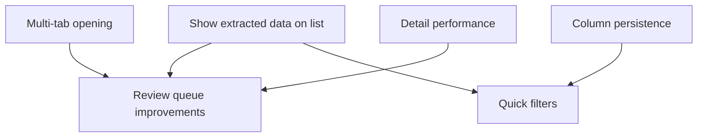

# Document Processing UX Improvements Plan

## 1. Objective

Improve the document processing experience so that:
- Extracted (draft) data is visible immediately after upload on `/processing`.
- Users can open multiple documents in separate tabs naturally.
- Reviewing unapproved documents becomes a fast, keyboard-friendly flow.
- Document detail loads noticeably faster (target: < 700ms warm load, excluding PDF render).
- Table columns auto-fit content by default, remain user-resizable, and persist per user across sessions (server-side).
- Add sleek “quick filter” shortcuts for common filter combinations.

---

## 2. Scope

### In scope
- `/processing` list: show latest extracted (draft) revision values when no approved revision exists.
- `/processing/[id]`: improve navigation UX for reviewing unapproved docs and reduce initial load latency.
- Column sizing: auto-fit + manual resize + per-user persistence.
- Quick filters: icon-only shortcuts that set common filter combinations.
- Performance: reduce redundant requests, unnecessary revalidation work, and add prefetching.

### Out of scope (for this iteration)
- New extraction models / OCR providers / pipeline worker changes beyond what’s needed to surface already-created draft revisions.
- Major redesign of processing module IA beyond the UX items listed above.

---

## 3. Standards Compliance

- Follow `docs/DESIGN_GUIDELINE.md` (compact, Linear-like, subtle interactions, icon button pattern, mobile table/card pattern).
- Follow `docs/RBAC_GUIDELINE.md` and existing patterns (`requireAuth`, `requirePermission`, tenant scoping).
- Keep changes modular; prefer shared hooks/components; avoid copy/paste logic.
- Update existing documentation under `docs/` (and `docs/TODO.md`) instead of creating extra docs (this plan file is the requested planning artifact).

---

## 4. Milestones

- [ ] **M1: Data visible on list immediately**
- [ ] **M2: Multi-tab document opening + intuitive links**
- [ ] **M3: Review workflow (next/prev unapproved)**
- [ ] **M4: Detail page performance improvements**
- [ ] **M5: Auto-fit + resizable + persisted columns**
- [ ] **M6: Quick filters + polish + docs/tests**

---

## 5. Task Breakdown (Checkable)

### 5.1 M1: Show extracted data immediately on `/processing`
- [ ] Update list service to return a “display revision”:
  - [ ] Query `currentRevision` (approved pointer) as today.
  - [ ] Also query latest revision (`revisions: take 1, orderBy revisionNumber desc`) as fallback.
  - [ ] In API mapping, set `displayRevision = currentRevision ?? latestRevision ?? null` and expose it for UI columns.
- [ ] Update `/api/processing-documents` response shape to include `displayRevision` (or reuse `currentRevision` field as “display”, but keep `currentRevisionId` semantics intact).
- [ ] Update `/processing` UI to use `displayRevision` for table columns so values appear after extraction completes (without requiring approval).
- [ ] Ensure bulk export uses the same logic (export draft data when no approved revision exists).

### 5.2 M2: Allow multi-tab opening (Ctrl+click / middle click / open in new tab)
- [ ] Replace row-level `onClick -> router.push()` navigation with actual `<Link>` targets for primary navigation cells (Document name/icon).
- [ ] Keep row click as convenience, but only for plain left-click without modifier keys:
  - [ ] Ignore clicks when `ctrlKey/metaKey/shiftKey/altKey` or `button !== 0`.
  - [ ] Do not interfere with right-click context menu on links.
- [ ] Add a subtle “Open” affordance (e.g., link styling on document name) consistent with design guidelines.

### 5.3 M3: Review all unapproved docs “one after another”
- [ ] Define “Needs Review” set consistently across list + detail:
  - DRAFT revision OR suspected duplicate OR failed validation (WARNINGS/INVALID) (confirm exact criteria).
- [ ] Add a list-page “Review next” action:
  - [ ] Button/icon that opens the next doc in the needs-review queue (respects current filters, tenant, and company selection).
- [ ] Improve `/processing/[id]` navigation:
  - [ ] Make next/prev controls more visible and add “Back to queue” / “Queue count” context.
  - [ ] Add keyboard shortcuts: `j/k` or `Alt+Left/Right` (existing) + visible hint.
- [ ] Fix navigation data source:
  - [ ] Current `useDocumentNavigation` fetches only `limit=100` and ignores tenant/company filters.
  - [ ] Add a dedicated endpoint for navigation that accepts the active filters (tenantId/companyId + “needs-review” filter) and returns prev/next IDs + position/count.

### 5.4 M4: Speed up document detail page load
- [ ] Remove redundant page metadata fetches:
  - [ ] Avoid calling `useDocumentPages()` twice (page-level + `DocumentPageViewer`).
  - [ ] Allow `DocumentPageViewer` to truly skip the pages API call when `pdfUrl` is already provided.
- [ ] Stop “validate on every mount” behavior:
  - [ ] Change `useRevisionWithLineItems()` default `revalidate` to `false`.
  - [ ] Provide explicit “Revalidate” action when needed (after edits, or via a small button).
  - [ ] Ensure validation runs after PATCH/update (already happens server-side).
- [ ] Reduce React Query churn:
  - [ ] Replace `refetchOnMount: 'always'` with tighter rules (e.g., `false` + `staleTime`) for pages/revisions where safe.
  - [ ] Add list hover prefetch: on row hover, prefetch doc detail + display revision.
- [ ] Optimize payload sizes:
  - [ ] Ensure list endpoints never include line items/pages.
  - [ ] Add an “overview” endpoint (single request) if multiple parallel calls remain the main bottleneck.

### 5.5 M5: Auto-fit + resizable columns + per-user persistence (server-side)
- [ ] Decide persistence approach:
  - [ ] Add a `UserPreference` (or `UiPreference`) Prisma model with `userId`, `key`, `valueJson`, `updatedAt`.
  - [ ] Key by table ID (e.g., `processing:list:columns`) and store `{ [columnId]: widthPx }`.
- [ ] Add API endpoints:
  - [ ] `GET /api/user-preferences?key=...`
  - [ ] `PUT /api/user-preferences` with `{ key, value }` (upsert).
  - [ ] RBAC: authenticated users can only read/write their own preferences.
- [ ] Implement column sizing behavior on `/processing`:
  - [ ] Default: auto-fit (content-driven widths) with horizontal scroll if needed.
  - [ ] Manual resize: drag handle on header cells; update widths live.
  - [ ] Persist: debounce-save to server; restore on load.
  - [ ] Provide “Reset columns” action.

### 5.6 M6: Quick filters + polish + docs/tests
- [ ] Add quick filters row (icon-only, tooltip titles):
  - [ ] “Uploaded today”
  - [ ] “Pending review”
  - [ ] “Suspected duplicates”
  - [ ] “Failed/Dead letter”
  - [ ] “This week”
  - (confirm exact combinations and timezone assumptions)
- [ ] Add small UX polish:
  - [ ] Better empty states explaining “no documents” vs “filters hide results”.
  - [ ] Clearer column meanings (tooltips on headers, consistent label casing).
- [ ] Update docs:
  - [ ] Update `docs/TODO.md` “Document Processing” section with the finalized decisions/notes from this plan.
- [ ] Tests:
  - [ ] Add API route unit tests for list “display revision” behavior (vitest) if existing patterns support it.
  - [ ] Add minimal integration test for preference endpoints if introduced.

---

## 6. Dependencies (Mermaid)

---

## 7. Risk Management

| Risk | Impact | Likelihood | Mitigation |
|------|--------|------------|------------|
| Ambiguity between “approved revision” vs “latest extracted draft” | Wrong data shown/exported | Medium | Introduce explicit `displayRevision` concept; keep `currentRevisionId` semantics unchanged |
| Column persistence schema/API adds complexity | Scope creep | Medium | Keep model minimal (key/value JSON), reuse auth patterns, ship only for processing list first |
| Performance regressions from extra joins | Slower list page | Low-Med | Use `take: 1` on latest revision; ensure proper indexes; measure with dev logs |
| Navigation queue ignores active filters | Confusing review flow | Medium | Create dedicated navigation endpoint that accepts filter context |

---

## 8. Resource Requirements

- Prisma migration (if adding `UserPreference` model).
- Small UI component work (resizable headers, quick filters).
- API route additions (navigation + preferences).
- Timebox for performance profiling (React Query + network waterfall).

---

## 9. Acceptance Criteria

- [ ] After extraction completes (but before approval), `/processing` shows vendor/doc#/date/amounts in the table.
- [ ] Users can Ctrl+click or middle-click a document link to open multiple documents in new tabs.
- [ ] Users can start a “review next unapproved” flow from `/processing` and move sequentially via next/prev + keyboard.
- [ ] Warm navigation to `/processing/[id]` feels instant for metadata (< 700ms) and avoids redundant refetch/validation loops.
- [ ] Columns auto-fit by default, can be resized, and persist per user across sessions.
- [ ] Quick filters apply instantly and are discoverable via tooltips.

---

## 10. Review History

- Drafted by Codex CLI agent (manual plan; zen-mcp `planner/consensus` tools not available in this runtime).

---

## 11. Revision Log

- v0.1: Initial plan covering items 1–7 from user feedback (2026-01-02)

